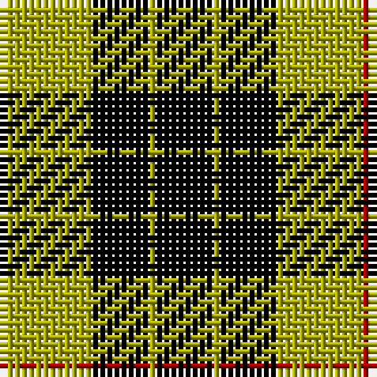

**Bands:** [KYKYR](/stripes/kykyr/) · **Stripes:** [K LY K LY R](/stripes/stripes5/) K LY K LY R

This was sourced from weddslist.  It is a [5 band tartan](/bands/bands5/).

Original link http://www.weddslist.com/cgi-bin/tartans/pg.pl?source=x

## Register references

External register numbers recorded for this tartan.

- Scottish Register of Tartans: [2540](https://www.tartanregister.gov.uk/tartanDetails.aspx?ref=2540)
- Scottish Register of Tartans: [2625](https://www.tartanregister.gov.uk/tartanDetails.aspx?ref=2625)
- Scottish Register of Tartans: [3555](https://www.tartanregister.gov.uk/tartanDetails.aspx?ref=3555)
- Scottish Tartans Authority (ITI): 1429
- Scottish Tartans Authority (ITI): 218
- Scottish Tartans World Register: 1429
- Scottish Tartans World Register: 218
- Scottish Tartans World Register: 864

## Variants

Other setts woven to the same stripe pattern.

- [MacLeod Dress Clan Tartan Tartan Number: 1272. Earliest known date: 1829 See illustration in Bain where red is 4 threads. Sir Thomas Dick Lauder in a letter to Sir Walter Scott in 1829 wrote, MacLeod has got a sketch of this splendid tartan, "three black stryps upon ain yellow fylde," See products available Copyright © Blair Urquhart, Comrie, 2015](/setts/s5/k4ly1k4ly6r1~x4/)
- [MacLeod of Lewis](/setts/s5/k8ly1k8ly12r1~x2/)
- [MacLeod of Lewis (Vestiarium Scoticum)](/setts/s5/k8ly1k8ly12r1~x4/)

## Thread count
DR/1 LG12 K8 LG1 K/8

## Palette
Each colour and its ΔE from the base-6 reference it is a variant of.

| Colour | Shade | Base | ΔE (OKLab) |
|---|---|---|---|
| DR | <code style="background-color:#AA0000;">#AA0000</code> `#AA0000` | R <code style="background-color:#CC0000;">#CC0000</code> | 0.07 |
| K | <code style="background-color:#000000;">#000000</code> `#000000` | K <code style="background-color:#000000;">#000000</code> | 0.00 |
| LG | <code style="background-color:#AAAA00;">#AAAA00</code> `#AAAA00` | Y <code style="background-color:#F2BF00;">#F2BF00</code> | 0.13 |

# Sample pattern

## Nearest tartans

The nearest existing variants by ΔTartan distance.

1. [MacLeod of Lewis](/setts/s5/k8ly1k8ly12r1~x2/) — ΔT 0.42
1. [MacLeod of Lewis (Vestiarium Scoticum)](/setts/s5/k8ly1k8ly12r1~x4/) — ΔT 1.13
1. [MacArthur](/setts/s5/k32g6k12g30ly3/) — ΔT 1.21
1. [MacArthur-Fox](/setts/s5/k19g8k10g31r3/) — ΔT 1.27
1. [Gunn](/setts/s6/g2k12g1k12g12r2~x2/) — ΔT 1.38
1. [Wallace, hunting](/setts/s4/k4g33k33ly4~x2/) — ΔT 1.39
1. [Barclay Dress](/setts/s4/lr1ly6k6ly1~x2/) — ΔT 1.43
1. [Robert Gordon University](/setts/s5/k7r3k24g28ly3~x2/) — ΔT 1.49
1. [Wallace Htg (Clan)](/setts/s4/k1g8k8ly1~x4/) — ΔT 1.50
1. [MacArthur](/setts/s5/k32dg6k12dg30ly3/) — ΔT 1.62

## Neighbour map

Every grey dot is one of 14313 variants placed by the first two principal components of the ΔTartan feature space (44% of its variance). Red is this tartan; blue dots are its nearest — click one to open its page.

<svg viewBox="0 0 640 380" role="img" style="max-width:100%;height:auto;border:1px solid #e0e0e0;border-radius:4px;display:block" xmlns="http://www.w3.org/2000/svg"><image href="/nn/cloud.v1.png" width="640" height="380"/><a href="/setts/s5/k8ly1k8ly12r1~x2/"><circle cx="286.9" cy="223.1" r="4" fill="#3465a4"><title>MacLeod of Lewis</title></circle></a><a href="/setts/s5/k8ly1k8ly12r1~x4/"><circle cx="297.1" cy="220.1" r="4" fill="#3465a4"><title>MacLeod of Lewis (Vestiarium Scoticum)</title></circle></a><a href="/setts/s5/k32g6k12g30ly3/"><circle cx="292.5" cy="245.2" r="4" fill="#3465a4"><title>MacArthur</title></circle></a><a href="/setts/s5/k19g8k10g31r3/"><circle cx="294.5" cy="248.7" r="4" fill="#3465a4"><title>MacArthur-Fox</title></circle></a><a href="/setts/s6/g2k12g1k12g12r2~x2/"><circle cx="323.9" cy="233.6" r="4" fill="#3465a4"><title>Gunn</title></circle></a><a href="/setts/s4/k4g33k33ly4~x2/"><circle cx="273.3" cy="256.0" r="4" fill="#3465a4"><title>Wallace, hunting</title></circle></a><a href="/setts/s4/lr1ly6k6ly1~x2/"><circle cx="241.6" cy="255.5" r="4" fill="#3465a4"><title>Barclay Dress</title></circle></a><a href="/setts/s5/k7r3k24g28ly3~x2/"><circle cx="233.2" cy="215.0" r="4" fill="#3465a4"><title>Robert Gordon University</title></circle></a><a href="/setts/s4/k1g8k8ly1~x4/"><circle cx="280.6" cy="262.1" r="4" fill="#3465a4"><title>Wallace Htg (Clan)</title></circle></a><a href="/setts/s5/k32dg6k12dg30ly3/"><circle cx="310.8" cy="254.5" r="4" fill="#3465a4"><title>MacArthur</title></circle></a><circle cx="292.1" cy="227.3" r="5" fill="#c00000"/></svg>

ID: /setts/s5/k8ly1k8ly12r1/
