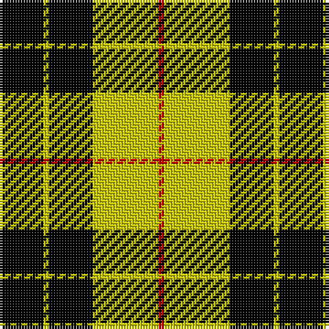

In pattern [KYKYR](/stripes/kykyr/).

This was sourced from weddslist.  It is a [5 stripe tartan](/stripes/stripes5/).

Original link http://www.weddslist.com/cgi-bin/tartans/pg.pl?source=rb

## Attestations

This cloth appears in 3 source records; the oldest owns this page.

- undated — MacLeod of Lewis (weddslist, [record](http://www.weddslist.com/cgi-bin/tartans/pg.pl?source=rb))
- undated — MacLeod of Lewis (weddslist, [record](http://www.weddslist.com/cgi-bin/tartans/pg.pl?source=tinsel))
- undated — MacLeod of Lewis (weddslist, [record](http://www.weddslist.com/cgi-bin/tartans/pg.pl?source=x))

## Register references

External register numbers recorded for this tartan.

- Scottish Register of Tartans: [1166](https://www.tartanregister.gov.uk/tartanDetails.aspx?ref=1166)
- Scottish Register of Tartans: [1510](https://www.tartanregister.gov.uk/tartanDetails.aspx?ref=1510)
- Scottish Register of Tartans: [1758](https://www.tartanregister.gov.uk/tartanDetails.aspx?ref=1758)
- Scottish Register of Tartans: [2307](https://www.tartanregister.gov.uk/tartanDetails.aspx?ref=2307)
- Scottish Register of Tartans: [2349](https://www.tartanregister.gov.uk/tartanDetails.aspx?ref=2349)
- Scottish Register of Tartans: [2540](https://www.tartanregister.gov.uk/tartanDetails.aspx?ref=2540)
- Scottish Register of Tartans: [2582](https://www.tartanregister.gov.uk/tartanDetails.aspx?ref=2582)
- Scottish Register of Tartans: [2585](https://www.tartanregister.gov.uk/tartanDetails.aspx?ref=2585)
- Scottish Register of Tartans: [2625](https://www.tartanregister.gov.uk/tartanDetails.aspx?ref=2625)
- Scottish Register of Tartans: [2666](https://www.tartanregister.gov.uk/tartanDetails.aspx?ref=2666)
- Scottish Register of Tartans: [2730](https://www.tartanregister.gov.uk/tartanDetails.aspx?ref=2730)
- Scottish Register of Tartans: [2862](https://www.tartanregister.gov.uk/tartanDetails.aspx?ref=2862)
- Scottish Register of Tartans: [3072](https://www.tartanregister.gov.uk/tartanDetails.aspx?ref=3072)
- Scottish Register of Tartans: [3555](https://www.tartanregister.gov.uk/tartanDetails.aspx?ref=3555)
- Scottish Register of Tartans: [3808](https://www.tartanregister.gov.uk/tartanDetails.aspx?ref=3808)
- Scottish Register of Tartans: [4925](https://www.tartanregister.gov.uk/tartanDetails.aspx?ref=4925)
- Scottish Register of Tartans: [696](https://www.tartanregister.gov.uk/tartanDetails.aspx?ref=696)
- Scottish Register of Tartans: [697](https://www.tartanregister.gov.uk/tartanDetails.aspx?ref=697)
- Scottish Register of Tartans: [982](https://www.tartanregister.gov.uk/tartanDetails.aspx?ref=982)
- Scottish Tartans Authority (ITI): 1277
- Scottish Tartans Authority (ITI): 1429
- Scottish Tartans Authority (ITI): 218
- Scottish Tartans Authority (ITI): 977
- Scottish Tartans World Register: 1010
- Scottish Tartans World Register: 1042
- Scottish Tartans World Register: 127
- Scottish Tartans World Register: 1277
- Scottish Tartans World Register: 1399
- Scottish Tartans World Register: 1429
- Scottish Tartans World Register: 1585
- Scottish Tartans World Register: 1593
- Scottish Tartans World Register: 218
- Scottish Tartans World Register: 2218
- Scottish Tartans World Register: 3061
- Scottish Tartans World Register: 441
- Scottish Tartans World Register: 737
- Scottish Tartans World Register: 858
- Scottish Tartans World Register: 864
- Scottish Tartans World Register: 873
- Scottish Tartans World Register: 897
- Scottish Tartans World Register: 977
- Scottish Tartans World Register: 978

## Thread count
K/16 Y2 K16 Y24 R/2

## Palette
Each colour and its ΔE from the base-6 reference it is a variant of.

| Colour | Shade | Base | ΔE (OKLab) |
|---|---|---|---|
| K | <code style="background-color:#000000;">#000000</code> `#000000` | K <code style="background-color:#000000;">#000000</code> | 0.00 |
| R | <code style="background-color:#C80000;">#C80000</code> `#C80000` | R <code style="background-color:#CC0000;">#CC0000</code> | 0.01 |
| Y | <code style="background-color:#C8C800;">#C8C800</code> `#C8C800` | Y <code style="background-color:#F2BF00;">#F2BF00</code> | 0.07 |

# Sample pattern

## Nearest tartans

The nearest existing variants by ΔTartan distance.

1. [MacLeod of Lewis (Vestiarium Scoticum)](/setts/s5/k8ly1k8ly12r1~x4/) — ΔT 0.90
1. [Barclay Dress](/setts/s4/lr1ly6k6ly1~x2/) — ΔT 1.28
1. [Barclay Dress](/setts/s4/lr1ly6k6ly1/) — ΔT 1.28
1. [MacArthur-Fox](/setts/s5/k19g8k10g31r3/) — ΔT 1.38
1. [MacLeod #3](/setts/s6/k6ly1k6ly9r1ly2~x2/) — ΔT 1.39
1. [MacArthur](/setts/s5/k32g6k12g30ly3/) — ΔT 1.47
1. [Robert Gordon University](/setts/s5/k7r3k24g28ly3~x2/) — ΔT 1.52
1. [Barclay Dress](/setts/s4/w1ly6k6ly1~x2/) — ΔT 1.54
1. [Wallace, hunting](/setts/s4/k4g33k33ly4~x2/) — ΔT 1.56
1. [Takla Makan #2 (Artefact)](/setts/s4/k4lo15k4w2~x2/) — ΔT 1.57

## Neighbour map

Every grey dot is one of 14299 variants placed by the first two principal components of the ΔTartan feature space (44% of its variance). Red is this tartan; blue dots are its nearest — click one to open its page.

<svg viewBox="0 0 640 380" role="img" style="max-width:100%;height:auto;border:1px solid #e0e0e0;border-radius:4px;display:block" xmlns="http://www.w3.org/2000/svg"><image href="/nn/cloud.v1.png" width="640" height="380"/><a href="/setts/s5/k8ly1k8ly12r1~x4/"><circle cx="297.0" cy="219.8" r="4" fill="#3465a4"><title>MacLeod of Lewis (Vestiarium Scoticum)</title></circle></a><a href="/setts/s4/lr1ly6k6ly1~x2/"><circle cx="241.6" cy="255.2" r="4" fill="#3465a4"><title>Barclay Dress</title></circle></a><a href="/setts/s4/lr1ly6k6ly1/"><circle cx="241.6" cy="255.2" r="4" fill="#3465a4"><title>Barclay Dress</title></circle></a><a href="/setts/s5/k19g8k10g31r3/"><circle cx="294.6" cy="248.4" r="4" fill="#3465a4"><title>MacArthur-Fox</title></circle></a><a href="/setts/s6/k6ly1k6ly9r1ly2~x2/"><circle cx="256.2" cy="216.7" r="4" fill="#3465a4"><title>MacLeod #3</title></circle></a><a href="/setts/s5/k32g6k12g30ly3/"><circle cx="292.6" cy="244.9" r="4" fill="#3465a4"><title>MacArthur</title></circle></a><a href="/setts/s5/k7r3k24g28ly3~x2/"><circle cx="233.3" cy="214.7" r="4" fill="#3465a4"><title>Robert Gordon University</title></circle></a><a href="/setts/s4/w1ly6k6ly1~x2/"><circle cx="234.6" cy="249.2" r="4" fill="#3465a4"><title>Barclay Dress</title></circle></a><a href="/setts/s4/k4g33k33ly4~x2/"><circle cx="273.4" cy="255.7" r="4" fill="#3465a4"><title>Wallace, hunting</title></circle></a><a href="/setts/s4/k4lo15k4w2~x2/"><circle cx="308.2" cy="235.5" r="4" fill="#3465a4"><title>Takla Makan #2 (Artefact)</title></circle></a><circle cx="286.9" cy="222.8" r="5" fill="#c00000"/></svg>

ID: /setts/s5/k8ly1k8ly12r1~x2/
