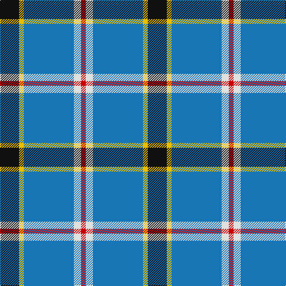

In pattern [KYBWR](/stripes/kybwr/).

This was sourced from register-of-tartans.  It is a [5 stripe tartan](/stripes/stripes5/).

Original link https://www.tartanregister.gov.uk/tartanDetails.aspx?ref=4820

## Also known as

This cloth is also recorded under:

- Oklahoma State

## Attestations

This cloth appears in 3 source records; the oldest owns this page.

- 01/03/1998 — Oklahoma (register-of-tartans, [record](https://www.tartanregister.gov.uk/tartanDetails.aspx?ref=4820))
- March 1998 — Oklahoma (US State) (tartans-authority, [record](http://www.tartansauthority.com/tartan-ferret/display/2429/))
- undated — Oklahoma State American District Tartan Tartan Number: 2429. Earliest known date: March 1998 Registration application to the Authority documents Polly Wittering as the designer but the Resolution adopted by the House of Representatives on 6th April 1999, identifies Jerrel R. Murray as the 'creator' (possibly President Emeritus of United Scottish Clans of Oklahoma). See products available Copyright © Blair Urquhart, Comrie, 2015 (house-of-tartan, [record](http://www.house-of-tartan.scotland.net/house/TartanViewjs.asp?colr=Def&tnam=2429))

## Register references

External register numbers recorded for this tartan.

- Scottish Register of Tartans: [4820](https://www.tartanregister.gov.uk/tartanDetails.aspx?ref=4820)
- Scottish Tartans Authority (ITI): 2429
- Scottish Tartans World Register: 2429

## Thread count
K/32 Y8 Ba84 LN12 R/8

## Palette
Each colour and the base-6 reference it is a variant of.

| Colour | Shade | Base |
|---|---|---|
| B | <code style="background-color:#48A4C0;">#48A4C0</code> `oklch(67.5% 0.096 221.0)` <small>#48A4C0</small> | Y <code style="background-color:#F2BF00;">#F2BF00</code> |
| Ba | <code style="background-color:#1474B4;">#1474B4</code> `oklch(54.0% 0.129 245.1)` <small>#1474B4</small> | B <code style="background-color:#2A418A;">#2A418A</code> |
| Bb | <code style="background-color:#2474E8;">#2474E8</code> `oklch(57.8% 0.192 258.7)` <small>#2474E8</small> | B <code style="background-color:#2A418A;">#2A418A</code> |
| DB | <code style="background-color:#2C2C80;">#2C2C80</code> `oklch(35.0% 0.138 276.6)` <small>#2C2C80</small> | B <code style="background-color:#2A418A;">#2A418A</code> |
| K | <code style="background-color:#101010;">#101010</code> `oklch(17.3% 0.000 89.9)` <small>#101010</small> | K <code style="background-color:#000000;">#000000</code> |
| LN | <code style="background-color:#E0E0E0;">#E0E0E0</code> `oklch(90.7% 0.000 89.9)` <small>#E0E0E0</small> | W <code style="background-color:#F7F7F7;">#F7F7F7</code> |
| R | <code style="background-color:#C80000;">#C80000</code> `oklch(52.3% 0.215 29.2)` <small>#C80000</small> | R <code style="background-color:#CC0000;">#CC0000</code> |
| Y | <code style="background-color:#E8C000;">#E8C000</code> `oklch(81.9% 0.168 93.7)` <small>#E8C000</small> | Y <code style="background-color:#F2BF00;">#F2BF00</code> |

# Sample pattern

## Nearest tartans

The nearest existing variants by ΔTartan distance, with this tartan at the top so the swatches line up against it.

ΔTartan

Tartan

Sett

—

<a href="/ttd/edit/#slug=k8ly2b21w3r2~x4">Oklahoma</a> <a class="nn-out" href="/setts/s5/k8ly2b21w3r2~x4/" title="open its dictionary page">↗</a>

1.14

<a href="/ttd/edit/#slug=ly8w3b40k12w3ly3~x2">Wolverine (Corporate)</a> <a class="nn-out" href="/setts/s6/ly8w3b40k12w3ly3~x2/" title="open its dictionary page">↗</a>

1.16

<a href="/ttd/edit/#slug=r4db24w2g13db2k3~x4">Vance (Family Association)</a> <a class="nn-out" href="/setts/s6/r4db24w2g13db2k3~x4/" title="open its dictionary page">↗</a>

1.20

<a href="/ttd/edit/#slug=k4t24k2g13t2k3~x4">Vance (Family Association) Corporate Family Tartan Tartan Number: 2208. Earliest known date: December 1994 Designed and Copyrighted in the US by Mark W. Vance. Details from Vance Family Association website. See products available Copyright © Blair Urquhart, Comrie, 2015</a> <a class="nn-out" href="/setts/s6/k4t24k2g13t2k3~x4/" title="open its dictionary page">↗</a>

1.24

<a href="/ttd/edit/#slug=t3k2g2k1db10w1~x8">Isle of Harris (District)</a> <a class="nn-out" href="/setts/s6/t3k2g2k1db10w1~x8/" title="open its dictionary page">↗</a>

1.31

<a href="/ttd/edit/#slug=o10k1db3g3ly1~x6">Celtic Norse Heritage Society</a> <a class="nn-out" href="/setts/s5/o10k1db3g3ly1~x6/" title="open its dictionary page">↗</a>

1.33

<a href="/ttd/edit/#slug=db3n10db3k3w10r4n28k2~x2">Moorpark Primary School (Corporate)</a> <a class="nn-out" href="/setts/s8/db3n10db3k3w10r4n28k2~x2/" title="open its dictionary page">↗</a>

1.40

<a href="/ttd/edit/#slug=w15ly2k5lb3b40k10">Herriot New Zealand</a> <a class="nn-out" href="/setts/s6/w15ly2k5lb3b40k10/" title="open its dictionary page">↗</a>

1.42

<a href="/ttd/edit/#slug=lo8k2dt20t4w1k2~x4">Solberg-Bell (Personal)</a> <a class="nn-out" href="/setts/s6/lo8k2dt20t4w1k2~x4/" title="open its dictionary page">↗</a>

1.44

<a href="/ttd/edit/#slug=ly8k3b40k12k3ly3~x2">Wolverine Corporate Tartan Tartan Number: 10748. Earliest known date: 03/12/2012 Created by the designer to celebrate an exclusive group of work colleagues known affectionately as the 'Wolverines'. Many within this close group share a proud Scottish heritage and wished to acknowledge this strong affiliation by commissioning a tartan. Yes. The Wolverine tartan has been created for the exclusive use of the 'Wolverines'. No commercial use of this tartan is permitted without expressed permission from the designer, and any party wishing to use or reproduce this tartan should first seek permission by email from the designer. See products available Copyright © Blair Urquhart, Comrie, 2015</a> <a class="nn-out" href="/setts/s6/ly8k3b40k12k3ly3~x2/" title="open its dictionary page">↗</a>

1.47

<a href="/ttd/edit/#slug=db10g4w27db40r4~x2">Turnbull Dress, Bruce (Personal)</a> <a class="nn-out" href="/setts/s5/db10g4w27db40r4~x2/" title="open its dictionary page">↗</a>

## Neighbour map

Every grey dot is one of 14299 variants placed by the first two principal components of the ΔTartan feature space (44% of its variance). Red is this tartan; blue dots are its nearest — click one to open its page.

<svg viewBox="0 0 640 380" role="img" style="max-width:100%;height:auto;border:1px solid #e0e0e0;border-radius:4px;display:block" xmlns="http://www.w3.org/2000/svg"><image href="/nn/cloud.v1.png" width="640" height="380"/><a href="/setts/s6/ly8w3b40k12w3ly3~x2/"><circle cx="302.7" cy="170.9" r="4" fill="#3465a4"><title>Wolverine (Corporate)</title></circle></a><a href="/setts/s6/r4db24w2g13db2k3~x4/"><circle cx="277.3" cy="178.6" r="4" fill="#3465a4"><title>Vance (Family Association)</title></circle></a><a href="/setts/s6/k4t24k2g13t2k3~x4/"><circle cx="261.1" cy="178.2" r="4" fill="#3465a4"><title>Vance (Family Association) Corporate Family Tartan Tartan Number: 2208. Earliest known date: December 1994 Designed and Copyrighted in the US by Mark W. Vance. Details from Vance Family Association website. See products available Copyright © Blair Urquhart, Comrie, 2015</title></circle></a><a href="/setts/s6/t3k2g2k1db10w1~x8/"><circle cx="243.4" cy="184.7" r="4" fill="#3465a4"><title>Isle of Harris (District)</title></circle></a><a href="/setts/s5/o10k1db3g3ly1~x6/"><circle cx="260.8" cy="190.1" r="4" fill="#3465a4"><title>Celtic Norse Heritage Society</title></circle></a><a href="/setts/s8/db3n10db3k3w10r4n28k2~x2/"><circle cx="304.5" cy="150.0" r="4" fill="#3465a4"><title>Moorpark Primary School (Corporate)</title></circle></a><a href="/setts/s6/w15ly2k5lb3b40k10/"><circle cx="252.3" cy="138.4" r="4" fill="#3465a4"><title>Herriot New Zealand</title></circle></a><a href="/setts/s6/lo8k2dt20t4w1k2~x4/"><circle cx="281.0" cy="148.0" r="4" fill="#3465a4"><title>Solberg-Bell (Personal)</title></circle></a><a href="/setts/s6/ly8k3b40k12k3ly3~x2/"><circle cx="314.5" cy="180.5" r="4" fill="#3465a4"><title>Wolverine Corporate Tartan Tartan Number: 10748. Earliest known date: 03/12/2012 Created by the designer to celebrate an exclusive group of work colleagues known affectionately as the 'Wolverines'. Many within this close group share a proud Scottish heritage and wished to acknowledge this strong affiliation by commissioning a tartan. Yes. The Wolverine tartan has been created for the exclusive use of the 'Wolverines'. No commercial use of this tartan is permitted without expressed permission from the designer, and any party wishing to use or reproduce this tartan should first seek permission by email from the designer. See products available Copyright © Blair Urquhart, Comrie, 2015</title></circle></a><a href="/setts/s5/db10g4w27db40r4~x2/"><circle cx="288.4" cy="200.2" r="4" fill="#3465a4"><title>Turnbull Dress, Bruce (Personal)</title></circle></a><circle cx="279.7" cy="181.2" r="5" fill="#c00000"/></svg>

ID: /setts/s5/k8ly2b21w3r2~x4/
