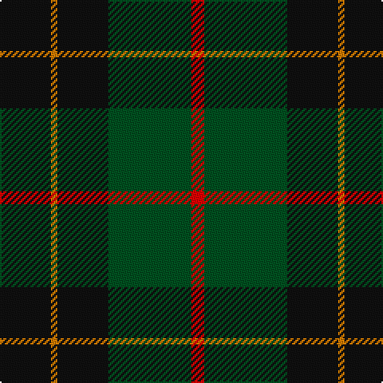

In pattern [KYKGR](/patterns/kykgr/).

This was sourced from register-of-tartans.  It is a [5 stripes tartan](/stripes/stripes5/).

Original link https://www.tartanregister.gov.uk/tartanDetails.aspx?ref=11581

## Thread count
K/32 O4 K32 G52 R/8

## Palette
Each colour and its ΔE from the base-6 reference it is a variant of.

| Colour | Shade | Base | ΔE (OKLab) |
|---|---|---|---|
| G | <code style="background-color:#005020;">#005020</code> `#005020` | G <code style="background-color:#006100;">#006100</code> | 0.07 |
| K | <code style="background-color:#101010;">#101010</code> `#101010` | K <code style="background-color:#000000;">#000000</code> | 0.17 |
| O | <code style="background-color:#D87C00;">#D87C00</code> `#D87C00` | Y <code style="background-color:#F2BF00;">#F2BF00</code> | 0.17 |
| R | <code style="background-color:#FF0000;">#FF0000</code> `#FF0000` | R <code style="background-color:#CC0000;">#CC0000</code> | 0.11 |

# Sample pattern

## Nearest tartans

The nearest existing variants by ΔTartan distance.

1. [Grass of Rasunda (Commemorative)](/setts/s7/k14g7k2ga8k4y2k1~g003820-ga5c6428-k101010-ye8c000~x4/) — ΔT 0.97
1. [Grass of Rasunda (2009), The](/setts/s7/k14g7k2ga8k4y2k1~g052f14-ga5a601e-k120a01-ye0a126~x4/) — ΔT 1.04
1. [Brooks Brothers (Corporate)](/setts/s4/r1g11k11y1~g006818-k101010-r880000-yd09800~x4/) — ΔT 1.09
1. [Douglas (Clan)](/setts/s5/k6b4g44k41w4~b20007c-g005030-k101010-we0e0e0~x2/) — ΔT 1.14
1. [Sinclair Hunting](/setts/s7/g6r2g13k6w2k16r3~g005020-k101010-r960028-we0e0e0~x2/) — ΔT 1.18
1. [MacKintosh Hunting](/setts/s7/y2g12b6r3g12r4b1~b000052-g11450d-raa0000-yaaaa00~x2/) — ΔT 1.18
1. [MacArthur (Variant)](/setts/s6/r3g30k12g6k16y2~g006818-k101010-rc80000-ye8c000~x2/) — ΔT 1.25
1. [Wcwm 1255](/setts/s5/g3r1k14g14y1~g006818-k101010-r880000-yd09800~x4/) — ΔT 1.25
1. [Cameron Hunting](/setts/s7/r3g10r3g14b16g3y2~b000052-g11450d-raa0000-yaaaa00~x2/) — ΔT 1.25
1. [Cameron Hunting](/setts/s7/r3g10r3g14b16g3y2~b000052-g11450d-raa0000-yaaaa00/) — ΔT 1.25

## Neighbour map

Every grey dot is one of 15726 variants placed by the first two principal components of the ΔTartan feature space (44% of its variance). Red is this tartan; blue dots are its nearest — click one to open its page.

<svg viewBox="0 0 640 380" role="img" style="max-width:100%;height:auto;border:1px solid #e0e0e0;border-radius:4px;display:block" xmlns="http://www.w3.org/2000/svg"><image href="/nn/cloud.v1.png" width="640" height="380"/><a href="/setts/s7/k14g7k2ga8k4y2k1~g003820-ga5c6428-k101010-ye8c000~x4/"><circle cx="310.5" cy="215.5" r="4" fill="#3465a4"><title>Grass of Rasunda (Commemorative)</title></circle></a><a href="/setts/s7/k14g7k2ga8k4y2k1~g052f14-ga5a601e-k120a01-ye0a126~x4/"><circle cx="318.8" cy="218.2" r="4" fill="#3465a4"><title>Grass of Rasunda (2009), The</title></circle></a><a href="/setts/s4/r1g11k11y1~g006818-k101010-r880000-yd09800~x4/"><circle cx="293.8" cy="243.5" r="4" fill="#3465a4"><title>Brooks Brothers (Corporate)</title></circle></a><a href="/setts/s5/k6b4g44k41w4~b20007c-g005030-k101010-we0e0e0~x2/"><circle cx="315.0" cy="232.4" r="4" fill="#3465a4"><title>Douglas (Clan)</title></circle></a><a href="/setts/s7/g6r2g13k6w2k16r3~g005020-k101010-r960028-we0e0e0~x2/"><circle cx="251.3" cy="235.7" r="4" fill="#3465a4"><title>Sinclair Hunting</title></circle></a><a href="/setts/s7/y2g12b6r3g12r4b1~b000052-g11450d-raa0000-yaaaa00~x2/"><circle cx="332.5" cy="224.8" r="4" fill="#3465a4"><title>MacKintosh Hunting</title></circle></a><a href="/setts/s6/r3g30k12g6k16y2~g006818-k101010-rc80000-ye8c000~x2/"><circle cx="316.8" cy="213.2" r="4" fill="#3465a4"><title>MacArthur (Variant)</title></circle></a><a href="/setts/s5/g3r1k14g14y1~g006818-k101010-r880000-yd09800~x4/"><circle cx="335.1" cy="221.7" r="4" fill="#3465a4"><title>Wcwm 1255</title></circle></a><a href="/setts/s7/r3g10r3g14b16g3y2~b000052-g11450d-raa0000-yaaaa00~x2/"><circle cx="282.7" cy="238.7" r="4" fill="#3465a4"><title>Cameron Hunting</title></circle></a><a href="/setts/s7/r3g10r3g14b16g3y2~b000052-g11450d-raa0000-yaaaa00/"><circle cx="282.7" cy="238.7" r="4" fill="#3465a4"><title>Cameron Hunting</title></circle></a><circle cx="305.4" cy="243.6" r="5" fill="#c00000"/></svg>

ID: /setts/s5/k8y1k8g13r2~g005020-k101010-rff0000-yd87c00~x4/
