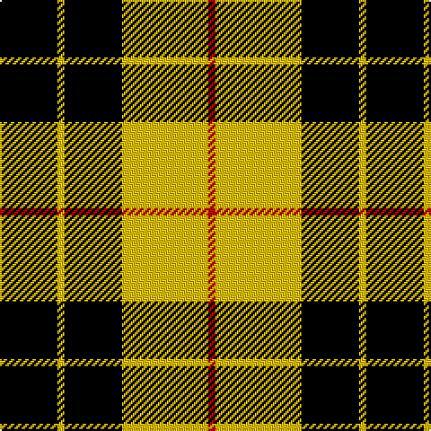

In pattern [KYKYR](/patterns/kykyr/).

This was sourced from weddslist.  It is a [5 stripes tartan](/stripes/stripes5/).

Original link http://www.weddslist.com/cgi-bin/tartans/pg.pl?source=sts

## Thread count
K/32 Y4 K32 Y48 R/4

## Palette
Each colour and its ΔE from the base-6 reference it is a variant of.

| Colour | Shade | Base | ΔE (OKLab) |
|---|---|---|---|
| K | <code style="background-color:#000000;">#000000</code> `#000000` | K <code style="background-color:#000000;">#000000</code> | 0.00 |
| R | <code style="background-color:#C00000;">#C00000</code> `#C00000` | R <code style="background-color:#CC0000;">#CC0000</code> | 0.03 |
| Y | <code style="background-color:#F0C000;">#F0C000</code> `#F0C000` | Y <code style="background-color:#F2BF00;">#F2BF00</code> | 0.00 |

# Sample pattern

## Nearest tartans

The nearest existing variants by ΔTartan distance.

1. [MacLeod of Lewis](/setts/s5/k8y1k8y12r1x2~k000000-rc80000-yc8c800/) — ΔT 0.54
1. [MacLeod of Lewis](/setts/s5/k8y1k8y12r1x2~k000000-raa0000-yaaaa00/) — ΔT 0.69
1. [MacLeod of Lewis](/setts/s5/k8y1k8y12r1~k000000-raa0000-yaaaa00/) — ΔT 0.69
1. [MacLeod of Lewis (Vestiarium Scoticum)](/setts/s5/k8y1k8y12r1x4~k101010-rc80000-yd8b000/) — ΔT 0.71
1. [MacLeod](/setts/s6/k6y1k6y9r1y2x2~k000000-r900030-yf0c000/) — ΔT 0.79
1. [MacLeod #3](/setts/s6/k6y1k6y9r1y2x2~k101010-r960028-ye8c000/) — ΔT 1.26
1. [Barclay Dress](/setts/s4/y1k6y6ya1x2~k000000-yaaaa00-yaaaaaaa/) — ΔT 1.43
1. [Takla Makan #2 (Artefact)](/setts/s4/k4y15k4w2x2~k000000-we0e0e0-ya08858/) — ΔT 1.46
1. [Unnamed C21st - Fashion](/setts/s6/k4y32k16r3k16y4x2~k101010-re87878-yfccc00/) — ΔT 1.47
1. [Barclay, dress](/setts/s4/w1y6k6y1x2~k000000-we0e0e0-yf0c000/) — ΔT 1.50

## Neighbour map

Every grey dot is one of 15726 variants placed by the first two principal components of the ΔTartan feature space (44% of its variance). Red is this tartan; blue dots are its nearest — click one to open its page.

<svg viewBox="0 0 640 380" role="img" style="max-width:100%;height:auto;border:1px solid #e0e0e0;border-radius:4px;display:block" xmlns="http://www.w3.org/2000/svg"><image href="/nn/cloud.v1.png" width="640" height="380"/><a href="/setts/s5/k8y1k8y12r1x2~k000000-rc80000-yc8c800/"><circle cx="284.5" cy="230.2" r="4" fill="#3465a4"><title>MacLeod of Lewis</title></circle></a><a href="/setts/s5/k8y1k8y12r1x2~k000000-raa0000-yaaaa00/"><circle cx="289.6" cy="233.9" r="4" fill="#3465a4"><title>MacLeod of Lewis</title></circle></a><a href="/setts/s5/k8y1k8y12r1~k000000-raa0000-yaaaa00/"><circle cx="289.6" cy="233.9" r="4" fill="#3465a4"><title>MacLeod of Lewis</title></circle></a><a href="/setts/s5/k8y1k8y12r1x4~k101010-rc80000-yd8b000/"><circle cx="295.3" cy="227.1" r="4" fill="#3465a4"><title>MacLeod of Lewis (Vestiarium Scoticum)</title></circle></a><a href="/setts/s6/k6y1k6y9r1y2x2~k000000-r900030-yf0c000/"><circle cx="251.0" cy="225.7" r="4" fill="#3465a4"><title>MacLeod</title></circle></a><a href="/setts/s6/k6y1k6y9r1y2x2~k101010-r960028-ye8c000/"><circle cx="254.5" cy="224.0" r="4" fill="#3465a4"><title>MacLeod #3</title></circle></a><a href="/setts/s4/y1k6y6ya1x2~k000000-yaaaa00-yaaaaaaa/"><circle cx="239.1" cy="262.3" r="4" fill="#3465a4"><title>Barclay Dress</title></circle></a><a href="/setts/s4/k4y15k4w2x2~k000000-we0e0e0-ya08858/"><circle cx="306.4" cy="243.6" r="4" fill="#3465a4"><title>Takla Makan #2 (Artefact)</title></circle></a><a href="/setts/s6/k4y32k16r3k16y4x2~k101010-re87878-yfccc00/"><circle cx="266.0" cy="206.0" r="4" fill="#3465a4"><title>Unnamed C21st - Fashion</title></circle></a><a href="/setts/s4/w1y6k6y1x2~k000000-we0e0e0-yf0c000/"><circle cx="236.5" cy="253.9" r="4" fill="#3465a4"><title>Barclay, dress</title></circle></a><circle cx="287.5" cy="227.0" r="5" fill="#c00000"/></svg>

ID: /setts/s5/k8y1k8y12r1x4~k000000-rc00000-yf0c000/
