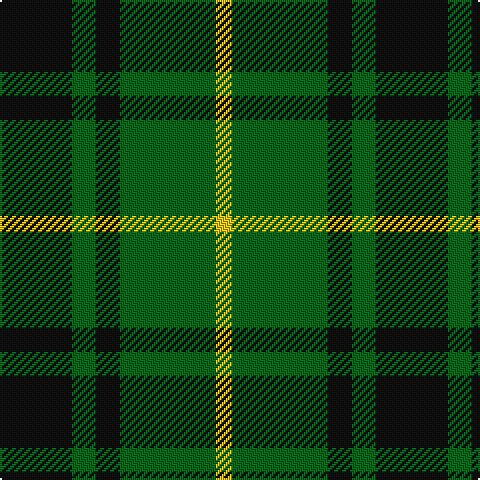

**Bands:** [KGKGY](/stripes/kgkgy/) · **Stripes:** [K G K G LY](/stripes/stripes5/) K G K G LY

This was sourced from register-of-tartans.  It is a [5 band tartan](/bands/bands5/).

Original link https://www.tartanregister.gov.uk/tartanDetails.aspx?ref=2278

## Attestations

This cloth appears in 2 source records; the oldest owns this page.

- 01/01/1842 — MacArthur (register-of-tartans, [record](https://www.tartanregister.gov.uk/tartanDetails.aspx?ref=2278))
- 1842 — MacArthur (Clan) (tartans-authority, [record](http://www.tartansauthority.com/tartan-ferret/display/1100/))

## Register references

External register numbers recorded for this tartan.

- Scottish Register of Tartans: [2278](https://www.tartanregister.gov.uk/tartanDetails.aspx?ref=2278)
- Scottish Tartans Authority (ITI): 1100
- Scottish Tartans World Register: 1100

## Variants

Other setts woven to the same stripe pattern.

- [MacArthur](/setts/s5/k32g6k12g30ly3/)

## Thread count
K/36 G12 K12 G48 Y/8

## Palette
Each colour and its ΔE from the base-6 reference it is a variant of.

| Colour | Shade | Base | ΔE (OKLab) |
|---|---|---|---|
| DG | <code style="background-color:#003820;">#003820</code> `#003820` | G <code style="background-color:#006100;">#006100</code> | 0.15 |
| G | <code style="background-color:#006818;">#006818</code> `#006818` | G <code style="background-color:#006100;">#006100</code> | 0.02 |
| K | <code style="background-color:#101010;">#101010</code> `#101010` | K <code style="background-color:#000000;">#000000</code> | 0.17 |
| Y | <code style="background-color:#E8C000;">#E8C000</code> `#E8C000` | Y <code style="background-color:#F2BF00;">#F2BF00</code> | 0.02 |

# Sample pattern

## Nearest tartans

The nearest existing variants by ΔTartan distance.

1. [Scotch Tape 2 (Corporate)](/setts/s4/k3g15k20ly3~x2/) — ΔT 0.85
1. [Innes Hunting](/setts/s4/k30lb7g36k5~x2/) — ΔT 0.86
1. [Confederate Infantry](/setts/s6/db2dg12o3dg8o14dg2~x2/) — ΔT 1.09
1. [Wilson's No.197](/setts/s4/g6ly1k6ly1~x4/) — ΔT 1.17
1. [Innes, Georgina (Portrait)](/setts/s6/g7k1g7t1k6t1~x4/) — ΔT 1.18
1. [Moore Caledonian (Personal)](/setts/s6/ly1g6ly1g6k6r1~x6/) — ΔT 1.21
1. [Confederate Artillery](/setts/s6/dg2o14dg8o3dg12r2~x2/) — ΔT 1.30
1. [MacArthur-Fox (Personal)](/setts/s5/k8g3k4g20r4~x2/) — ΔT 1.31
1. [Holman (Personal)](/setts/s6/b3g7k16g20k9r3~x2/) — ΔT 1.35
1. [Romsdal](/setts/s5/g40k10r7k10r7/) — ΔT 1.39

## Neighbour map

Every grey dot is one of 14313 variants placed by the first two principal components of the ΔTartan feature space (44% of its variance). Red is this tartan; blue dots are its nearest — click one to open its page.

<svg viewBox="0 0 640 380" role="img" style="max-width:100%;height:auto;border:1px solid #e0e0e0;border-radius:4px;display:block" xmlns="http://www.w3.org/2000/svg"><image href="/nn/cloud.v1.png" width="640" height="380"/><a href="/setts/s4/k3g15k20ly3~x2/"><circle cx="311.8" cy="278.9" r="4" fill="#3465a4"><title>Scotch Tape 2 (Corporate)</title></circle></a><a href="/setts/s4/k30lb7g36k5~x2/"><circle cx="264.5" cy="277.1" r="4" fill="#3465a4"><title>Innes Hunting</title></circle></a><a href="/setts/s6/db2dg12o3dg8o14dg2~x2/"><circle cx="313.8" cy="262.2" r="4" fill="#3465a4"><title>Confederate Infantry</title></circle></a><a href="/setts/s4/g6ly1k6ly1~x4/"><circle cx="224.4" cy="272.1" r="4" fill="#3465a4"><title>Wilson's No.197</title></circle></a><a href="/setts/s6/g7k1g7t1k6t1~x4/"><circle cx="310.8" cy="256.0" r="4" fill="#3465a4"><title>Innes, Georgina (Portrait)</title></circle></a><a href="/setts/s6/ly1g6ly1g6k6r1~x6/"><circle cx="262.6" cy="243.4" r="4" fill="#3465a4"><title>Moore Caledonian (Personal)</title></circle></a><a href="/setts/s6/dg2o14dg8o3dg12r2~x2/"><circle cx="320.4" cy="263.1" r="4" fill="#3465a4"><title>Confederate Artillery</title></circle></a><a href="/setts/s5/k8g3k4g20r4~x2/"><circle cx="356.0" cy="278.0" r="4" fill="#3465a4"><title>MacArthur-Fox (Personal)</title></circle></a><a href="/setts/s6/b3g7k16g20k9r3~x2/"><circle cx="252.1" cy="263.0" r="4" fill="#3465a4"><title>Holman (Personal)</title></circle></a><a href="/setts/s5/g40k10r7k10r7/"><circle cx="261.8" cy="245.2" r="4" fill="#3465a4"><title>Romsdal</title></circle></a><circle cx="282.4" cy="278.7" r="5" fill="#c00000"/></svg>

ID: /setts/s5/k9g3k3g12ly2~x4/
