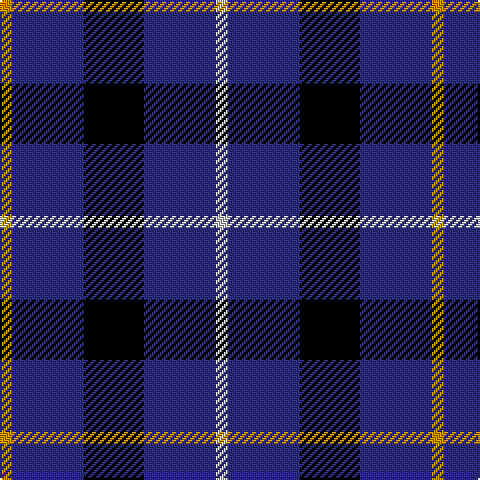

**Bands:** [WBKBY](/stripes/wbkby/) · **Stripes:** [LB DB K DB LO](/stripes/stripes5/) LB DB K DB LO

This was sourced from register-of-tartans.  It is a [5 band tartan](/bands/bands5/).

Original link https://www.tartanregister.gov.uk/tartanDetails.aspx?ref=191

## Attestations

This cloth appears in 2 source records; the oldest owns this page.

- 01/01/1994 — Bank of Scotland (1995) (register-of-tartans, [record](https://www.tartanregister.gov.uk/tartanDetails.aspx?ref=191))
- Jun. 1995 — Bank of Scotland (1995) (Corporate) (tartans-authority, [record](http://www.tartansauthority.com/tartan-ferret/display/2462/))

## Register references

External register numbers recorded for this tartan.

- Scottish Register of Tartans: [191](https://www.tartanregister.gov.uk/tartanDetails.aspx?ref=191)
- Scottish Tartans Authority (ITI): 2462
- Scottish Tartans World Register: 2462

## Thread count
DY/6 DBa36 K30 DBa36 N/6

## Palette
Each colour and its ΔE from the base-6 reference it is a variant of.

| Colour | Shade | Base | ΔE (OKLab) |
|---|---|---|---|
| B | <code style="background-color:#788CB4;">#788CB4</code> `#788CB4` | B <code style="background-color:#2A418A;">#2A418A</code> | 0.25 |
| DB | <code style="background-color:#000064;">#000064</code> `#000064` | B <code style="background-color:#2A418A;">#2A418A</code> | 0.18 |
| DBa | <code style="background-color:#2C2C80;">#2C2C80</code> `#2C2C80` | B <code style="background-color:#2A418A;">#2A418A</code> | 0.06 |
| DR | <code style="background-color:#8C0000;">#8C0000</code> `#8C0000` | R <code style="background-color:#CC0000;">#CC0000</code> | 0.14 |
| DY | <code style="background-color:#C88C00;">#C88C00</code> `#C88C00` | Y <code style="background-color:#F2BF00;">#F2BF00</code> | 0.15 |
| G | <code style="background-color:#007800;">#007800</code> `#007800` | G <code style="background-color:#006100;">#006100</code> | 0.07 |
| K | <code style="background-color:#000000;">#000000</code> `#000000` | K <code style="background-color:#000000;">#000000</code> | 0.00 |
| N | <code style="background-color:#C8C8C8;">#C8C8C8</code> `#C8C8C8` | W <code style="background-color:#F7F7F7;">#F7F7F7</code> | 0.14 |
| P | <code style="background-color:#64008C;">#64008C</code> `#64008C` | B <code style="background-color:#2A418A;">#2A418A</code> | 0.14 |

# Sample pattern

## Nearest tartans

The nearest existing variants by ΔTartan distance.

1. [Bank of Scotland](/setts/s5/ly4db24k23db30w4~x2/) — ΔT 1.00
1. [H.M.S. DUNCAN](/setts/s6/o3k15r2k15n15p3~x2/) — ΔT 1.36
1. [Baptist Union of Scotland](/setts/s6/lb4db23g16k4db23lo4/) — ΔT 1.39
1. [College of Radiographers](/setts/s5/k15lo2k10db18lb3~x2/) — ΔT 1.41
1. [College of Radiographers Corporate Tartan Tartan Number: 1274. Earliest known date: 1988 Marketed in Edinburgh around 1930s but no longer seen. See products available Copyright © Blair Urquhart, Comrie, 2015](/setts/s5/k15ly2k10db18w3~x2/) — ΔT 1.45
1. [Burberry Blue](/setts/s5/lr3k3lr3k10r1~x6/) — ΔT 1.58
1. [Allen, Nicholas (Personal)](/setts/s6/r8k24db10k5db10k5~x2/) — ΔT 1.61
1. [Ancient Atlantic](/setts/s6/ly1db6k1dy5db6w1~x4/) — ΔT 1.66
1. [Murray Taylor](/setts/s6/db3t3db16t16db16w3~x2/) — ΔT 1.67
1. [College of Radiographers](/setts/s5/k15y2k10db18w3~x2/) — ΔT 1.69

## Neighbour map

Every grey dot is one of 14313 variants placed by the first two principal components of the ΔTartan feature space (44% of its variance). Red is this tartan; blue dots are its nearest — click one to open its page.

<svg viewBox="0 0 640 380" role="img" style="max-width:100%;height:auto;border:1px solid #e0e0e0;border-radius:4px;display:block" xmlns="http://www.w3.org/2000/svg"><image href="/nn/cloud.v1.png" width="640" height="380"/><a href="/setts/s5/ly4db24k23db30w4~x2/"><circle cx="311.0" cy="260.5" r="4" fill="#3465a4"><title>Bank of Scotland</title></circle></a><a href="/setts/s6/o3k15r2k15n15p3~x2/"><circle cx="251.9" cy="221.1" r="4" fill="#3465a4"><title>H.M.S. DUNCAN</title></circle></a><a href="/setts/s6/lb4db23g16k4db23lo4/"><circle cx="274.6" cy="235.0" r="4" fill="#3465a4"><title>Baptist Union of Scotland</title></circle></a><a href="/setts/s5/k15lo2k10db18lb3~x2/"><circle cx="273.6" cy="252.8" r="4" fill="#3465a4"><title>College of Radiographers</title></circle></a><a href="/setts/s5/k15ly2k10db18w3~x2/"><circle cx="267.3" cy="244.8" r="4" fill="#3465a4"><title>College of Radiographers Corporate Tartan Tartan Number: 1274. Earliest known date: 1988 Marketed in Edinburgh around 1930s but no longer seen. See products available Copyright © Blair Urquhart, Comrie, 2015</title></circle></a><a href="/setts/s5/lr3k3lr3k10r1~x6/"><circle cx="351.6" cy="236.6" r="4" fill="#3465a4"><title>Burberry Blue</title></circle></a><a href="/setts/s6/r8k24db10k5db10k5~x2/"><circle cx="252.3" cy="276.6" r="4" fill="#3465a4"><title>Allen, Nicholas (Personal)</title></circle></a><a href="/setts/s6/ly1db6k1dy5db6w1~x4/"><circle cx="271.8" cy="229.4" r="4" fill="#3465a4"><title>Ancient Atlantic</title></circle></a><a href="/setts/s6/db3t3db16t16db16w3~x2/"><circle cx="323.6" cy="272.0" r="4" fill="#3465a4"><title>Murray Taylor</title></circle></a><a href="/setts/s5/k15y2k10db18w3~x2/"><circle cx="250.4" cy="240.3" r="4" fill="#3465a4"><title>College of Radiographers</title></circle></a><circle cx="296.0" cy="263.0" r="5" fill="#c00000"/></svg>

ID: /setts/s5/lb1db6k5db6lo1~x6/
