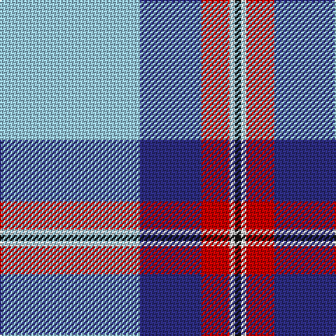

In pattern [KWRBW](/stripes/kwrbw/).

This was sourced from tartans-authority.  It is a [5 stripe tartan](/stripes/stripes5/).

Original link http://www.tartansauthority.com/tartan-ferret/display/10420/

## Thread count
LB/100 DB44 R20 LN4 K/4

## Palette
Each colour and its ΔE from the base-6 reference it is a variant of.

| Colour | Shade | Base | ΔE (OKLab) |
|---|---|---|---|
| DB | <code style="background-color:#2C2C80;">#2C2C80</code> `#2C2C80` | B <code style="background-color:#2A418A;">#2A418A</code> | 0.06 |
| K | <code style="background-color:#101010;">#101010</code> `#101010` | K <code style="background-color:#000000;">#000000</code> | 0.17 |
| LB | <code style="background-color:#98C8E8;">#98C8E8</code> `#98C8E8` | W <code style="background-color:#F7F7F7;">#F7F7F7</code> | 0.18 |
| LN | <code style="background-color:#E0E0E0;">#E0E0E0</code> `#E0E0E0` | W <code style="background-color:#F7F7F7;">#F7F7F7</code> | 0.07 |
| R | <code style="background-color:#C80000;">#C80000</code> `#C80000` | R <code style="background-color:#CC0000;">#CC0000</code> | 0.01 |

# Sample pattern

## Nearest tartans

The nearest existing variants by ΔTartan distance.

1. [Mount Vernon Primary School](/setts/s5/lt25db11r5w1k1~x4/) — ΔT 0.60
1. [Jack Sinclair (Personal)](/setts/s7/b4r2b40k11g2w16r2~x2/) — ΔT 0.97
1. [Gothenburg/Goteborg](/setts/s7/db26w28db14ly3k1ly2k1~x2/) — ΔT 1.27
1. [Kinloch of Loch Awe (Personal)](/setts/s5/w18o29t2dp3k1~x2/) — ΔT 1.33
1. [Gothenburg](/setts/s7/b26w28b14ly3k1ly2k1~x2/) — ΔT 1.36
1. [Prehospital EMS (Corporate)](/setts/s5/k1w7lo7b16ly1~x4/) — ΔT 1.36
1. [Herriot (New Zealand) (Name)](/setts/s6/w15ly2dt5lr3t40dt10/) — ΔT 1.43
1. [Tartan Lassie (Fashion)](/setts/s6/w3b23lr44b26g4ly2~x2/) — ΔT 1.47
1. [Herriot New Zealand](/setts/s6/w15ly2k5lb3b40k10/) — ΔT 1.53
1. [Cornish, National Day](/setts/s5/k5w2ly36b47r3~x2/) — ΔT 1.54

## Neighbour map

Every grey dot is one of 14299 variants placed by the first two principal components of the ΔTartan feature space (44% of its variance). Red is this tartan; blue dots are its nearest — click one to open its page.

<svg viewBox="0 0 640 380" role="img" style="max-width:100%;height:auto;border:1px solid #e0e0e0;border-radius:4px;display:block" xmlns="http://www.w3.org/2000/svg"><image href="/nn/cloud.v1.png" width="640" height="380"/><a href="/setts/s5/lt25db11r5w1k1~x4/"><circle cx="300.9" cy="132.8" r="4" fill="#3465a4"><title>Mount Vernon Primary School</title></circle></a><a href="/setts/s7/b4r2b40k11g2w16r2~x2/"><circle cx="287.2" cy="119.3" r="4" fill="#3465a4"><title>Jack Sinclair (Personal)</title></circle></a><a href="/setts/s7/db26w28db14ly3k1ly2k1~x2/"><circle cx="309.0" cy="132.3" r="4" fill="#3465a4"><title>Gothenburg/Goteborg</title></circle></a><a href="/setts/s5/w18o29t2dp3k1~x2/"><circle cx="324.3" cy="131.4" r="4" fill="#3465a4"><title>Kinloch of Loch Awe (Personal)</title></circle></a><a href="/setts/s7/b26w28b14ly3k1ly2k1~x2/"><circle cx="313.4" cy="134.0" r="4" fill="#3465a4"><title>Gothenburg</title></circle></a><a href="/setts/s5/k1w7lo7b16ly1~x4/"><circle cx="237.6" cy="163.2" r="4" fill="#3465a4"><title>Prehospital EMS (Corporate)</title></circle></a><a href="/setts/s6/w15ly2dt5lr3t40dt10/"><circle cx="295.0" cy="152.8" r="4" fill="#3465a4"><title>Herriot (New Zealand) (Name)</title></circle></a><a href="/setts/s6/w3b23lr44b26g4ly2~x2/"><circle cx="290.6" cy="148.8" r="4" fill="#3465a4"><title>Tartan Lassie (Fashion)</title></circle></a><a href="/setts/s6/w15ly2k5lb3b40k10/"><circle cx="252.3" cy="138.4" r="4" fill="#3465a4"><title>Herriot New Zealand</title></circle></a><a href="/setts/s5/k5w2ly36b47r3~x2/"><circle cx="288.3" cy="134.2" r="4" fill="#3465a4"><title>Cornish, National Day</title></circle></a><circle cx="315.2" cy="135.8" r="5" fill="#c00000"/></svg>

ID: /setts/s5/lb25db11r5w1k1~x4/
