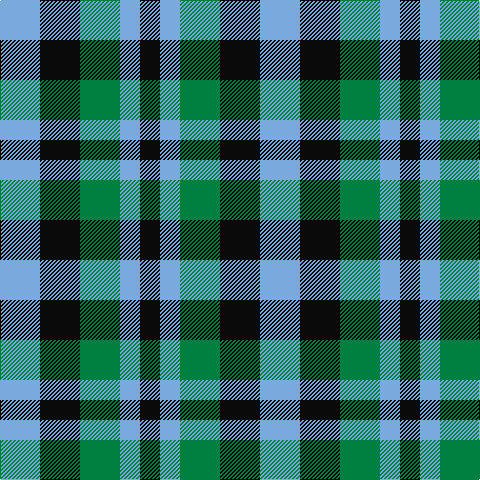

This page is one **sett** — a single exact thread-count. It belongs to the [tartan](/tartans/lb2k2g2lb1k1/)
(the same proportion at any scale), whose colour order is pattern [KWGKW](/stripes/kwgkw/).

Sourced from register-of-tartans.  It is a [5 stripe tartan](/stripes/stripes5/).

Original link https://www.tartanregister.gov.uk/tartanDetails.aspx?ref=10169

## Register references

External register numbers recorded for this tartan.

- Scottish Register of Tartans: [10169](https://www.tartanregister.gov.uk/tartanDetails.aspx?ref=10169)

## Thread count
LB/40 K40 G40 LB20 K/20

## Palette
Each colour and the base-6 reference it is a variant of.

| Colour | Shade | Base |
|---|---|---|
| G | <code style="background-color:#008040;">#008040</code> `oklch(52.5% 0.138 152.2)` <small>#008040</small> | G <code style="background-color:#006100;">#006100</code> |
| K | <code style="background-color:#0A0A0A;">#0A0A0A</code> `oklch(14.5% 0.000 89.9)` <small>#0A0A0A</small> | K <code style="background-color:#000000;">#000000</code> |
| LB | <code style="background-color:#7AA9DD;">#7AA9DD</code> `oklch(72.1% 0.091 251.6)` <small>#7AA9DD</small> | W <code style="background-color:#F7F7F7;">#F7F7F7</code> |

# Sample pattern

## Nearest tartans

The nearest existing variants by ΔTartan distance, with this tartan at the top so the swatches line up against it.

ΔTartan

Tartan

Sett

—

<a href="/ttd/edit/#slug=lb2k2g2lb1k1~x20">Shepherd, Derek (Wandering)</a> <a class="nn-out" href="/setts/s5/lb2k2g2lb1k1~x20/" title="open its dictionary page">↗</a>

1.54

<a href="/ttd/edit/#slug=t3o6k4t2~x2">Bedford Check</a> <a class="nn-out" href="/setts/s4/t3o6k4t2~x2/" title="open its dictionary page">↗</a>

1.58

<a href="/ttd/edit/#slug=do12k8t15w8~x2">Equity Vision Ltd</a> <a class="nn-out" href="/setts/s4/do12k8t15w8~x2/" title="open its dictionary page">↗</a>

1.63

<a href="/ttd/edit/#slug=dg8k8dg8ly6k3ly6~x2">Hage-West (Personal)</a> <a class="nn-out" href="/setts/s6/dg8k8dg8ly6k3ly6~x2/" title="open its dictionary page">↗</a>

1.70

<a href="/ttd/edit/#slug=g3k2db2~x4">Glenlyon #2</a> <a class="nn-out" href="/setts/s3/g3k2db2~x4/" title="open its dictionary page">↗</a>

1.85

<a href="/ttd/edit/#slug=lo5db5k3~x4">Kazakhstan Relic (Artefact)</a> <a class="nn-out" href="/setts/s3/lo5db5k3~x4/" title="open its dictionary page">↗</a>

1.85

<a href="/ttd/edit/#slug=k5g4t3~x2">Glen Lyon (District)</a> <a class="nn-out" href="/setts/s3/k5g4t3~x2/" title="open its dictionary page">↗</a>

1.85

<a href="/ttd/edit/#slug=dp3k3dp3dg6ly2~x2">Austin (Wilson's No 173)</a> <a class="nn-out" href="/setts/s5/dp3k3dp3dg6ly2~x2/" title="open its dictionary page">↗</a>

1.88

<a href="/ttd/edit/#slug=p3k3p3g6ly2~x2">Austin / Wilson's No 173</a> <a class="nn-out" href="/setts/s5/p3k3p3g6ly2~x2/" title="open its dictionary page">↗</a>

1.93

<a href="/ttd/edit/#slug=db18t18lo28dt13~x2">Gold Country (California)</a> <a class="nn-out" href="/setts/s4/db18t18lo28dt13~x2/" title="open its dictionary page">↗</a>

2.01

<a href="/ttd/edit/#slug=g3dp3w1dp3g3r1~x4">Wilson's No.113</a> <a class="nn-out" href="/setts/s6/g3dp3w1dp3g3r1~x4/" title="open its dictionary page">↗</a>

## Neighbour map

Every grey dot is one of 14299 variants placed by the first two principal components of the ΔTartan feature space (44% of its variance). Red is this tartan; blue dots are its nearest — click one to open its page.

<svg viewBox="0 0 640 380" role="img" style="max-width:100%;height:auto;border:1px solid #e0e0e0;border-radius:4px;display:block" xmlns="http://www.w3.org/2000/svg"><image href="/nn/cloud.v1.png" width="640" height="380"/><a href="/setts/s4/t3o6k4t2~x2/"><circle cx="149.4" cy="333.8" r="4" fill="#3465a4"><title>Bedford Check</title></circle></a><a href="/setts/s4/do12k8t15w8~x2/"><circle cx="24.5" cy="332.5" r="4" fill="#3465a4"><title>Equity Vision Ltd</title></circle></a><a href="/setts/s6/dg8k8dg8ly6k3ly6~x2/"><circle cx="90.8" cy="319.7" r="4" fill="#3465a4"><title>Hage-West (Personal)</title></circle></a><a href="/setts/s3/g3k2db2~x4/"><circle cx="89.4" cy="366.0" r="4" fill="#3465a4"><title>Glenlyon #2</title></circle></a><a href="/setts/s3/lo5db5k3~x4/"><circle cx="94.3" cy="366.0" r="4" fill="#3465a4"><title>Kazakhstan Relic (Artefact)</title></circle></a><a href="/setts/s3/k5g4t3~x2/"><circle cx="111.9" cy="366.0" r="4" fill="#3465a4"><title>Glen Lyon (District)</title></circle></a><a href="/setts/s5/dp3k3dp3dg6ly2~x2/"><circle cx="93.6" cy="304.0" r="4" fill="#3465a4"><title>Austin (Wilson's No 173)</title></circle></a><a href="/setts/s5/p3k3p3g6ly2~x2/"><circle cx="71.4" cy="288.6" r="4" fill="#3465a4"><title>Austin / Wilson's No 173</title></circle></a><a href="/setts/s4/db18t18lo28dt13~x2/"><circle cx="54.8" cy="329.7" r="4" fill="#3465a4"><title>Gold Country (California)</title></circle></a><a href="/setts/s6/g3dp3w1dp3g3r1~x4/"><circle cx="148.9" cy="296.7" r="4" fill="#3465a4"><title>Wilson's No.113</title></circle></a><circle cx="81.5" cy="342.4" r="5" fill="#c00000"/></svg>

ID: /setts/s5/lb2k2g2lb1k1~x20/
