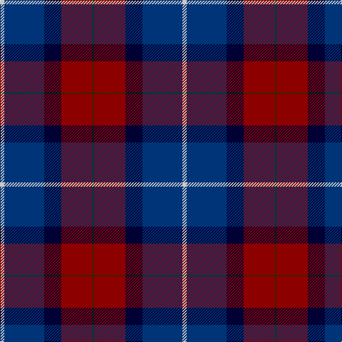

This page is one **sett** — a single exact thread-count. It belongs to the [tartan](/tartans/lb3db28k12r22dg1/)
(the same proportion at any scale), whose colour order is pattern [GRKBW](/stripes/grkbw/).

Sourced from tartans-authority.  It is a [5 stripe tartan](/stripes/stripes5/).

Original link http://www.tartansauthority.com/tartan-ferret/display/2690/

## Register references

External register numbers recorded for this tartan.

- Scottish Tartans Authority (ITI): 2690

## Thread count
N/6 DBa56 DB24 DR44 G/2

## Palette

Palette: <strong>Tartan Register</strong> <small style="color:#888">(1 of 5 colours)</small>
<table><thead><tr><th>Colour</th><th>Threads</th><th>Shade</th><th>Base</th><th>OKLCh</th></tr></thead><tbody><tr><td>N/</td><td style="text-align:right;font-variant-numeric:tabular-nums">6</td><td><code style="background-color:#C8C8C8;">#C8C8C8</code> <small style="color:#888">#C8C8C8</small></td><td>W <code style="background-color:#F7F7F7;">#F7F7F7</code></td><td><small style="color:#888">oklch(83.3% 0.000 89.9)</small></td></tr><tr><td>DBa</td><td style="text-align:right;font-variant-numeric:tabular-nums">56</td><td><code style="background-color:#003478;">#003478</code> <small style="color:#888">#003478</small></td><td>B <code style="background-color:#2A418A;">#2A418A</code></td><td><small style="color:#888">oklch(34.1% 0.127 258.1)</small></td></tr><tr><td>DB</td><td style="text-align:right;font-variant-numeric:tabular-nums">24</td><td><code style="background-color:#000034;">#000034</code> <small style="color:#888">#000034</small></td><td>K <code style="background-color:#000000;">#000000</code></td><td><small style="color:#888">oklch(14.7% 0.102 264.1)</small></td></tr><tr><td>DR</td><td style="text-align:right;font-variant-numeric:tabular-nums">44</td><td><code style="background-color:#8C0000;">#8C0000</code> <small style="color:#888">#8C0000</small></td><td>R <code style="background-color:#CC0000;">#CC0000</code></td><td><small style="color:#888">oklch(40.2% 0.165 29.2)</small></td></tr><tr><td>G/</td><td style="text-align:right;font-variant-numeric:tabular-nums">2</td><td><code style="background-color:#003800;">#003800</code> <small style="color:#888">#003800</small></td><td>G <code style="background-color:#006100;">#006100</code></td><td><small style="color:#888">oklch(29.5% 0.100 142.5)</small></td></tr></tbody></table>

# Sample pattern

## Nearest tartans

The nearest existing variants by ΔTartan distance, with this tartan at the top so the swatches line up against it.

ΔTartan

Tartan

Sett

—

<a href="/ttd/edit/#slug=lb3db28k12r22dg1~x2">Diaspora (Fashion)</a> <a class="nn-out" href="/setts/s5/lb3db28k12r22dg1~x2/" title="open its dictionary page">↗</a>

0.56

<a href="/ttd/edit/#slug=db3dg1r22k12db28lb3~x2">Diaspora</a> <a class="nn-out" href="/setts/s6/db3dg1r22k12db28lb3~x2/" title="open its dictionary page">↗</a>

0.96

<a href="/ttd/edit/#slug=o3ri18k2dg18k24r1~x2">205 (Scottish) Field Hospital (Mil.)</a> <a class="nn-out" href="/setts/s6/o3ri18k2dg18k24r1~x2/" title="open its dictionary page">↗</a>

0.99

<a href="/ttd/edit/#slug=dp72k40dg23r4dg23k2w4~x2">Ferguson Unidentified</a> <a class="nn-out" href="/setts/s7/dp72k40dg23r4dg23k2w4~x2/" title="open its dictionary page">↗</a>

1.02

<a href="/ttd/edit/#slug=dt3dg1r24dt16db28w3~x2">Diaspora</a> <a class="nn-out" href="/setts/s6/dt3dg1r24dt16db28w3~x2/" title="open its dictionary page">↗</a>

1.27

<a href="/ttd/edit/#slug=db19k8lb1g10m3~x2">Unidentified #50</a> <a class="nn-out" href="/setts/s5/db19k8lb1g10m3~x2/" title="open its dictionary page">↗</a>

1.38

<a href="/ttd/edit/#slug=db37o18k37r2k2r2~x2">Hakkarain Personal Finnish Tartan Tartan Number: 6110. Earliest known date: 2003 A personal tartan designed by Jari Hakkarainen of Porvoo in Finland. See products available Copyright © Blair Urquhart, Comrie, 2015</a> <a class="nn-out" href="/setts/s6/db37o18k37r2k2r2~x2/" title="open its dictionary page">↗</a>

1.45

<a href="/ttd/edit/#slug=dt22k16ly4k11dp2n1~x4">Martinez, Clément (Personal)</a> <a class="nn-out" href="/setts/s6/dt22k16ly4k11dp2n1~x4/" title="open its dictionary page">↗</a>

1.46

<a href="/ttd/edit/#slug=r6db32k18g28k1lb2~x2">Naysmith (Name)</a> <a class="nn-out" href="/setts/s6/r6db32k18g28k1lb2~x2/" title="open its dictionary page">↗</a>

1.50

<a href="/ttd/edit/#slug=db4dg2r18ri10dg10db29b4~x2">Ross Dempster (Personal)</a> <a class="nn-out" href="/setts/s7/db4dg2r18ri10dg10db29b4~x2/" title="open its dictionary page">↗</a>

1.50

<a href="/ttd/edit/#slug=w4b44db19dbi44r2~x2">World Federation of Building Contractors</a> <a class="nn-out" href="/setts/s5/w4b44db19dbi44r2~x2/" title="open its dictionary page">↗</a>

## Neighbour map

Every grey dot is one of 14359 variants placed by the first two principal components of the ΔTartan feature space (44% of its variance). Red is this tartan; blue dots are its nearest — click one to open its page.

<svg viewBox="0 0 640 380" role="img" style="max-width:100%;height:auto;border:1px solid #e0e0e0;border-radius:4px;display:block" xmlns="http://www.w3.org/2000/svg"><image href="/nn/cloud.v1.png" width="640" height="380"/><a href="/setts/s6/db3dg1r22k12db28lb3~x2/"><circle cx="281.6" cy="166.4" r="4" fill="#3465a4"><title>Diaspora</title></circle></a><a href="/setts/s6/o3ri18k2dg18k24r1~x2/"><circle cx="247.0" cy="180.5" r="4" fill="#3465a4"><title>205 (Scottish) Field Hospital (Mil.)</title></circle></a><a href="/setts/s7/dp72k40dg23r4dg23k2w4~x2/"><circle cx="281.1" cy="145.0" r="4" fill="#3465a4"><title>Ferguson Unidentified</title></circle></a><a href="/setts/s6/dt3dg1r24dt16db28w3~x2/"><circle cx="242.9" cy="159.1" r="4" fill="#3465a4"><title>Diaspora</title></circle></a><a href="/setts/s5/db19k8lb1g10m3~x2/"><circle cx="248.3" cy="202.3" r="4" fill="#3465a4"><title>Unidentified #50</title></circle></a><a href="/setts/s6/db37o18k37r2k2r2~x2/"><circle cx="272.7" cy="196.6" r="4" fill="#3465a4"><title>Hakkarain Personal Finnish Tartan Tartan Number: 6110. Earliest known date: 2003 A personal tartan designed by Jari Hakkarainen of Porvoo in Finland. See products available Copyright © Blair Urquhart, Comrie, 2015</title></circle></a><a href="/setts/s6/dt22k16ly4k11dp2n1~x4/"><circle cx="296.3" cy="189.7" r="4" fill="#3465a4"><title>Martinez, Clément (Personal)</title></circle></a><a href="/setts/s6/r6db32k18g28k1lb2~x2/"><circle cx="234.1" cy="168.0" r="4" fill="#3465a4"><title>Naysmith (Name)</title></circle></a><a href="/setts/s7/db4dg2r18ri10dg10db29b4~x2/"><circle cx="224.6" cy="184.7" r="4" fill="#3465a4"><title>Ross Dempster (Personal)</title></circle></a><a href="/setts/s5/w4b44db19dbi44r2~x2/"><circle cx="264.9" cy="202.9" r="4" fill="#3465a4"><title>World Federation of Building Contractors</title></circle></a><circle cx="264.2" cy="180.7" r="5" fill="#c00000"/></svg>

ID: /setts/s5/lb3db28k12r22dg1~x2/
