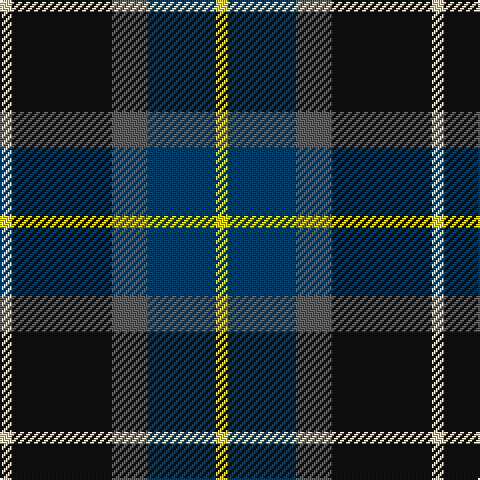

**Bands:** [WKBBY](/stripes/wkbby/) · **Stripes:** [LB K N DT LY](/stripes/stripes5/) LB K N DT LY

This was sourced from tartans-authority.  It is a [5 band tartan](/bands/bands5/).

Original link http://www.tartansauthority.com/tartan-ferret/display/10792/

## Thread count
LR/6 K50 N18 DB34 Y/6

## Palette
Each colour and its ΔE from the base-6 reference it is a variant of.

| Colour | Shade | Base | ΔE (OKLab) |
|---|---|---|---|
| DB | <code style="background-color:#003C64;">#003C64</code> `#003C64` | B <code style="background-color:#2A418A;">#2A418A</code> | 0.08 |
| K | <code style="background-color:#101010;">#101010</code> `#101010` | K <code style="background-color:#000000;">#000000</code> | 0.17 |
| LR | <code style="background-color:#E8CCB8;">#E8CCB8</code> `#E8CCB8` | W <code style="background-color:#F7F7F7;">#F7F7F7</code> | 0.12 |
| N | <code style="background-color:#5C5C5C;">#5C5C5C</code> `#5C5C5C` | B <code style="background-color:#2A418A;">#2A418A</code> | 0.15 |
| Y | <code style="background-color:#FCCC00;">#FCCC00</code> `#FCCC00` | Y <code style="background-color:#F2BF00;">#F2BF00</code> | 0.04 |

# Sample pattern

## Nearest tartans

The nearest existing variants by ΔTartan distance.

1. [Teylu Coleman (Cornwall)](/setts/s5/ly3dp17do9k25w3~x2/) — ΔT 0.61
1. [Stovell (2015)](/setts/s6/db15r6dg8k2w2k2~x6/) — ΔT 0.73
1. [MacPhail Hunting #2](/setts/s6/r4db24k12g14k4lb3~x2/) — ΔT 0.81
1. [Wellington No 229](/setts/s5/k4t3dp11dg14w2~x2/) — ΔT 0.81
1. [Douglas, brown](/setts/s5/k7t3o30dt30w3~x2/) — ΔT 0.84
1. [Paterson Blue (Personal)](/setts/s6/db22w2k10g11r3g4~x2/) — ΔT 0.85
1. [Rose Hunting](/setts/s6/k4w1g10k10db10r2~x4/) — ΔT 0.88
1. [Lyle and Scott](/setts/s6/dg5db2dg9db19dr9ly2~x2/) — ΔT 0.92
1. [Midlothian](/setts/s6/db31b4db5k19g20ly4~x2/) — ΔT 0.94
1. [Rose Hunting Clan Tartan Tartan Number: 1226. Earliest known date: 1831 First recorded in James Logan's, 'The Scottish Gael' in 1831. See products available Copyright © Blair Urquhart, Comrie, 2015](/setts/s6/k4w1g10k10db10r2~x2/) — ΔT 0.94

## Neighbour map

Every grey dot is one of 14313 variants placed by the first two principal components of the ΔTartan feature space (44% of its variance). Red is this tartan; blue dots are its nearest — click one to open its page.

<svg viewBox="0 0 640 380" role="img" style="max-width:100%;height:auto;border:1px solid #e0e0e0;border-radius:4px;display:block" xmlns="http://www.w3.org/2000/svg"><image href="/nn/cloud.v1.png" width="640" height="380"/><a href="/setts/s5/ly3dp17do9k25w3~x2/"><circle cx="198.3" cy="221.8" r="4" fill="#3465a4"><title>Teylu Coleman (Cornwall)</title></circle></a><a href="/setts/s6/db15r6dg8k2w2k2~x6/"><circle cx="182.1" cy="210.5" r="4" fill="#3465a4"><title>Stovell (2015)</title></circle></a><a href="/setts/s6/r4db24k12g14k4lb3~x2/"><circle cx="172.3" cy="220.7" r="4" fill="#3465a4"><title>MacPhail Hunting #2</title></circle></a><a href="/setts/s5/k4t3dp11dg14w2~x2/"><circle cx="172.9" cy="231.0" r="4" fill="#3465a4"><title>Wellington No 229</title></circle></a><a href="/setts/s5/k7t3o30dt30w3~x2/"><circle cx="216.4" cy="201.7" r="4" fill="#3465a4"><title>Douglas, brown</title></circle></a><a href="/setts/s6/db22w2k10g11r3g4~x2/"><circle cx="203.9" cy="204.8" r="4" fill="#3465a4"><title>Paterson Blue (Personal)</title></circle></a><a href="/setts/s6/k4w1g10k10db10r2~x4/"><circle cx="166.2" cy="223.1" r="4" fill="#3465a4"><title>Rose Hunting</title></circle></a><a href="/setts/s6/dg5db2dg9db19dr9ly2~x2/"><circle cx="202.7" cy="221.6" r="4" fill="#3465a4"><title>Lyle and Scott</title></circle></a><a href="/setts/s6/db31b4db5k19g20ly4~x2/"><circle cx="158.8" cy="208.9" r="4" fill="#3465a4"><title>Midlothian</title></circle></a><a href="/setts/s6/k4w1g10k10db10r2~x2/"><circle cx="170.4" cy="225.3" r="4" fill="#3465a4"><title>Rose Hunting Clan Tartan Tartan Number: 1226. Earliest known date: 1831 First recorded in James Logan's, 'The Scottish Gael' in 1831. See products available Copyright © Blair Urquhart, Comrie, 2015</title></circle></a><circle cx="192.0" cy="221.7" r="5" fill="#c00000"/></svg>

ID: /setts/s5/lb3k25n9dt17ly3~x2/
