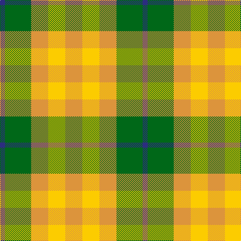

**Bands:** [BGYYY](/stripes/bgyyy/) · **Stripes:** [DB G LO LY LO](/stripes/stripes5/) DB G LO LY LO

This was sourced from tartans-authority.  It is a [5 band tartan](/bands/bands5/).

Original link http://www.tartansauthority.com/tartan-ferret/display/10933/

## Thread count
DB/10 G52 O34 Y34 O/34

## Palette
Each colour and its ΔE from the base-6 reference it is a variant of.

| Colour | Shade | Base | ΔE (OKLab) |
|---|---|---|---|
| DB | <code style="background-color:#2C2C80;">#2C2C80</code> `#2C2C80` | B <code style="background-color:#2A418A;">#2A418A</code> | 0.06 |
| G | <code style="background-color:#006818;">#006818</code> `#006818` | G <code style="background-color:#006100;">#006100</code> | 0.02 |
| O | <code style="background-color:#DC943C;">#DC943C</code> `#DC943C` | Y <code style="background-color:#F2BF00;">#F2BF00</code> | 0.12 |
| Y | <code style="background-color:#FCCC00;">#FCCC00</code> `#FCCC00` | Y <code style="background-color:#F2BF00;">#F2BF00</code> | 0.04 |

# Sample pattern

## Nearest tartans

The nearest existing variants by ΔTartan distance.

1. [Unidentified, Silk Plaid](/setts/s5/db7o8g15ly6y3~x10/) — ΔT 1.42
1. [Wild Mustard Dreams](/setts/s5/lo17ly17o17g26b5~x2/) — ΔT 1.55
1. [MacKinnon, dress](/setts/s4/g9o7w7r1~x4/) — ΔT 1.56
1. [Wilson's No.203](/setts/s4/t2r4g5ly1~x4/) — ΔT 1.56
1. [Spirit of Riverside (Corporate)](/setts/s4/o20w13ly24k3~x2/) — ΔT 1.60
1. [Unidentified Silk Plaid](/setts/s5/db7o8dg15ly6lo3~x10/) — ΔT 1.80
1. [Omani Regiment 2nd Pipe Sqn.](/setts/s6/g23r23w9r23g23w9~x2/) — ΔT 1.81
1. [Tulsa](/setts/s6/r14k3r14g13db8g13~x2/) — ΔT 1.88
1. [Londonderry](/setts/s7/r6k2g12lo8r5k2g3~x4/) — ΔT 1.96
1. [Pilgrims (Bedford)](/setts/s4/g3ly6dg4g2~x2/) — ΔT 1.98

## Neighbour map

Every grey dot is one of 14313 variants placed by the first two principal components of the ΔTartan feature space (44% of its variance). Red is this tartan; blue dots are its nearest — click one to open its page.

<svg viewBox="0 0 640 380" role="img" style="max-width:100%;height:auto;border:1px solid #e0e0e0;border-radius:4px;display:block" xmlns="http://www.w3.org/2000/svg"><image href="/nn/cloud.v1.png" width="640" height="380"/><a href="/setts/s5/db7o8g15ly6y3~x10/"><circle cx="98.1" cy="245.9" r="4" fill="#3465a4"><title>Unidentified, Silk Plaid</title></circle></a><a href="/setts/s5/lo17ly17o17g26b5~x2/"><circle cx="66.7" cy="253.4" r="4" fill="#3465a4"><title>Wild Mustard Dreams</title></circle></a><a href="/setts/s4/g9o7w7r1~x4/"><circle cx="149.6" cy="246.9" r="4" fill="#3465a4"><title>MacKinnon, dress</title></circle></a><a href="/setts/s4/t2r4g5ly1~x4/"><circle cx="177.5" cy="277.1" r="4" fill="#3465a4"><title>Wilson's No.203</title></circle></a><a href="/setts/s4/o20w13ly24k3~x2/"><circle cx="183.4" cy="249.9" r="4" fill="#3465a4"><title>Spirit of Riverside (Corporate)</title></circle></a><a href="/setts/s5/db7o8dg15ly6lo3~x10/"><circle cx="92.0" cy="242.2" r="4" fill="#3465a4"><title>Unidentified Silk Plaid</title></circle></a><a href="/setts/s6/g23r23w9r23g23w9~x2/"><circle cx="137.6" cy="303.0" r="4" fill="#3465a4"><title>Omani Regiment 2nd Pipe Sqn.</title></circle></a><a href="/setts/s6/r14k3r14g13db8g13~x2/"><circle cx="165.2" cy="281.7" r="4" fill="#3465a4"><title>Tulsa</title></circle></a><a href="/setts/s7/r6k2g12lo8r5k2g3~x4/"><circle cx="149.0" cy="224.5" r="4" fill="#3465a4"><title>Londonderry</title></circle></a><a href="/setts/s4/g3ly6dg4g2~x2/"><circle cx="121.7" cy="316.6" r="4" fill="#3465a4"><title>Pilgrims (Bedford)</title></circle></a><circle cx="146.1" cy="273.1" r="5" fill="#c00000"/></svg>

ID: /setts/s5/lo17ly17lo17g26db5~x2/
