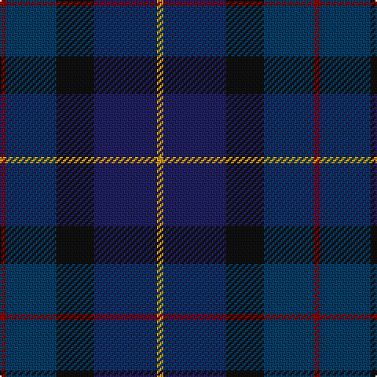

**Bands:** [RBKBY](/stripes/rbkby/) · **Stripes:** [R DT K DB LO](/stripes/stripes5/) R DT K DB LO

This was sourced from register-of-tartans.  It is a [5 band tartan](/bands/bands5/).

Original link https://www.tartanregister.gov.uk/tartanDetails.aspx?ref=3651

## Attestations

This cloth appears in 2 source records; the oldest owns this page.

- 01/12/1999 — Sanix Modern (register-of-tartans, [record](https://www.tartanregister.gov.uk/tartanDetails.aspx?ref=3651))
- Dec. 1999 — Sanix Modern (Fashion) (tartans-authority, [record](http://www.tartansauthority.com/tartan-ferret/display/2643/))

## Register references

External register numbers recorded for this tartan.

- Scottish Register of Tartans: [3651](https://www.tartanregister.gov.uk/tartanDetails.aspx?ref=3651)
- Scottish Tartans Authority (ITI): 2643
- Scottish Tartans World Register: 2643

## Thread count
DR/4 DBa32 K24 DB40 DY/4

## Palette
Each colour and its ΔE from the base-6 reference it is a variant of.

| Colour | Shade | Base | ΔE (OKLab) |
|---|---|---|---|
| DB | <code style="background-color:#202060;">#202060</code> `#202060` | B <code style="background-color:#2A418A;">#2A418A</code> | 0.11 |
| DBa | <code style="background-color:#003C64;">#003C64</code> `#003C64` | B <code style="background-color:#2A418A;">#2A418A</code> | 0.08 |
| DR | <code style="background-color:#880000;">#880000</code> `#880000` | R <code style="background-color:#CC0000;">#CC0000</code> | 0.15 |
| DY | <code style="background-color:#D09800;">#D09800</code> `#D09800` | Y <code style="background-color:#F2BF00;">#F2BF00</code> | 0.12 |
| K | <code style="background-color:#101010;">#101010</code> `#101010` | K <code style="background-color:#000000;">#000000</code> | 0.17 |

# Sample pattern

## Nearest tartans

The nearest existing variants by ΔTartan distance.

1. [Bobby Jones (Personal)](/setts/s6/lo1db16dy8dt12dy2r1~x2/) — ΔT 1.42
1. [United Colours of Scotland (Corporat](/setts/s7/dg7db3dg7dt22db22w3db5~x2/) — ΔT 1.59
1. [Rose, Danny and Hanna (Personal)](/setts/s5/dt11db19db38m7k7~x2/) — ΔT 1.61
1. [I Y](/setts/s6/k4dg16k13db16t3db3~x2/) — ΔT 1.63
1. [Balmoral Hotel](/setts/s8/dt17o2dt2o2dt2k17db13k4~x2/) — ΔT 1.65
1. [Dallard (Personal)](/setts/s5/k37dg37n8k3dp5~x2/) — ΔT 1.68
1. [Passion of Scotland, Pewter (Fashion](/setts/s5/n8o3n34k34dp3~x2/) — ΔT 1.69
1. [Hutchesons' Grammar (Corporate)](/setts/s6/t8o4db30dt30r3dt4~x2/) — ΔT 1.69
1. [Bobby Jones (Personal)](/setts/s6/lo1db16dy8k12dy2r1~x2/) — ΔT 1.71
1. [Baron of Crawfordjohn (Personal)](/setts/s7/dt8db10dt22dg7g10dg22dp3~x2/) — ΔT 1.72

## Neighbour map

Every grey dot is one of 14313 variants placed by the first two principal components of the ΔTartan feature space (44% of its variance). Red is this tartan; blue dots are its nearest — click one to open its page.

<svg viewBox="0 0 640 380" role="img" style="max-width:100%;height:auto;border:1px solid #e0e0e0;border-radius:4px;display:block" xmlns="http://www.w3.org/2000/svg"><image href="/nn/cloud.v1.png" width="640" height="380"/><a href="/setts/s6/lo1db16dy8dt12dy2r1~x2/"><circle cx="305.9" cy="228.9" r="4" fill="#3465a4"><title>Bobby Jones (Personal)</title></circle></a><a href="/setts/s7/dg7db3dg7dt22db22w3db5~x2/"><circle cx="289.0" cy="275.2" r="4" fill="#3465a4"><title>United Colours of Scotland (Corporat</title></circle></a><a href="/setts/s5/dt11db19db38m7k7~x2/"><circle cx="292.9" cy="307.5" r="4" fill="#3465a4"><title>Rose, Danny and Hanna (Personal)</title></circle></a><a href="/setts/s6/k4dg16k13db16t3db3~x2/"><circle cx="238.4" cy="310.2" r="4" fill="#3465a4"><title>I Y</title></circle></a><a href="/setts/s8/dt17o2dt2o2dt2k17db13k4~x2/"><circle cx="259.9" cy="248.0" r="4" fill="#3465a4"><title>Balmoral Hotel</title></circle></a><a href="/setts/s5/k37dg37n8k3dp5~x2/"><circle cx="295.9" cy="245.5" r="4" fill="#3465a4"><title>Dallard (Personal)</title></circle></a><a href="/setts/s5/n8o3n34k34dp3~x2/"><circle cx="313.9" cy="246.2" r="4" fill="#3465a4"><title>Passion of Scotland, Pewter (Fashion</title></circle></a><a href="/setts/s6/t8o4db30dt30r3dt4~x2/"><circle cx="279.7" cy="227.8" r="4" fill="#3465a4"><title>Hutchesons' Grammar (Corporate)</title></circle></a><a href="/setts/s6/lo1db16dy8k12dy2r1~x2/"><circle cx="286.0" cy="218.0" r="4" fill="#3465a4"><title>Bobby Jones (Personal)</title></circle></a><a href="/setts/s7/dt8db10dt22dg7g10dg22dp3~x2/"><circle cx="241.8" cy="294.0" r="4" fill="#3465a4"><title>Baron of Crawfordjohn (Personal)</title></circle></a><circle cx="261.3" cy="271.3" r="5" fill="#c00000"/></svg>

ID: /setts/s5/lo1db10k6dt8r1~x4/
