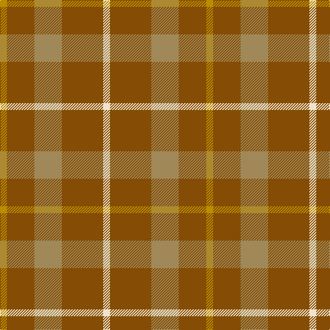

**Bands:** [WRYRY](/stripes/wryry/) · **Stripes:** [W O LO O LO](/stripes/stripes5/) W O LO O LO

This was sourced from tartans-authority.  It is a [5 band tartan](/bands/bands5/).

Original link http://www.tartansauthority.com/tartan-ferret/display/8111/

## Thread count
DY/10 T40 LT40 T60 W/10

## Palette
Each colour and its ΔE from the base-6 reference it is a variant of.

| Colour | Shade | Base | ΔE (OKLab) |
|---|---|---|---|
| DY | <code style="background-color:#BC8C00;">#BC8C00</code> `#BC8C00` | Y <code style="background-color:#F2BF00;">#F2BF00</code> | 0.16 |
| LT | <code style="background-color:#A08858;">#A08858</code> `#A08858` | Y <code style="background-color:#F2BF00;">#F2BF00</code> | 0.21 |
| T | <code style="background-color:#844C04;">#844C04</code> `#844C04` | R <code style="background-color:#CC0000;">#CC0000</code> | 0.15 |
| W | <code style="background-color:#F0E4CC;">#F0E4CC</code> `#F0E4CC` | W <code style="background-color:#F7F7F7;">#F7F7F7</code> | 0.06 |

# Sample pattern

## Nearest tartans

The nearest existing variants by ΔTartan distance.

1. [Burnett of Powis (Personal)](/setts/s8/r3y19ly3y19r3y3r21t3~x2/) — ΔT 1.76
1. [Mowbray (Moubray) Family Tartan Tartan Number: 565. Earliest known date: 1983 Designed C.1984 by Peter MacDonald for a Mr Mowbray in the USA. Sometimes woven with green in place of gray, and blue in place of azure. See products available Copyright © Blair Urquhart, Comrie, 2015](/setts/s5/o16r2o10r15t5~x2/) — ΔT 1.84
1. [Miyuki #4](/setts/s8/lo3dy8lo3dy20lo20r3lo8r3~x2/) — ΔT 1.89
1. [Mowbray, (Moubray)](/setts/s5/y16r2y10r15t5~x2/) — ΔT 1.89
1. [Dohmen Family (Zuid-Nederland)](/setts/s4/g30lo3t8o25~x2/) — ΔT 2.05
1. [Prince of Orange Tartan Tartan Number: 389. Earliest known date: pre 2003 Sales help Princess Diana Memorial Trust See products available Copyright © Blair Urquhart, Comrie, 2015](/setts/s4/t6lo28dy20t3~x2/) — ΔT 2.12
1. [Loch Garth Tartan Tartan Number: 1750. Earliest known date: pre 2003 Nothing See products available Copyright © Blair Urquhart, Comrie, 2015](/setts/s4/dy12lo6dy2ly1~x4/) — ΔT 2.14
1. [Trinity Bicycles](/setts/s5/dy4lg11dy14o30r4~x2/) — ΔT 2.17
1. [Prince of Orange](/setts/s4/t6lo28o20t3~x2/) — ΔT 2.18
1. [Land's End (Unnamed Camel)](/setts/s9/o24dr2o3o6o3dr2dg15o20dr4~x2/) — ΔT 2.22

## Neighbour map

Every grey dot is one of 14313 variants placed by the first two principal components of the ΔTartan feature space (44% of its variance). Red is this tartan; blue dots are its nearest — click one to open its page.

<svg viewBox="0 0 640 380" role="img" style="max-width:100%;height:auto;border:1px solid #e0e0e0;border-radius:4px;display:block" xmlns="http://www.w3.org/2000/svg"><image href="/nn/cloud.v1.png" width="640" height="380"/><a href="/setts/s8/r3y19ly3y19r3y3r21t3~x2/"><circle cx="352.5" cy="225.5" r="4" fill="#3465a4"><title>Burnett of Powis (Personal)</title></circle></a><a href="/setts/s5/o16r2o10r15t5~x2/"><circle cx="369.8" cy="294.5" r="4" fill="#3465a4"><title>Mowbray (Moubray) Family Tartan Tartan Number: 565. Earliest known date: 1983 Designed C.1984 by Peter MacDonald for a Mr Mowbray in the USA. Sometimes woven with green in place of gray, and blue in place of azure. See products available Copyright © Blair Urquhart, Comrie, 2015</title></circle></a><a href="/setts/s8/lo3dy8lo3dy20lo20r3lo8r3~x2/"><circle cx="351.2" cy="255.9" r="4" fill="#3465a4"><title>Miyuki #4</title></circle></a><a href="/setts/s5/y16r2y10r15t5~x2/"><circle cx="374.7" cy="298.4" r="4" fill="#3465a4"><title>Mowbray, (Moubray)</title></circle></a><a href="/setts/s4/g30lo3t8o25~x2/"><circle cx="295.1" cy="258.3" r="4" fill="#3465a4"><title>Dohmen Family (Zuid-Nederland)</title></circle></a><a href="/setts/s4/t6lo28dy20t3~x2/"><circle cx="323.0" cy="261.9" r="4" fill="#3465a4"><title>Prince of Orange Tartan Tartan Number: 389. Earliest known date: pre 2003 Sales help Princess Diana Memorial Trust See products available Copyright © Blair Urquhart, Comrie, 2015</title></circle></a><a href="/setts/s4/dy12lo6dy2ly1~x4/"><circle cx="464.5" cy="263.3" r="4" fill="#3465a4"><title>Loch Garth Tartan Tartan Number: 1750. Earliest known date: pre 2003 Nothing See products available Copyright © Blair Urquhart, Comrie, 2015</title></circle></a><a href="/setts/s5/dy4lg11dy14o30r4~x2/"><circle cx="317.6" cy="270.1" r="4" fill="#3465a4"><title>Trinity Bicycles</title></circle></a><a href="/setts/s4/t6lo28o20t3~x2/"><circle cx="330.2" cy="259.5" r="4" fill="#3465a4"><title>Prince of Orange</title></circle></a><a href="/setts/s9/o24dr2o3o6o3dr2dg15o20dr4~x2/"><circle cx="410.6" cy="212.5" r="4" fill="#3465a4"><title>Land's End (Unnamed Camel)</title></circle></a><circle cx="374.5" cy="285.4" r="5" fill="#c00000"/></svg>

ID: /setts/s5/lo1o4lo4o6w1~x10/
