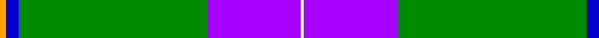
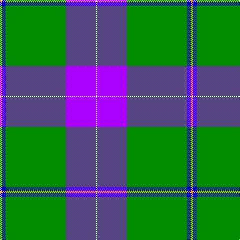

In pattern [WBGBY](/stripes/wbgby/).

This was sourced from register-of-tartans.  It is a [5 stripe tartan](/stripes/stripes5/).

Original link https://www.tartanregister.gov.uk/tartanDetails.aspx?ref=10581

## Register references

External register numbers recorded for this tartan.

- Scottish Register of Tartans: [10581](https://www.tartanregister.gov.uk/tartanDetails.aspx?ref=10581)

## Thread count
Y/4 B8 G120 P60 W/2

## Palette
Each colour and the base-6 reference it is a variant of.

| Colour | Shade | Base |
|---|---|---|
| B | <code style="background-color:#0000CD;">#0000CD</code> `oklch(38.3% 0.266 264.1)` <small>#0000CD</small> | B <code style="background-color:#2A418A;">#2A418A</code> |
| G | <code style="background-color:#008B00;">#008B00</code> `oklch(55.2% 0.188 142.5)` <small>#008B00</small> | G <code style="background-color:#006100;">#006100</code> |
| P | <code style="background-color:#AA00FF;">#AA00FF</code> `oklch(58.1% 0.299 307.0)` <small>#AA00FF</small> | B <code style="background-color:#2A418A;">#2A418A</code> |
| W | <code style="background-color:#FFFFFF;">#FFFFFF</code> `oklch(100.0% 0.000 89.9)` <small>#FFFFFF</small> | W <code style="background-color:#F7F7F7;">#F7F7F7</code> |
| Y | <code style="background-color:#FFA500;">#FFA500</code> `oklch(79.3% 0.171 70.7)` <small>#FFA500</small> | Y <code style="background-color:#F2BF00;">#F2BF00</code> |

# Sample pattern

## Nearest tartans

The nearest existing variants by ΔTartan distance, with this tartan at the top so the swatches line up against it.

ΔTartan

Tartan

Sett

—

<a href="/ttd/edit/#slug=lo2db4g60p30w1~x2">McGuinness, Tam (Personal)</a> <a class="nn-out" href="/setts/s5/lo2db4g60p30w1~x2/" title="open its dictionary page">↗</a>

1.49

<a href="/ttd/edit/#slug=b52ly23g6g5w1r1~x2">College of New Caledonia (Corporate)</a> <a class="nn-out" href="/setts/s6/b52ly23g6g5w1r1~x2/" title="open its dictionary page">↗</a>

1.57

<a href="/ttd/edit/#slug=dg44w18dg6w11dt1o4~x2">Westfalia (Corporate)</a> <a class="nn-out" href="/setts/s6/dg44w18dg6w11dt1o4~x2/" title="open its dictionary page">↗</a>

1.64

<a href="/ttd/edit/#slug=lt2r2lt30dg20lt3dg7k2ly1~x2">L'Abeille du Cercle de Fermières Sainte-Geneviève-de-Sainte-Foy</a> <a class="nn-out" href="/setts/s8/lt2r2lt30dg20lt3dg7k2ly1~x2/" title="open its dictionary page">↗</a>

1.66

<a href="/ttd/edit/#slug=ly21g26db62w2dg2w2">Nynashamn Whisky Society (Corporate)</a> <a class="nn-out" href="/setts/s6/ly21g26db62w2dg2w2/" title="open its dictionary page">↗</a>

1.68

<a href="/ttd/edit/#slug=db52lo23g6dg5w1r1~x2">College of New Caledonia</a> <a class="nn-out" href="/setts/s6/db52lo23g6dg5w1r1~x2/" title="open its dictionary page">↗</a>

1.72

<a href="/ttd/edit/#slug=lo2db4g60dp30w1~x2">McGuinness, Tam (Personal)</a> <a class="nn-out" href="/setts/s5/lo2db4g60dp30w1~x2/" title="open its dictionary page">↗</a>

1.74

<a href="/ttd/edit/#slug=r1w10ly2w16db40w1~x2">Caithness Glass (Corporate)</a> <a class="nn-out" href="/setts/s6/r1w10ly2w16db40w1~x2/" title="open its dictionary page">↗</a>

1.81

<a href="/ttd/edit/#slug=g55ly4db15w3r3w5~x2">Spencer (2013)</a> <a class="nn-out" href="/setts/s6/g55ly4db15w3r3w5~x2/" title="open its dictionary page">↗</a>

1.84

<a href="/ttd/edit/#slug=dt50g25ly3lb8r1w1r1~x2">Wells (2014)</a> <a class="nn-out" href="/setts/s7/dt50g25ly3lb8r1w1r1~x2/" title="open its dictionary page">↗</a>

1.84

<a href="/ttd/edit/#slug=t72r16k5ly2dt16~x2">Thomas, Jean Marc (Personal)</a> <a class="nn-out" href="/setts/s5/t72r16k5ly2dt16~x2/" title="open its dictionary page">↗</a>

## Neighbour map

Every grey dot is one of 14299 variants placed by the first two principal components of the ΔTartan feature space (44% of its variance). Red is this tartan; blue dots are its nearest — click one to open its page.

<svg viewBox="0 0 640 380" role="img" style="max-width:100%;height:auto;border:1px solid #e0e0e0;border-radius:4px;display:block" xmlns="http://www.w3.org/2000/svg"><image href="/nn/cloud.v1.png" width="640" height="380"/><a href="/setts/s6/b52ly23g6g5w1r1~x2/"><circle cx="357.6" cy="96.0" r="4" fill="#3465a4"><title>College of New Caledonia (Corporate)</title></circle></a><a href="/setts/s6/dg44w18dg6w11dt1o4~x2/"><circle cx="362.7" cy="127.4" r="4" fill="#3465a4"><title>Westfalia (Corporate)</title></circle></a><a href="/setts/s8/lt2r2lt30dg20lt3dg7k2ly1~x2/"><circle cx="298.1" cy="107.2" r="4" fill="#3465a4"><title>L'Abeille du Cercle de Fermières Sainte-Geneviève-de-Sainte-Foy</title></circle></a><a href="/setts/s6/ly21g26db62w2dg2w2/"><circle cx="301.2" cy="128.1" r="4" fill="#3465a4"><title>Nynashamn Whisky Society (Corporate)</title></circle></a><a href="/setts/s6/db52lo23g6dg5w1r1~x2/"><circle cx="358.3" cy="90.0" r="4" fill="#3465a4"><title>College of New Caledonia</title></circle></a><a href="/setts/s5/lo2db4g60dp30w1~x2/"><circle cx="426.9" cy="136.1" r="4" fill="#3465a4"><title>McGuinness, Tam (Personal)</title></circle></a><a href="/setts/s6/r1w10ly2w16db40w1~x2/"><circle cx="353.4" cy="113.5" r="4" fill="#3465a4"><title>Caithness Glass (Corporate)</title></circle></a><a href="/setts/s6/g55ly4db15w3r3w5~x2/"><circle cx="373.2" cy="143.7" r="4" fill="#3465a4"><title>Spencer (2013)</title></circle></a><a href="/setts/s7/dt50g25ly3lb8r1w1r1~x2/"><circle cx="345.7" cy="91.5" r="4" fill="#3465a4"><title>Wells (2014)</title></circle></a><a href="/setts/s5/t72r16k5ly2dt16~x2/"><circle cx="411.5" cy="145.9" r="4" fill="#3465a4"><title>Thomas, Jean Marc (Personal)</title></circle></a><circle cx="383.4" cy="113.4" r="5" fill="#c00000"/></svg>

ID: /setts/s5/lo2db4g60p30w1~x2/
