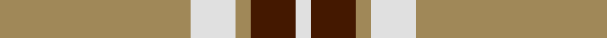
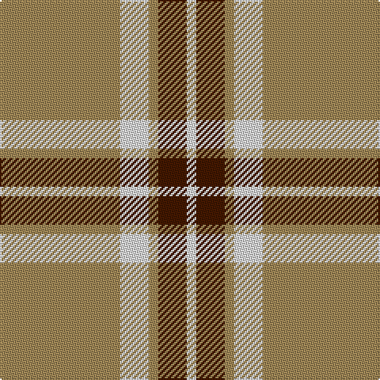

In pattern [WBYWY](/stripes/wbywy/).

This was sourced from house-of-tartan.  It is a [5 stripe tartan](/stripes/stripes5/).

Original link http://www.house-of-tartan.scotland.net/house/TartanViewjs.asp?colr=Def&tnam=1751

## Thread count
LT/76 LN18 LT6 DR18 LN/6

## Palette
Each colour and the base-6 reference it is a variant of.

| Colour | Shade | Base |
|---|---|---|
| DR | <code style="background-color:#441800;">#441800</code> `oklch(27.3% 0.076 46.3)` <small>#441800</small> | B <code style="background-color:#2A418A;">#2A418A</code> |
| LN | <code style="background-color:#E0E0E0;">#E0E0E0</code> `oklch(90.7% 0.000 89.9)` <small>#E0E0E0</small> | W <code style="background-color:#F7F7F7;">#F7F7F7</code> |
| LT | <code style="background-color:#A08858;">#A08858</code> `oklch(63.7% 0.071 84.0)` <small>#A08858</small> | Y <code style="background-color:#F2BF00;">#F2BF00</code> |

# Sample pattern

## Nearest tartans

The nearest existing variants by ΔTartan distance.

1. [Loch Tummel](/setts/s5/o38w9o3dr9w3~x2/) — ΔT 0.84
1. [Ceredigion (Personal)](/setts/s5/ly5n1ly1n12r1~x8/) — ΔT 1.24
1. [Carlisle, Ancient](/setts/s5/t11ly2r1ly2r1~x4/) — ΔT 1.29
1. [Machair](/setts/s6/lo72dt16w9dt4w5dt16~x2/) — ΔT 1.40
1. [Lister (Misty Mountain)](/setts/s7/dy8lr29dy8lo3dy8lr8lo3~x2/) — ΔT 1.53
1. [Coca Cola (Corporate)](/setts/s5/w15dy15w15dy80r6/) — ΔT 1.57
1. [Menzies, Brown & White](/setts/s8/o31w5o2w5o4w3o2w7~x2/) — ΔT 1.64
1. [Coca Cola](/setts/s5/w7dy7w7dy40r3~x2/) — ΔT 1.65
1. [Deer Park (Loton) (Personal)](/setts/s7/lg60r7w10dg16lg15w3lg15~x2/) — ΔT 1.76
1. [Wilbers](/setts/s8/ly5k9ly2k7lo35r4lo35k4~x2/) — ΔT 1.78

## Neighbour map

Every grey dot is one of 14299 variants placed by the first two principal components of the ΔTartan feature space (44% of its variance). Red is this tartan; blue dots are its nearest — click one to open its page.

<svg viewBox="0 0 640 380" role="img" style="max-width:100%;height:auto;border:1px solid #e0e0e0;border-radius:4px;display:block" xmlns="http://www.w3.org/2000/svg"><image href="/nn/cloud.v1.png" width="640" height="380"/><a href="/setts/s5/o38w9o3dr9w3~x2/"><circle cx="408.1" cy="198.0" r="4" fill="#3465a4"><title>Loch Tummel</title></circle></a><a href="/setts/s5/ly5n1ly1n12r1~x8/"><circle cx="433.6" cy="218.8" r="4" fill="#3465a4"><title>Ceredigion (Personal)</title></circle></a><a href="/setts/s5/t11ly2r1ly2r1~x4/"><circle cx="408.1" cy="208.3" r="4" fill="#3465a4"><title>Carlisle, Ancient</title></circle></a><a href="/setts/s6/lo72dt16w9dt4w5dt16~x2/"><circle cx="382.0" cy="178.5" r="4" fill="#3465a4"><title>Machair</title></circle></a><a href="/setts/s7/dy8lr29dy8lo3dy8lr8lo3~x2/"><circle cx="312.3" cy="200.1" r="4" fill="#3465a4"><title>Lister (Misty Mountain)</title></circle></a><a href="/setts/s5/w15dy15w15dy80r6/"><circle cx="445.4" cy="197.5" r="4" fill="#3465a4"><title>Coca Cola (Corporate)</title></circle></a><a href="/setts/s8/o31w5o2w5o4w3o2w7~x2/"><circle cx="452.7" cy="177.1" r="4" fill="#3465a4"><title>Menzies, Brown &amp; White</title></circle></a><a href="/setts/s5/w7dy7w7dy40r3~x2/"><circle cx="455.5" cy="196.4" r="4" fill="#3465a4"><title>Coca Cola</title></circle></a><a href="/setts/s7/lg60r7w10dg16lg15w3lg15~x2/"><circle cx="429.6" cy="168.4" r="4" fill="#3465a4"><title>Deer Park (Loton) (Personal)</title></circle></a><a href="/setts/s8/ly5k9ly2k7lo35r4lo35k4~x2/"><circle cx="399.9" cy="150.2" r="4" fill="#3465a4"><title>Wilbers</title></circle></a><circle cx="409.2" cy="200.0" r="5" fill="#c00000"/></svg>

ID: /setts/s5/lo38w9lo3do9w3~x2/
