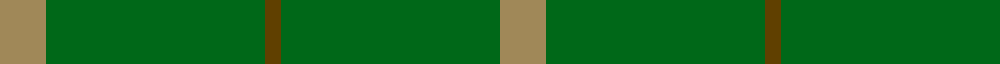

**Bands:** [YGGGY](/stripes/ygggy/) · **Stripes:** [LO G DY G LO](/stripes/stripes5/) LO G DY G LO

This was sourced from house-of-tartan.  It is a [5 band tartan](/bands/bands5/).

Original link http://www.house-of-tartan.scotland.net/house/TartanViewjs.asp?colr=Def&tnam=1734

## Thread count
LT/12 G56 T4 G56 LT/12

## Palette
Each colour and its ΔE from the base-6 reference it is a variant of.

| Colour | Shade | Base | ΔE (OKLab) |
|---|---|---|---|
| G | <code style="background-color:#006818;">#006818</code> `#006818` | G <code style="background-color:#006100;">#006100</code> | 0.02 |
| LT | <code style="background-color:#A08858;">#A08858</code> `#A08858` | Y <code style="background-color:#F2BF00;">#F2BF00</code> | 0.21 |
| T | <code style="background-color:#604000;">#604000</code> `#604000` | G <code style="background-color:#006100;">#006100</code> | 0.14 |

# Sample pattern

## Nearest tartans

The nearest existing variants by ΔTartan distance.

1. [Pearson](/setts/s5/o3g14o1g14o3~x4/) — ΔT 1.52
1. [Bannockbane Hunting Trade Tartan Tartan Number: 909. Earliest known date: c.1984 Nothing See products available Copyright © Blair Urquhart, Comrie, 2015](/setts/s8/g2dy2g15dy1w1g15dy2g2~x2/) — ΔT 1.59
1. [Bannockbane, hunting](/setts/s8/g2o2g15o1w1g15o2g2~x2/) — ΔT 1.78
1. [Campbell Simpson](/setts/s4/dg22k3dg25k4~x2/) — ΔT 2.25
1. [Glenlivet Corporate Tartan Tartan Number: 193. Earliest known date: 1989 Designed for Glenlivet Distilleries Ltd, Strathspey. See products available Copyright © Blair Urquhart, Comrie, 2015](/setts/s8/g18r6g75db6g13dy35g12db6/) — ΔT 2.41
1. [Glenlivet](/setts/s8/g18r6g75db6g13o35g12db6/) — ΔT 2.44
1. [O'Neill, Red](/setts/s6/g46o20g9o20g46lg5~x2/) — ΔT 2.46
1. [Glen Boig](/setts/s5/g37o9g3dr9o3~x2/) — ΔT 2.54
1. [O'Neill, Red (Corporate?)](/setts/s4/g9o20g46lg5~x2/) — ΔT 2.55
1. [Colonial Marine (Corporate)](/setts/s4/g56dy13lo13lo5~x2/) — ΔT 2.64

## Neighbour map

Every grey dot is one of 14313 variants placed by the first two principal components of the ΔTartan feature space (44% of its variance). Red is this tartan; blue dots are its nearest — click one to open its page.

<svg viewBox="0 0 640 380" role="img" style="max-width:100%;height:auto;border:1px solid #e0e0e0;border-radius:4px;display:block" xmlns="http://www.w3.org/2000/svg"><image href="/nn/cloud.v1.png" width="640" height="380"/><a href="/setts/s5/o3g14o1g14o3~x4/"><circle cx="626.0" cy="316.8" r="4" fill="#3465a4"><title>Pearson</title></circle></a><a href="/setts/s8/g2dy2g15dy1w1g15dy2g2~x2/"><circle cx="626.0" cy="258.9" r="4" fill="#3465a4"><title>Bannockbane Hunting Trade Tartan Tartan Number: 909. Earliest known date: c.1984 Nothing See products available Copyright © Blair Urquhart, Comrie, 2015</title></circle></a><a href="/setts/s8/g2o2g15o1w1g15o2g2~x2/"><circle cx="626.0" cy="249.4" r="4" fill="#3465a4"><title>Bannockbane, hunting</title></circle></a><a href="/setts/s4/dg22k3dg25k4~x2/"><circle cx="626.0" cy="363.0" r="4" fill="#3465a4"><title>Campbell Simpson</title></circle></a><a href="/setts/s8/g18r6g75db6g13dy35g12db6/"><circle cx="498.6" cy="244.0" r="4" fill="#3465a4"><title>Glenlivet Corporate Tartan Tartan Number: 193. Earliest known date: 1989 Designed for Glenlivet Distilleries Ltd, Strathspey. See products available Copyright © Blair Urquhart, Comrie, 2015</title></circle></a><a href="/setts/s8/g18r6g75db6g13o35g12db6/"><circle cx="472.9" cy="228.7" r="4" fill="#3465a4"><title>Glenlivet</title></circle></a><a href="/setts/s6/g46o20g9o20g46lg5~x2/"><circle cx="455.7" cy="286.3" r="4" fill="#3465a4"><title>O'Neill, Red</title></circle></a><a href="/setts/s5/g37o9g3dr9o3~x2/"><circle cx="492.9" cy="271.5" r="4" fill="#3465a4"><title>Glen Boig</title></circle></a><a href="/setts/s4/g9o20g46lg5~x2/"><circle cx="463.9" cy="288.8" r="4" fill="#3465a4"><title>O'Neill, Red (Corporate?)</title></circle></a><a href="/setts/s4/g56dy13lo13lo5~x2/"><circle cx="459.6" cy="281.1" r="4" fill="#3465a4"><title>Colonial Marine (Corporate)</title></circle></a><circle cx="609.5" cy="298.4" r="5" fill="#c00000"/></svg>

ID: /setts/s5/lo3g14dy1g14lo3~x4/
