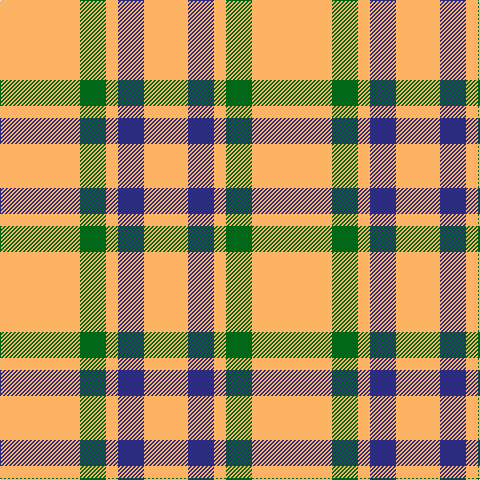

In pattern [YBYGY](/stripes/ybygy/).

This was sourced from tartans-authority.  It is a [5 stripe tartan](/stripes/stripes5/).

Original link http://www.tartansauthority.com/tartan-ferret/display/8908/

## Thread count
LG/80 G26 LG12 DB26 LG/44

## Palette
Each colour and the base-6 reference it is a variant of.

| Colour | Shade | Base |
|---|---|---|
| DB | <code style="background-color:#2C2C80;">#2C2C80</code> `oklch(35.0% 0.138 276.6)` <small>#2C2C80</small> | B <code style="background-color:#2A418A;">#2A418A</code> |
| G | <code style="background-color:#006818;">#006818</code> `oklch(45.0% 0.142 145.0)` <small>#006818</small> | G <code style="background-color:#006100;">#006100</code> |
| LG | <code style="background-color:#FCB464;">#FCB464</code> `oklch(82.2% 0.128 67.3)` <small>#FCB464</small> | Y <code style="background-color:#F2BF00;">#F2BF00</code> |

# Sample pattern

## Nearest tartans

The nearest existing variants by ΔTartan distance.

1. [Silvicola](/setts/s4/ly20k15ly20w3~x2/) — ΔT 1.61
1. [Quenouille (2011)](/setts/s3/ly49r16k11~x2/) — ΔT 1.72
1. [Sands-Pingot Family, Alabama (Personal)](/setts/s5/ly6r1ly4r4db2~x5/) — ΔT 1.99
1. [Clayton Dress (Dance)](/setts/s6/w8r14w8r14w35k4~x2/) — ΔT 2.02
1. [Clayton Dress (Dance)](/setts/s8/r14w35k4w35r14w8r14w8~x2/) — ΔT 2.02
1. [Buchanan VS](/setts/s6/lb2r4lb2r4lb9k1~x2/) — ΔT 2.07
1. [Tokharion](/setts/s6/db1lo5db1lo5db2w1~x4/) — ΔT 2.13
1. [Masai Shuka 04 (Artefact)](/setts/s3/ly20db10k3~x2/) — ΔT 2.16
1. [Tennessee Volunteer](/setts/s8/w12lo12w12k5lo45k5lb5lo10~x2/) — ΔT 2.18
1. [Loch Tummel Trade Tartan Tartan Number: 1751. Earliest known date: pre 2003 Nothing See products available Copyright © Blair Urquhart, Comrie, 2015](/setts/s5/lo38w9lo3do9w3~x2/) — ΔT 2.18

## Neighbour map

Every grey dot is one of 14299 variants placed by the first two principal components of the ΔTartan feature space (44% of its variance). Red is this tartan; blue dots are its nearest — click one to open its page.

<svg viewBox="0 0 640 380" role="img" style="max-width:100%;height:auto;border:1px solid #e0e0e0;border-radius:4px;display:block" xmlns="http://www.w3.org/2000/svg"><image href="/nn/cloud.v1.png" width="640" height="380"/><a href="/setts/s4/ly20k15ly20w3~x2/"><circle cx="322.2" cy="265.6" r="4" fill="#3465a4"><title>Silvicola</title></circle></a><a href="/setts/s3/ly49r16k11~x2/"><circle cx="301.2" cy="261.2" r="4" fill="#3465a4"><title>Quenouille (2011)</title></circle></a><a href="/setts/s5/ly6r1ly4r4db2~x5/"><circle cx="257.0" cy="242.3" r="4" fill="#3465a4"><title>Sands-Pingot Family, Alabama (Personal)</title></circle></a><a href="/setts/s6/w8r14w8r14w35k4~x2/"><circle cx="303.4" cy="198.2" r="4" fill="#3465a4"><title>Clayton Dress (Dance)</title></circle></a><a href="/setts/s8/r14w35k4w35r14w8r14w8~x2/"><circle cx="317.5" cy="191.9" r="4" fill="#3465a4"><title>Clayton Dress (Dance)</title></circle></a><a href="/setts/s6/lb2r4lb2r4lb9k1~x2/"><circle cx="321.8" cy="205.5" r="4" fill="#3465a4"><title>Buchanan VS</title></circle></a><a href="/setts/s6/db1lo5db1lo5db2w1~x4/"><circle cx="360.6" cy="259.5" r="4" fill="#3465a4"><title>Tokharion</title></circle></a><a href="/setts/s3/ly20db10k3~x2/"><circle cx="288.1" cy="259.9" r="4" fill="#3465a4"><title>Masai Shuka 04 (Artefact)</title></circle></a><a href="/setts/s8/w12lo12w12k5lo45k5lb5lo10~x2/"><circle cx="321.1" cy="165.1" r="4" fill="#3465a4"><title>Tennessee Volunteer</title></circle></a><a href="/setts/s5/lo38w9lo3do9w3~x2/"><circle cx="409.2" cy="200.0" r="4" fill="#3465a4"><title>Loch Tummel Trade Tartan Tartan Number: 1751. Earliest known date: pre 2003 Nothing See products available Copyright © Blair Urquhart, Comrie, 2015</title></circle></a><circle cx="374.5" cy="244.7" r="5" fill="#c00000"/></svg>

ID: /setts/s5/lo40g13lo6db13lo22~x2/
