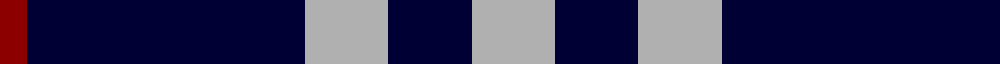

**Bands:** [RKYKY](/stripes/rkyky/) · **Stripes:** [R K LR K LR](/stripes/stripes5/) R K LR K LR

This was sourced from register-of-tartans.  It is a [5 band tartan](/bands/bands5/).

Original link https://www.tartanregister.gov.uk/tartanDetails.aspx?ref=5382

## Attestations

This cloth appears in 3 source records; the oldest owns this page.

- 01/01/1985 — Burberry Blue (register-of-tartans, [record](https://www.tartanregister.gov.uk/tartanDetails.aspx?ref=5382))
- 01/01/1986 — Burberry Black (register-of-tartans, [record](https://www.tartanregister.gov.uk/tartanDetails.aspx?ref=5039))
- 1986 — Burberry, Black (Original) (Fashion) (tartans-authority, [record](http://www.tartansauthority.com/tartan-ferret/display/3768/))

## Register references

External register numbers recorded for this tartan.

- Scottish Register of Tartans: [5382](https://www.tartanregister.gov.uk/tartanDetails.aspx?ref=5382)
- Scottish Tartans Authority (ITI): 3769

## Thread count
N/18 DB18 N18 DB60 DR/6

## Palette
Each colour and its ΔE from the base-6 reference it is a variant of.

| Colour | Shade | Base | ΔE (OKLab) |
|---|---|---|---|
| DB | <code style="background-color:#000034;">#000034</code> `#000034` | K <code style="background-color:#000000;">#000000</code> | 0.18 |
| DR | <code style="background-color:#8C0000;">#8C0000</code> `#8C0000` | R <code style="background-color:#CC0000;">#CC0000</code> | 0.14 |
| N | <code style="background-color:#B0B0B0;">#B0B0B0</code> `#B0B0B0` | Y <code style="background-color:#F2BF00;">#F2BF00</code> | 0.18 |

# Sample pattern

## Nearest tartans

The nearest existing variants by ΔTartan distance.

1. [Glen Moy](/setts/s5/db37w9db3r9w3~x2/) — ΔT 1.08
1. [Ochterlonie](/setts/s6/dt30w7dt18w11dt6ly3~x2/) — ΔT 1.26
1. [Sligo Irish County Tartan Tartan Number: 2256. Earliest known date: 1995 One of a series of Irish District tartans designed by Polly Wittering of the House of Edgar, with colours reminiscent of the Country with soft warm colours dominating. See products available Copyright © Blair Urquhart, Comrie, 2015](/setts/s6/t50k4t12k23lo4k4~x2/) — ΔT 1.37
1. [St. Eloi](/setts/s6/r3lo2k10w1~x6/) — ΔT 1.39
1. [Ochterlonie](/setts/s6/db35lr8db21lr13db6lo4~x2/) — ΔT 1.46
1. [BC Corps of Commissionaires](/setts/s7/db12w1r3w1r3w1db6~x4/) — ΔT 1.49
1. [Bank of Scotland (1995)](/setts/s5/lo1db6k5db6lb1~x6/) — ΔT 1.58
1. [St. Eloi (Corporate)](/setts/s4/r3lo2k10w1~x6/) — ΔT 1.58
1. [Scottish Nuclear](/setts/s4/r4db32k15w2~x2/) — ΔT 1.58
1. [Glen Moy](/setts/s5/db13lb3db1r3lb1~x6/) — ΔT 1.60

## Neighbour map

Every grey dot is one of 14299 variants placed by the first two principal components of the ΔTartan feature space (44% of its variance). Red is this tartan; blue dots are its nearest — click one to open its page.

<svg viewBox="0 0 640 380" role="img" style="max-width:100%;height:auto;border:1px solid #e0e0e0;border-radius:4px;display:block" xmlns="http://www.w3.org/2000/svg"><image href="/nn/cloud.v1.png" width="640" height="380"/><a href="/setts/s5/db37w9db3r9w3~x2/"><circle cx="369.0" cy="201.6" r="4" fill="#3465a4"><title>Glen Moy</title></circle></a><a href="/setts/s6/dt30w7dt18w11dt6ly3~x2/"><circle cx="384.0" cy="228.3" r="4" fill="#3465a4"><title>Ochterlonie</title></circle></a><a href="/setts/s6/t50k4t12k23lo4k4~x2/"><circle cx="370.0" cy="197.4" r="4" fill="#3465a4"><title>Sligo Irish County Tartan Tartan Number: 2256. Earliest known date: 1995 One of a series of Irish District tartans designed by Polly Wittering of the House of Edgar, with colours reminiscent of the Country with soft warm colours dominating. See products available Copyright © Blair Urquhart, Comrie, 2015</title></circle></a><a href="/setts/s6/r3lo2k10w1~x6/"><circle cx="376.7" cy="215.7" r="4" fill="#3465a4"><title>St. Eloi</title></circle></a><a href="/setts/s6/db35lr8db21lr13db6lo4~x2/"><circle cx="388.0" cy="238.8" r="4" fill="#3465a4"><title>Ochterlonie</title></circle></a><a href="/setts/s7/db12w1r3w1r3w1db6~x4/"><circle cx="395.7" cy="206.2" r="4" fill="#3465a4"><title>BC Corps of Commissionaires</title></circle></a><a href="/setts/s5/lo1db6k5db6lb1~x6/"><circle cx="296.2" cy="262.7" r="4" fill="#3465a4"><title>Bank of Scotland (1995)</title></circle></a><a href="/setts/s4/r3lo2k10w1~x6/"><circle cx="322.5" cy="218.4" r="4" fill="#3465a4"><title>St. Eloi (Corporate)</title></circle></a><a href="/setts/s4/r4db32k15w2~x2/"><circle cx="346.4" cy="208.8" r="4" fill="#3465a4"><title>Scottish Nuclear</title></circle></a><a href="/setts/s5/db13lb3db1r3lb1~x6/"><circle cx="395.4" cy="200.9" r="4" fill="#3465a4"><title>Glen Moy</title></circle></a><circle cx="351.7" cy="236.2" r="5" fill="#c00000"/></svg>

ID: /setts/s5/lr3k3lr3k10r1~x6/
