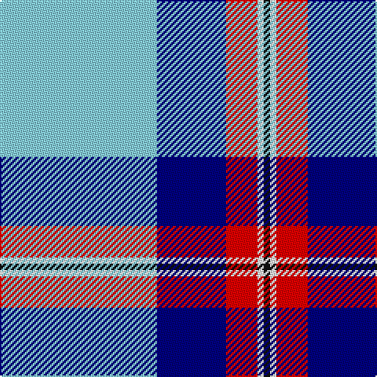

In pattern [KWRBW](/stripes/kwrbw/).

This was sourced from register-of-tartans.  It is a [5 stripe tartan](/stripes/stripes5/).

Original link https://www.tartanregister.gov.uk/tartanDetails.aspx?ref=10420

## Register references

External register numbers recorded for this tartan.

- Scottish Register of Tartans: [10420](https://www.tartanregister.gov.uk/tartanDetails.aspx?ref=10420)

## Thread count
LB/100 DB44 R20 W4 K/4

## Palette
Each colour and its ΔE from the base-6 reference it is a variant of.

| Colour | Shade | Base | ΔE (OKLab) |
|---|---|---|---|
| DB | <code style="background-color:#000080;">#000080</code> `#000080` | B <code style="background-color:#2A418A;">#2A418A</code> | 0.14 |
| K | <code style="background-color:#101010;">#101010</code> `#101010` | K <code style="background-color:#000000;">#000000</code> | 0.17 |
| LB | <code style="background-color:#87CEEB;">#87CEEB</code> `#87CEEB` | W <code style="background-color:#F7F7F7;">#F7F7F7</code> | 0.18 |
| R | <code style="background-color:#FF0000;">#FF0000</code> `#FF0000` | R <code style="background-color:#CC0000;">#CC0000</code> | 0.11 |
| W | <code style="background-color:#FFFFFF;">#FFFFFF</code> `#FFFFFF` | W <code style="background-color:#F7F7F7;">#F7F7F7</code> | 0.02 |

# Sample pattern

## Nearest tartans

The nearest existing variants by ΔTartan distance.

1. [Mount Vernon Primary School (Corp)](/setts/s5/lb25db11r5w1k1~x4/) — ΔT 0.60
1. [Jack Sinclair (Personal)](/setts/s7/b4r2b40k11g2w16r2~x2/) — ΔT 0.91
1. [Herriot New Zealand](/setts/s6/w15ly2k5lb3b40k10/) — ΔT 1.23
1. [Gothenburg/Goteborg](/setts/s7/db26w28db14ly3k1ly2k1~x2/) — ΔT 1.27
1. [Gothenburg](/setts/s7/b26w28b14ly3k1ly2k1~x2/) — ΔT 1.31
1. [WaterAid](/setts/s6/db23w8lb2k5w44db4~x2/) — ΔT 1.35
1. [Prehospital EMS (Corporate)](/setts/s5/k1w7lo7b16ly1~x4/) — ΔT 1.58
1. [Cunningham, Dress Blue (Dance) Fashion Tartan Tartan Number: 4642. Earliest known date: 01/01/2002 Like so many of the invented 'Dance' tartans this one is not known by the relevant Clan Cunningham Association (USA). /Threadcount and colours aren't 100% original. Generated manually./ See products available Copyright © Blair Urquhart, Comrie, 2015](/setts/s7/t2db1k1db20w20db1w2~x4/) — ΔT 1.60
1. [Torridon, Saphire (Dance)](/setts/s7/w3db2w30db30k2db2ly3~x2/) — ΔT 1.61
1. [St. Christopher's School (Corporate)](/setts/s6/lb20w2lb5k2b10r3~x2/) — ΔT 1.64

## Neighbour map

Every grey dot is one of 14299 variants placed by the first two principal components of the ΔTartan feature space (44% of its variance). Red is this tartan; blue dots are its nearest — click one to open its page.

<svg viewBox="0 0 640 380" role="img" style="max-width:100%;height:auto;border:1px solid #e0e0e0;border-radius:4px;display:block" xmlns="http://www.w3.org/2000/svg"><image href="/nn/cloud.v1.png" width="640" height="380"/><a href="/setts/s5/lb25db11r5w1k1~x4/"><circle cx="315.2" cy="135.8" r="4" fill="#3465a4"><title>Mount Vernon Primary School (Corp)</title></circle></a><a href="/setts/s7/b4r2b40k11g2w16r2~x2/"><circle cx="287.2" cy="119.3" r="4" fill="#3465a4"><title>Jack Sinclair (Personal)</title></circle></a><a href="/setts/s6/w15ly2k5lb3b40k10/"><circle cx="252.3" cy="138.4" r="4" fill="#3465a4"><title>Herriot New Zealand</title></circle></a><a href="/setts/s7/db26w28db14ly3k1ly2k1~x2/"><circle cx="309.0" cy="132.3" r="4" fill="#3465a4"><title>Gothenburg/Goteborg</title></circle></a><a href="/setts/s7/b26w28b14ly3k1ly2k1~x2/"><circle cx="313.4" cy="134.0" r="4" fill="#3465a4"><title>Gothenburg</title></circle></a><a href="/setts/s6/db23w8lb2k5w44db4~x2/"><circle cx="319.9" cy="134.8" r="4" fill="#3465a4"><title>WaterAid</title></circle></a><a href="/setts/s5/k1w7lo7b16ly1~x4/"><circle cx="237.6" cy="163.2" r="4" fill="#3465a4"><title>Prehospital EMS (Corporate)</title></circle></a><a href="/setts/s7/t2db1k1db20w20db1w2~x4/"><circle cx="289.3" cy="128.7" r="4" fill="#3465a4"><title>Cunningham, Dress Blue (Dance) Fashion Tartan Tartan Number: 4642. Earliest known date: 01/01/2002 Like so many of the invented 'Dance' tartans this one is not known by the relevant Clan Cunningham Association (USA). /Threadcount and colours aren't 100% original. Generated manually./ See products available Copyright © Blair Urquhart, Comrie, 2015</title></circle></a><a href="/setts/s7/w3db2w30db30k2db2ly3~x2/"><circle cx="239.6" cy="121.8" r="4" fill="#3465a4"><title>Torridon, Saphire (Dance)</title></circle></a><a href="/setts/s6/lb20w2lb5k2b10r3~x2/"><circle cx="277.8" cy="172.2" r="4" fill="#3465a4"><title>St. Christopher's School (Corporate)</title></circle></a><circle cx="300.9" cy="132.8" r="5" fill="#c00000"/></svg>

ID: /setts/s5/lt25db11r5w1k1~x4/
