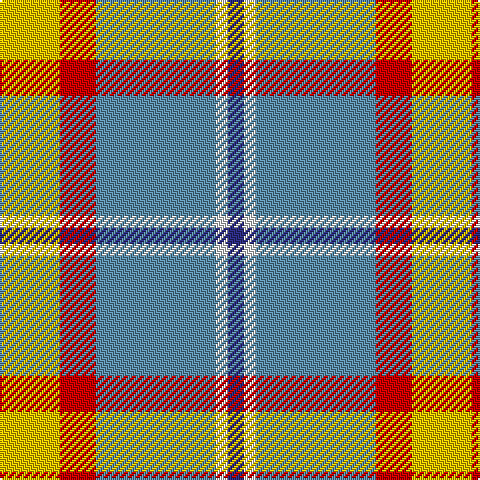

In pattern [BWBRY](/stripes/bwbry/).

This was sourced from tartans-authority.  It is a [5 stripe tartan](/stripes/stripes5/).

Original link http://www.tartansauthority.com/tartan-ferret/display/6970/

## Thread count
Y/30 R18 B60 LN6 DB/8

## Palette
Each colour and its ΔE from the base-6 reference it is a variant of.

| Colour | Shade | Base | ΔE (OKLab) |
|---|---|---|---|
| B | <code style="background-color:#5C8CA8;">#5C8CA8</code> `#5C8CA8` | B <code style="background-color:#2A418A;">#2A418A</code> | 0.23 |
| DB | <code style="background-color:#2C2C80;">#2C2C80</code> `#2C2C80` | B <code style="background-color:#2A418A;">#2A418A</code> | 0.06 |
| LN | <code style="background-color:#E0E0E0;">#E0E0E0</code> `#E0E0E0` | W <code style="background-color:#F7F7F7;">#F7F7F7</code> | 0.07 |
| R | <code style="background-color:#C80000;">#C80000</code> `#C80000` | R <code style="background-color:#CC0000;">#CC0000</code> | 0.01 |
| Y | <code style="background-color:#E8C000;">#E8C000</code> `#E8C000` | Y <code style="background-color:#F2BF00;">#F2BF00</code> | 0.02 |

# Sample pattern

## Nearest tartans

The nearest existing variants by ΔTartan distance.

1. [Bagpipe Shop (Switzerland)](/setts/s5/n10w3lr3g1r1~x10/) — ΔT 0.75
1. [Bagpipe Shop (Corporate)](/setts/s5/n10w3lb3g1r1~x10/) — ΔT 0.81
1. [Tombow 140th Anniversary, The](/setts/s7/g4lo7r9lo9b20w2b2~x2/) — ΔT 1.02
1. [Trinity Bicycles (Corporate)](/setts/s5/r4lb30y14lb11y4~x2/) — ΔT 1.14
1. [Burberry Counterfeit](/setts/s5/o3w3k3lo10r1~x6/) — ΔT 1.25
1. [Afternoon Tea / Milk Tea](/setts/s6/w15lo98do72r25do8lg15/) — ΔT 1.26
1. [Sterling, Rob (Florida) (Persona Name Tartan Tartan Number: 10653. Earliest known date: 10/07/2012 Designed by Rob Sterling, St. Petersburg, Florida, for use by his family and associates. See products available Copyright © Blair Urquhart, Comrie, 2015](/setts/s5/g11lo10dp11t33w3~x2/) — ΔT 1.28
1. [MacKintosh Dress (Dance)](/setts/s6/r3w33dp8dg18r9g3~x2/) — ΔT 1.34
1. [Manitoba Dress (Dance)](/setts/s8/g3r10lb2g3lb13g2lb2g3~x2/) — ΔT 1.37
1. [Thompson, D.C. (Personal)](/setts/s6/k4t28r6w12r12w3~x2/) — ΔT 1.38

## Neighbour map

Every grey dot is one of 14299 variants placed by the first two principal components of the ΔTartan feature space (44% of its variance). Red is this tartan; blue dots are its nearest — click one to open its page.

<svg viewBox="0 0 640 380" role="img" style="max-width:100%;height:auto;border:1px solid #e0e0e0;border-radius:4px;display:block" xmlns="http://www.w3.org/2000/svg"><image href="/nn/cloud.v1.png" width="640" height="380"/><a href="/setts/s5/n10w3lr3g1r1~x10/"><circle cx="277.9" cy="188.2" r="4" fill="#3465a4"><title>Bagpipe Shop (Switzerland)</title></circle></a><a href="/setts/s5/n10w3lb3g1r1~x10/"><circle cx="274.9" cy="187.9" r="4" fill="#3465a4"><title>Bagpipe Shop (Corporate)</title></circle></a><a href="/setts/s7/g4lo7r9lo9b20w2b2~x2/"><circle cx="182.4" cy="181.8" r="4" fill="#3465a4"><title>Tombow 140th Anniversary, The</title></circle></a><a href="/setts/s5/r4lb30y14lb11y4~x2/"><circle cx="234.6" cy="220.7" r="4" fill="#3465a4"><title>Trinity Bicycles (Corporate)</title></circle></a><a href="/setts/s5/o3w3k3lo10r1~x6/"><circle cx="212.7" cy="186.2" r="4" fill="#3465a4"><title>Burberry Counterfeit</title></circle></a><a href="/setts/s6/w15lo98do72r25do8lg15/"><circle cx="227.8" cy="181.5" r="4" fill="#3465a4"><title>Afternoon Tea / Milk Tea</title></circle></a><a href="/setts/s5/g11lo10dp11t33w3~x2/"><circle cx="242.7" cy="214.8" r="4" fill="#3465a4"><title>Sterling, Rob (Florida) (Persona Name Tartan Tartan Number: 10653. Earliest known date: 10/07/2012 Designed by Rob Sterling, St. Petersburg, Florida, for use by his family and associates. See products available Copyright © Blair Urquhart, Comrie, 2015</title></circle></a><a href="/setts/s6/r3w33dp8dg18r9g3~x2/"><circle cx="176.2" cy="158.0" r="4" fill="#3465a4"><title>MacKintosh Dress (Dance)</title></circle></a><a href="/setts/s8/g3r10lb2g3lb13g2lb2g3~x2/"><circle cx="173.6" cy="181.0" r="4" fill="#3465a4"><title>Manitoba Dress (Dance)</title></circle></a><a href="/setts/s6/k4t28r6w12r12w3~x2/"><circle cx="203.8" cy="195.3" r="4" fill="#3465a4"><title>Thompson, D.C. (Personal)</title></circle></a><circle cx="230.9" cy="192.9" r="5" fill="#c00000"/></svg>

ID: /setts/s5/ly15r9t30w3db4~x2/
