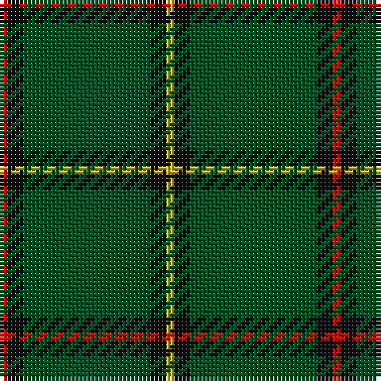

**Bands:** [RKGKY](/stripes/rkgky/) · **Stripes:** [R K DG K LY](/stripes/stripes5/) R K DG K LY

This was sourced from register-of-tartans.  It is a [5 band tartan](/bands/bands5/).

Original link https://www.tartanregister.gov.uk/tartanDetails.aspx?ref=3808

## Attestations

This cloth appears in 2 source records; the oldest owns this page.

- undated — Skene or Tribe of Mar (register-of-tartans, [record](https://www.tartanregister.gov.uk/tartanDetails.aspx?ref=3808))
- undated — Mar District (weddslist, [record](http://www.weddslist.com/cgi-bin/tartans/pg.pl?source=rb))

## Register references

External register numbers recorded for this tartan.

- Scottish Register of Tartans: [2540](https://www.tartanregister.gov.uk/tartanDetails.aspx?ref=2540)
- Scottish Register of Tartans: [2666](https://www.tartanregister.gov.uk/tartanDetails.aspx?ref=2666)
- Scottish Register of Tartans: [3808](https://www.tartanregister.gov.uk/tartanDetails.aspx?ref=3808)
- Scottish Tartans Authority (ITI): 218
- Scottish Tartans World Register: 1010
- Scottish Tartans World Register: 1585
- Scottish Tartans World Register: 218

## Thread count
R/2 K4 G32 K4 Y/2

## Palette
Each colour and its ΔE from the base-6 reference it is a variant of.

| Colour | Shade | Base | ΔE (OKLab) |
|---|---|---|---|
| G | <code style="background-color:#005020;">#005020</code> `#005020` | G <code style="background-color:#006100;">#006100</code> | 0.07 |
| K | <code style="background-color:#101010;">#101010</code> `#101010` | K <code style="background-color:#000000;">#000000</code> | 0.17 |
| R | <code style="background-color:#DC0000;">#DC0000</code> `#DC0000` | R <code style="background-color:#CC0000;">#CC0000</code> | 0.03 |
| Y | <code style="background-color:#E8C000;">#E8C000</code> `#E8C000` | Y <code style="background-color:#F2BF00;">#F2BF00</code> | 0.02 |

# Sample pattern

## Nearest tartans

The nearest existing variants by ΔTartan distance.

1. [Inman (2016)](/setts/s7/r2dg24k2dg12lo6k1r2~x2/) — ΔT 1.31
1. [Tyrconnell (Personal)](/setts/s5/g44db9r2db9g2~x2/) — ΔT 1.36
1. [Glenlivet Check (Corporate)](/setts/s8/dg18r6dg75b6dg13lo35dg12b6/) — ΔT 1.52
1. [Welsh National (District)](/setts/s5/r8g3r4g44w4~x2/) — ΔT 1.53
1. [Green Watch](/setts/s7/dg10o1dg1o1lr2dg1o1~x4/) — ΔT 1.54
1. [McCall, F W (Personal)](/setts/s9/dg6do2m1dg15m3do1dg15g6m1~x2/) — ΔT 1.55
1. [Military Medical Memorial (USA)](/setts/s6/db6w3r3g55k10r3~x4/) — ΔT 1.59
1. [Annapolis Valley](/setts/s6/g30t8g5lb4g5r2~x4/) — ΔT 1.59
1. [Welsh National District Tartan Tartan Number: 1523. Earliest known date: 1968 The Welsh Tartan owes its origin to a Society formed in Cardiff in 1967. Its aims were cultural and political - to strengthen Celtic ties and give visible signs of being an individual nation in culture, language and dress. The colours are those of the Welsh flag. It is said that the design was based on the Lord of the Isles tartan because the present Lord is also Prince of Wales. However comparison reveals similarity only to MacDonald, MacDonald of the Isles, or perhaps Applecross district. See products available Copyright © Blair Urquhart, Comrie, 2015](/setts/s5/m2g1m1g10w1~x4/) — ΔT 1.63
1. [Mar, Tribe of (Clan)](/setts/s5/ly2k3g45k4r2~x2/) — ΔT 1.67

## Neighbour map

Every grey dot is one of 14313 variants placed by the first two principal components of the ΔTartan feature space (44% of its variance). Red is this tartan; blue dots are its nearest — click one to open its page.

<svg viewBox="0 0 640 380" role="img" style="max-width:100%;height:auto;border:1px solid #e0e0e0;border-radius:4px;display:block" xmlns="http://www.w3.org/2000/svg"><image href="/nn/cloud.v1.png" width="640" height="380"/><a href="/setts/s7/r2dg24k2dg12lo6k1r2~x2/"><circle cx="473.0" cy="171.9" r="4" fill="#3465a4"><title>Inman (2016)</title></circle></a><a href="/setts/s5/g44db9r2db9g2~x2/"><circle cx="513.2" cy="221.4" r="4" fill="#3465a4"><title>Tyrconnell (Personal)</title></circle></a><a href="/setts/s8/dg18r6dg75b6dg13lo35dg12b6/"><circle cx="424.4" cy="201.6" r="4" fill="#3465a4"><title>Glenlivet Check (Corporate)</title></circle></a><a href="/setts/s5/r8g3r4g44w4~x2/"><circle cx="504.9" cy="208.4" r="4" fill="#3465a4"><title>Welsh National (District)</title></circle></a><a href="/setts/s7/dg10o1dg1o1lr2dg1o1~x4/"><circle cx="459.6" cy="214.8" r="4" fill="#3465a4"><title>Green Watch</title></circle></a><a href="/setts/s9/dg6do2m1dg15m3do1dg15g6m1~x2/"><circle cx="453.4" cy="206.0" r="4" fill="#3465a4"><title>McCall, F W (Personal)</title></circle></a><a href="/setts/s6/db6w3r3g55k10r3~x4/"><circle cx="411.8" cy="150.4" r="4" fill="#3465a4"><title>Military Medical Memorial (USA)</title></circle></a><a href="/setts/s6/g30t8g5lb4g5r2~x4/"><circle cx="478.5" cy="213.3" r="4" fill="#3465a4"><title>Annapolis Valley</title></circle></a><a href="/setts/s5/m2g1m1g10w1~x4/"><circle cx="479.8" cy="228.7" r="4" fill="#3465a4"><title>Welsh National District Tartan Tartan Number: 1523. Earliest known date: 1968 The Welsh Tartan owes its origin to a Society formed in Cardiff in 1967. Its aims were cultural and political - to strengthen Celtic ties and give visible signs of being an individual nation in culture, language and dress. The colours are those of the Welsh flag. It is said that the design was based on the Lord of the Isles tartan because the present Lord is also Prince of Wales. However comparison reveals similarity only to MacDonald, MacDonald of the Isles, or perhaps Applecross district. See products available Copyright © Blair Urquhart, Comrie, 2015</title></circle></a><a href="/setts/s5/ly2k3g45k4r2~x2/"><circle cx="577.6" cy="187.7" r="4" fill="#3465a4"><title>Mar, Tribe of (Clan)</title></circle></a><circle cx="489.7" cy="201.5" r="5" fill="#c00000"/></svg>

ID: /setts/s5/ly1k2dg16k2r1~x2/
