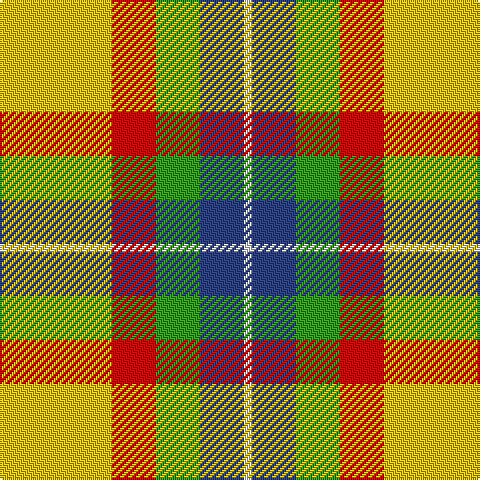

In pattern [WBGRY](/stripes/wbgry/).

This was sourced from register-of-tartans.  It is a [5 stripe tartan](/stripes/stripes5/).

Original link https://www.tartanregister.gov.uk/tartanDetails.aspx?ref=5888

## Register references

External register numbers recorded for this tartan.

- Scottish Register of Tartans: [5888](https://www.tartanregister.gov.uk/tartanDetails.aspx?ref=5888)
- Scottish Tartans World Register: 3169

## Thread count
Y/56 R22 G22 B22 LN/4

## Palette
Each colour and the base-6 reference it is a variant of.

| Colour | Shade | Base |
|---|---|---|
| B | <code style="background-color:#2C4084;">#2C4084</code> `oklch(39.4% 0.117 268.3)` <small>#2C4084</small> | B <code style="background-color:#2A418A;">#2A418A</code> |
| G | <code style="background-color:#309C18;">#309C18</code> `oklch(60.8% 0.188 140.8)` <small>#309C18</small> | G <code style="background-color:#006100;">#006100</code> |
| LN | <code style="background-color:#E0E0E0;">#E0E0E0</code> `oklch(90.7% 0.000 89.9)` <small>#E0E0E0</small> | W <code style="background-color:#F7F7F7;">#F7F7F7</code> |
| R | <code style="background-color:#DC0000;">#DC0000</code> `oklch(56.2% 0.230 29.2)` <small>#DC0000</small> | R <code style="background-color:#CC0000;">#CC0000</code> |
| Y | <code style="background-color:#E8C000;">#E8C000</code> `oklch(81.9% 0.168 93.7)` <small>#E8C000</small> | Y <code style="background-color:#F2BF00;">#F2BF00</code> |

# Sample pattern

## Nearest tartans

The nearest existing variants by ΔTartan distance, with this tartan at the top so the swatches line up against it.

ΔTartan

Tartan

Sett

—

<a href="/ttd/edit/#slug=ly28r11g11db11w2~x2">Samye #2</a> <a class="nn-out" href="/setts/s5/ly28r11g11db11w2~x2/" title="open its dictionary page">↗</a>

0.71

<a href="/ttd/edit/#slug=ly25r10g10db11w2~x2">Samye</a> <a class="nn-out" href="/setts/s5/ly25r10g10db11w2~x2/" title="open its dictionary page">↗</a>

1.29

<a href="/ttd/edit/#slug=r1w12g6r8t3ly1~x4">MacLean, dress</a> <a class="nn-out" href="/setts/s6/r1w12g6r8t3ly1~x4/" title="open its dictionary page">↗</a>

1.33

<a href="/ttd/edit/#slug=o3w3k3lo10r1~x6">Burberry Counterfeit</a> <a class="nn-out" href="/setts/s5/o3w3k3lo10r1~x6/" title="open its dictionary page">↗</a>

1.41

<a href="/ttd/edit/#slug=lo13g8k5lb3w2r1~x4">Ball Hunting</a> <a class="nn-out" href="/setts/s6/lo13g8k5lb3w2r1~x4/" title="open its dictionary page">↗</a>

1.45

<a href="/ttd/edit/#slug=r1w12g6r8lb3lo1~x4">MacLean Dress (Lumsden)</a> <a class="nn-out" href="/setts/s6/r1w12g6r8lb3lo1~x4/" title="open its dictionary page">↗</a>

1.59

<a href="/ttd/edit/#slug=r34w3dg4g23w24k3dg4~x2">MacLachlan, dress</a> <a class="nn-out" href="/setts/s7/r34w3dg4g23w24k3dg4~x2/" title="open its dictionary page">↗</a>

1.63

<a href="/ttd/edit/#slug=r2w2ly27g14ly2db14ly2~x2">Fraser, Yellow</a> <a class="nn-out" href="/setts/s7/r2w2ly27g14ly2db14ly2~x2/" title="open its dictionary page">↗</a>

1.66

<a href="/ttd/edit/#slug=ly4o21w2dt11ly21r2ly4~x2">Barbour - Muted</a> <a class="nn-out" href="/setts/s7/ly4o21w2dt11ly21r2ly4~x2/" title="open its dictionary page">↗</a>

1.66

<a href="/ttd/edit/#slug=ly32k21r16lr6dt4~x2">Scottish American Athletic Assoc</a> <a class="nn-out" href="/setts/s5/ly32k21r16lr6dt4~x2/" title="open its dictionary page">↗</a>

1.67

<a href="/ttd/edit/#slug=r3w33dp8dg18r9g3~x2">MacKintosh Dress (Dance)</a> <a class="nn-out" href="/setts/s6/r3w33dp8dg18r9g3~x2/" title="open its dictionary page">↗</a>

## Neighbour map

Every grey dot is one of 14299 variants placed by the first two principal components of the ΔTartan feature space (44% of its variance). Red is this tartan; blue dots are its nearest — click one to open its page.

<svg viewBox="0 0 640 380" role="img" style="max-width:100%;height:auto;border:1px solid #e0e0e0;border-radius:4px;display:block" xmlns="http://www.w3.org/2000/svg"><image href="/nn/cloud.v1.png" width="640" height="380"/><a href="/setts/s5/ly25r10g10db11w2~x2/"><circle cx="159.8" cy="183.6" r="4" fill="#3465a4"><title>Samye</title></circle></a><a href="/setts/s6/r1w12g6r8t3ly1~x4/"><circle cx="158.9" cy="164.8" r="4" fill="#3465a4"><title>MacLean, dress</title></circle></a><a href="/setts/s5/o3w3k3lo10r1~x6/"><circle cx="212.7" cy="186.2" r="4" fill="#3465a4"><title>Burberry Counterfeit</title></circle></a><a href="/setts/s6/lo13g8k5lb3w2r1~x4/"><circle cx="141.5" cy="152.8" r="4" fill="#3465a4"><title>Ball Hunting</title></circle></a><a href="/setts/s6/r1w12g6r8lb3lo1~x4/"><circle cx="149.5" cy="158.8" r="4" fill="#3465a4"><title>MacLean Dress (Lumsden)</title></circle></a><a href="/setts/s7/r34w3dg4g23w24k3dg4~x2/"><circle cx="148.8" cy="150.9" r="4" fill="#3465a4"><title>MacLachlan, dress</title></circle></a><a href="/setts/s7/r2w2ly27g14ly2db14ly2~x2/"><circle cx="228.8" cy="143.4" r="4" fill="#3465a4"><title>Fraser, Yellow</title></circle></a><a href="/setts/s7/ly4o21w2dt11ly21r2ly4~x2/"><circle cx="148.7" cy="144.6" r="4" fill="#3465a4"><title>Barbour - Muted</title></circle></a><a href="/setts/s5/ly32k21r16lr6dt4~x2/"><circle cx="130.7" cy="196.8" r="4" fill="#3465a4"><title>Scottish American Athletic Assoc</title></circle></a><a href="/setts/s6/r3w33dp8dg18r9g3~x2/"><circle cx="176.2" cy="158.0" r="4" fill="#3465a4"><title>MacKintosh Dress (Dance)</title></circle></a><circle cx="183.6" cy="180.3" r="5" fill="#c00000"/></svg>

ID: /setts/s5/ly28r11g11db11w2~x2/
