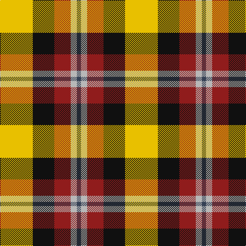

In pattern [BYRKY](/stripes/byrky/).

This was sourced from register-of-tartans.  It is a [5 stripe tartan](/stripes/stripes5/).

Original link https://www.tartanregister.gov.uk/tartanDetails.aspx?ref=3708

## Also known as

This cloth is also recorded under:

- Scottish American Athletic Assoc (Co
- Scottish American Athletic Assoc Corporate Sports

## Attestations

This cloth appears in 3 source records; the oldest owns this page.

- 01/05/2007 — Scottish American Athletic Assoc (register-of-tartans, [record](https://www.tartanregister.gov.uk/tartanDetails.aspx?ref=3708))
- May 2007 — Scottish American Athletic Assoc (Co (tartans-authority, [record](http://www.tartansauthority.com/tartan-ferret/display/7193/))
- undated — Scottish American Athletic Assoc Corporate Sports Tartan Tartan Number: 7193. Earliest known date: 2007 Designed using the corporate colours of the Scottish American Athletic Association. First worn by David P. Garman, President 326 N. Western Ave. Suite 254 Los Angeles , CA 90004, in 2007 See products available Copyright © Blair Urquhart, Comrie, 2015 (house-of-tartan, [record](http://www.house-of-tartan.scotland.net/house/TartanViewjs.asp?colr=Def&tnam=7193))

## Register references

External register numbers recorded for this tartan.

- Scottish Register of Tartans: [3708](https://www.tartanregister.gov.uk/tartanDetails.aspx?ref=3708)
- Scottish Tartans Authority (ITI): 7193

## Thread count
Y/64 K42 DRa32 N12 Na/8

## Palette
Each colour and the base-6 reference it is a variant of.

| Colour | Shade | Base |
|---|---|---|
| B | <code style="background-color:#38409C;">#38409C</code> `oklch(42.1% 0.148 274.4)` <small>#38409C</small> | B <code style="background-color:#2A418A;">#2A418A</code> |
| DB | <code style="background-color:#003C64;">#003C64</code> `oklch(34.5% 0.089 246.0)` <small>#003C64</small> | B <code style="background-color:#2A418A;">#2A418A</code> |
| DR | <code style="background-color:#780028;">#780028</code> `oklch(36.5% 0.146 12.8)` <small>#780028</small> | R <code style="background-color:#CC0000;">#CC0000</code> |
| DRa | <code style="background-color:#901C1C;">#901C1C</code> `oklch(42.7% 0.152 26.5)` <small>#901C1C</small> | R <code style="background-color:#CC0000;">#CC0000</code> |
| K | <code style="background-color:#101010;">#101010</code> `oklch(17.3% 0.000 89.9)` <small>#101010</small> | K <code style="background-color:#000000;">#000000</code> |
| N | <code style="background-color:#B8B8B8;">#B8B8B8</code> `oklch(78.3% 0.000 89.9)` <small>#B8B8B8</small> | Y <code style="background-color:#F2BF00;">#F2BF00</code> |
| Na | <code style="background-color:#344054;">#344054</code> `oklch(36.9% 0.038 260.5)` <small>#344054</small> | B <code style="background-color:#2A418A;">#2A418A</code> |
| R | <code style="background-color:#C8002C;">#C8002C</code> `oklch(52.6% 0.212 22.0)` <small>#C8002C</small> | R <code style="background-color:#CC0000;">#CC0000</code> |
| Y | <code style="background-color:#E8C000;">#E8C000</code> `oklch(81.9% 0.168 93.7)` <small>#E8C000</small> | Y <code style="background-color:#F2BF00;">#F2BF00</code> |

# Sample pattern

## Nearest tartans

The nearest existing variants by ΔTartan distance.

1. [Entre Rios Province (Provisional](/setts/s6/g36lb4g8k29r24w7~x2/) — ΔT 1.06
1. [Samye](/setts/s5/ly25r10g10db11w2~x2/) — ΔT 1.07
1. [Aboyne II (Fashion)](/setts/s6/r2ly1r5k4g5w1~x4/) — ΔT 1.20
1. [Thirkill (Dalgliesh)](/setts/s7/w6r18k2r6g7k8ly6~x4/) — ΔT 1.29
1. [Turnbull, dress](/setts/s5/k7db3g28r28ly3~x2/) — ΔT 1.30
1. [Sachie Hara Scottish Check (Personal)](/setts/s5/k5db4g24r21w3~x2/) — ΔT 1.31
1. [Burberry Counterfeit](/setts/s5/o3w3k3lo10r1~x6/) — ΔT 1.35
1. [Ikelman No 2](/setts/s5/y26k10r10ly10y3~x2/) — ΔT 1.38
1. [Abbink, Ingmar (Personal)](/setts/s5/r39t22k11ly22g5~x2/) — ΔT 1.39
1. [MacLachlan Dress](/setts/s7/r36w3lo4g24w24k3lo6~x2/) — ΔT 1.40

## Neighbour map

Every grey dot is one of 14299 variants placed by the first two principal components of the ΔTartan feature space (44% of its variance). Red is this tartan; blue dots are its nearest — click one to open its page.

<svg viewBox="0 0 640 380" role="img" style="max-width:100%;height:auto;border:1px solid #e0e0e0;border-radius:4px;display:block" xmlns="http://www.w3.org/2000/svg"><image href="/nn/cloud.v1.png" width="640" height="380"/><a href="/setts/s6/g36lb4g8k29r24w7~x2/"><circle cx="144.7" cy="193.6" r="4" fill="#3465a4"><title>Entre Rios Province (Provisional</title></circle></a><a href="/setts/s5/ly25r10g10db11w2~x2/"><circle cx="159.8" cy="183.6" r="4" fill="#3465a4"><title>Samye</title></circle></a><a href="/setts/s6/r2ly1r5k4g5w1~x4/"><circle cx="113.6" cy="221.6" r="4" fill="#3465a4"><title>Aboyne II (Fashion)</title></circle></a><a href="/setts/s7/w6r18k2r6g7k8ly6~x4/"><circle cx="149.6" cy="180.2" r="4" fill="#3465a4"><title>Thirkill (Dalgliesh)</title></circle></a><a href="/setts/s5/k7db3g28r28ly3~x2/"><circle cx="197.0" cy="188.9" r="4" fill="#3465a4"><title>Turnbull, dress</title></circle></a><a href="/setts/s5/k5db4g24r21w3~x2/"><circle cx="194.2" cy="201.6" r="4" fill="#3465a4"><title>Sachie Hara Scottish Check (Personal)</title></circle></a><a href="/setts/s5/o3w3k3lo10r1~x6/"><circle cx="212.7" cy="186.2" r="4" fill="#3465a4"><title>Burberry Counterfeit</title></circle></a><a href="/setts/s5/y26k10r10ly10y3~x2/"><circle cx="200.0" cy="215.3" r="4" fill="#3465a4"><title>Ikelman No 2</title></circle></a><a href="/setts/s5/r39t22k11ly22g5~x2/"><circle cx="130.8" cy="203.4" r="4" fill="#3465a4"><title>Abbink, Ingmar (Personal)</title></circle></a><a href="/setts/s7/r36w3lo4g24w24k3lo6~x2/"><circle cx="140.3" cy="146.4" r="4" fill="#3465a4"><title>MacLachlan Dress</title></circle></a><circle cx="130.7" cy="196.8" r="5" fill="#c00000"/></svg>

ID: /setts/s5/ly32k21r16lr6dt4~x2/
