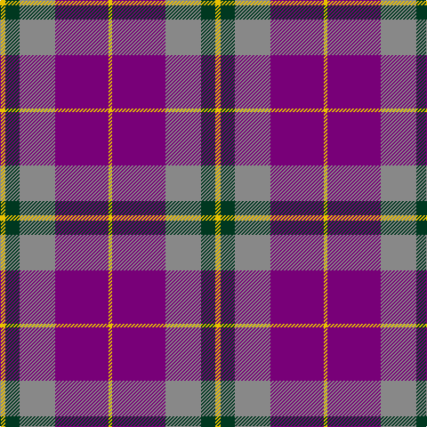

**Bands:** [YBRGY](/stripes/ybrgy/) · **Stripes:** [LY DP O DG LY](/stripes/stripes5/) LY DP O DG LY

This was sourced from tartans-authority.  It is a [5 band tartan](/bands/bands5/).

Original link http://www.tartansauthority.com/tartan-ferret/display/5968/

## Thread count
Y/6 DG16 N40 P60 Y/4

## Palette
Each colour and its ΔE from the base-6 reference it is a variant of.

| Colour | Shade | Base | ΔE (OKLab) |
|---|---|---|---|
| DG | <code style="background-color:#003820;">#003820</code> `#003820` | G <code style="background-color:#006100;">#006100</code> | 0.15 |
| N | <code style="background-color:#888888;">#888888</code> `#888888` | R <code style="background-color:#CC0000;">#CC0000</code> | 0.24 |
| P | <code style="background-color:#780078;">#780078</code> `#780078` | B <code style="background-color:#2A418A;">#2A418A</code> | 0.17 |
| Y | <code style="background-color:#E8C000;">#E8C000</code> `#E8C000` | Y <code style="background-color:#F2BF00;">#F2BF00</code> | 0.02 |

# Sample pattern

## Nearest tartans

The nearest existing variants by ΔTartan distance.

1. [Masai Shuka 17 (Artefact)](/setts/s6/k4b32r30b2w5k2~x2/) — ΔT 1.02
1. [McIntosh, Georgina (Personal)](/setts/s6/db9r1db2r1r4w1~x12/) — ΔT 1.16
1. [Robinson, dress](/setts/s6/g1db16r7k1r7k1~x2/) — ΔT 1.17
1. [Robinson Dress (Pendleton) #1](/setts/s6/g1db16r7k1r7k1~x4/) — ΔT 1.18
1. [Wicks (Personal)](/setts/s8/dp30o20dg8ly3dg8o20dp30ly2~x2/) — ΔT 1.19
1. [Highland Spring Dress (2004) (Corp)](/setts/s5/w4db30g10r25w2~x2/) — ΔT 1.19
1. [Galloway Red](/setts/s6/g3r2db22r22db2w3~x2/) — ΔT 1.23
1. [Galloway Dress (Yellow Line)](/setts/s6/dg2r1db16r16db1ly2~x2/) — ΔT 1.26
1. [Discover Islay (District)](/setts/s6/dp6ly1dp20db6g19dp2~x4/) — ΔT 1.28
1. [Thompson/Thomson/MacTavish](/setts/s6/t2r12db2t6k6t1~x4/) — ΔT 1.29

## Neighbour map

Every grey dot is one of 14313 variants placed by the first two principal components of the ΔTartan feature space (44% of its variance). Red is this tartan; blue dots are its nearest — click one to open its page.

<svg viewBox="0 0 640 380" role="img" style="max-width:100%;height:auto;border:1px solid #e0e0e0;border-radius:4px;display:block" xmlns="http://www.w3.org/2000/svg"><image href="/nn/cloud.v1.png" width="640" height="380"/><a href="/setts/s6/k4b32r30b2w5k2~x2/"><circle cx="285.1" cy="162.4" r="4" fill="#3465a4"><title>Masai Shuka 17 (Artefact)</title></circle></a><a href="/setts/s6/db9r1db2r1r4w1~x12/"><circle cx="285.7" cy="201.4" r="4" fill="#3465a4"><title>McIntosh, Georgina (Personal)</title></circle></a><a href="/setts/s6/g1db16r7k1r7k1~x2/"><circle cx="325.0" cy="181.4" r="4" fill="#3465a4"><title>Robinson, dress</title></circle></a><a href="/setts/s6/g1db16r7k1r7k1~x4/"><circle cx="329.2" cy="182.2" r="4" fill="#3465a4"><title>Robinson Dress (Pendleton) #1</title></circle></a><a href="/setts/s8/dp30o20dg8ly3dg8o20dp30ly2~x2/"><circle cx="282.8" cy="194.5" r="4" fill="#3465a4"><title>Wicks (Personal)</title></circle></a><a href="/setts/s5/w4db30g10r25w2~x2/"><circle cx="227.9" cy="194.3" r="4" fill="#3465a4"><title>Highland Spring Dress (2004) (Corp)</title></circle></a><a href="/setts/s6/g3r2db22r22db2w3~x2/"><circle cx="277.5" cy="178.8" r="4" fill="#3465a4"><title>Galloway Red</title></circle></a><a href="/setts/s6/dg2r1db16r16db1ly2~x2/"><circle cx="308.6" cy="167.0" r="4" fill="#3465a4"><title>Galloway Dress (Yellow Line)</title></circle></a><a href="/setts/s6/dp6ly1dp20db6g19dp2~x4/"><circle cx="337.4" cy="195.4" r="4" fill="#3465a4"><title>Discover Islay (District)</title></circle></a><a href="/setts/s6/t2r12db2t6k6t1~x4/"><circle cx="216.8" cy="192.2" r="4" fill="#3465a4"><title>Thompson/Thomson/MacTavish</title></circle></a><circle cx="280.7" cy="194.6" r="5" fill="#c00000"/></svg>

ID: /setts/s5/ly3dg8o20dp30ly2~x2/
