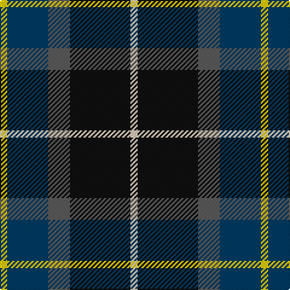

This page is one **sett** — a single exact thread-count. It belongs to the [tartan](/tartans/y3db17n9k25lr3/)
(the same proportion at any scale), whose colour order is pattern [WKBBY](/stripes/wkbby/).

Sourced from tartans-authority.  It is a [5 stripe tartan](/stripes/stripes5/).

Original link http://www.tartansauthority.com/tartan-ferret/display/10792/

## Thread count
Y/6 DB34 N18 K50 LR/6

## Palette
Each colour and the base-6 reference it is a variant of.

| Colour | Shade | Base |
|---|---|---|
| DB | <code style="background-color:#003C64;">#003C64</code> `oklch(34.5% 0.089 246.0)` <small>#003C64</small> | B <code style="background-color:#2A418A;">#2A418A</code> |
| K | <code style="background-color:#101010;">#101010</code> `oklch(17.3% 0.000 89.9)` <small>#101010</small> | K <code style="background-color:#000000;">#000000</code> |
| LR | <code style="background-color:#E8CCB8;">#E8CCB8</code> `oklch(86.3% 0.042 57.7)` <small>#E8CCB8</small> | W <code style="background-color:#F7F7F7;">#F7F7F7</code> |
| N | <code style="background-color:#5C5C5C;">#5C5C5C</code> `oklch(47.5% 0.000 89.9)` <small>#5C5C5C</small> | B <code style="background-color:#2A418A;">#2A418A</code> |
| Y | <code style="background-color:#FCCC00;">#FCCC00</code> `oklch(86.2% 0.176 91.5)` <small>#FCCC00</small> | Y <code style="background-color:#F2BF00;">#F2BF00</code> |

# Sample pattern

## Nearest tartans

The nearest existing variants by ΔTartan distance, with this tartan at the top so the swatches line up against it.

ΔTartan

Tartan

Sett

—

<a href="/ttd/edit/#slug=ly3dt17n9k25lb3~x2">Teylu Coleman (Name)</a> <a class="nn-out" href="/setts/s5/ly3dt17n9k25lb3~x2/" title="open its dictionary page">↗</a>

0.61

<a href="/ttd/edit/#slug=w3k25do9dp17ly3~x2">Teylu Coleman (Cornwall)</a> <a class="nn-out" href="/setts/s5/w3k25do9dp17ly3~x2/" title="open its dictionary page">↗</a>

0.73

<a href="/ttd/edit/#slug=db15r6dg8k2w2k2~x6">Stovell (2015)</a> <a class="nn-out" href="/setts/s6/db15r6dg8k2w2k2~x6/" title="open its dictionary page">↗</a>

0.81

<a href="/ttd/edit/#slug=r4db24k12g14k4lb3~x2">MacPhail Hunting #2</a> <a class="nn-out" href="/setts/s6/r4db24k12g14k4lb3~x2/" title="open its dictionary page">↗</a>

0.81

<a href="/ttd/edit/#slug=k4t3dp11dg14w2~x2">Wellington No 229</a> <a class="nn-out" href="/setts/s5/k4t3dp11dg14w2~x2/" title="open its dictionary page">↗</a>

0.84

<a href="/ttd/edit/#slug=k7t3o30dt30w3~x2">Douglas, brown</a> <a class="nn-out" href="/setts/s5/k7t3o30dt30w3~x2/" title="open its dictionary page">↗</a>

0.85

<a href="/ttd/edit/#slug=db22w2k10g11r3g4~x2">Paterson Blue (Personal)</a> <a class="nn-out" href="/setts/s6/db22w2k10g11r3g4~x2/" title="open its dictionary page">↗</a>

0.88

<a href="/ttd/edit/#slug=k4w1g10k10db10r2~x4">Rose Hunting</a> <a class="nn-out" href="/setts/s6/k4w1g10k10db10r2~x4/" title="open its dictionary page">↗</a>

0.92

<a href="/ttd/edit/#slug=dg5db2dg9db19dr9ly2~x2">Lyle and Scott</a> <a class="nn-out" href="/setts/s6/dg5db2dg9db19dr9ly2~x2/" title="open its dictionary page">↗</a>

0.94

<a href="/ttd/edit/#slug=db31b4db5k19g20ly4~x2">Midlothian</a> <a class="nn-out" href="/setts/s6/db31b4db5k19g20ly4~x2/" title="open its dictionary page">↗</a>

0.94

<a href="/ttd/edit/#slug=k4w1g10k10db10r2~x2">Rose Hunting Clan Tartan Tartan Number: 1226. Earliest known date: 1831 First recorded in James Logan's, 'The Scottish Gael' in 1831. See products available Copyright © Blair Urquhart, Comrie, 2015</a> <a class="nn-out" href="/setts/s6/k4w1g10k10db10r2~x2/" title="open its dictionary page">↗</a>

## Neighbour map

Every grey dot is one of 14299 variants placed by the first two principal components of the ΔTartan feature space (44% of its variance). Red is this tartan; blue dots are its nearest — click one to open its page.

<svg viewBox="0 0 640 380" role="img" style="max-width:100%;height:auto;border:1px solid #e0e0e0;border-radius:4px;display:block" xmlns="http://www.w3.org/2000/svg"><image href="/nn/cloud.v1.png" width="640" height="380"/><a href="/setts/s5/w3k25do9dp17ly3~x2/"><circle cx="198.5" cy="221.8" r="4" fill="#3465a4"><title>Teylu Coleman (Cornwall)</title></circle></a><a href="/setts/s6/db15r6dg8k2w2k2~x6/"><circle cx="182.2" cy="210.6" r="4" fill="#3465a4"><title>Stovell (2015)</title></circle></a><a href="/setts/s6/r4db24k12g14k4lb3~x2/"><circle cx="172.5" cy="220.7" r="4" fill="#3465a4"><title>MacPhail Hunting #2</title></circle></a><a href="/setts/s5/k4t3dp11dg14w2~x2/"><circle cx="173.1" cy="231.0" r="4" fill="#3465a4"><title>Wellington No 229</title></circle></a><a href="/setts/s5/k7t3o30dt30w3~x2/"><circle cx="216.5" cy="201.7" r="4" fill="#3465a4"><title>Douglas, brown</title></circle></a><a href="/setts/s6/db22w2k10g11r3g4~x2/"><circle cx="204.0" cy="204.8" r="4" fill="#3465a4"><title>Paterson Blue (Personal)</title></circle></a><a href="/setts/s6/k4w1g10k10db10r2~x4/"><circle cx="166.4" cy="223.2" r="4" fill="#3465a4"><title>Rose Hunting</title></circle></a><a href="/setts/s6/dg5db2dg9db19dr9ly2~x2/"><circle cx="202.9" cy="221.7" r="4" fill="#3465a4"><title>Lyle and Scott</title></circle></a><a href="/setts/s6/db31b4db5k19g20ly4~x2/"><circle cx="159.0" cy="208.8" r="4" fill="#3465a4"><title>Midlothian</title></circle></a><a href="/setts/s6/k4w1g10k10db10r2~x2/"><circle cx="170.6" cy="225.3" r="4" fill="#3465a4"><title>Rose Hunting Clan Tartan Tartan Number: 1226. Earliest known date: 1831 First recorded in James Logan's, 'The Scottish Gael' in 1831. See products available Copyright © Blair Urquhart, Comrie, 2015</title></circle></a><circle cx="192.2" cy="221.7" r="5" fill="#c00000"/></svg>

ID: /setts/s5/ly3dt17n9k25lb3~x2/
