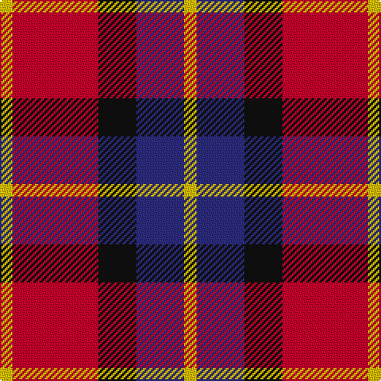

This page is one **sett** — a single exact thread-count. It belongs to the [tartan](/tartans/ly4r27k12db15ly4/)
(the same proportion at any scale), whose colour order is pattern [YBKRY](/stripes/ybkry/).

Sourced from register-of-tartans.  It is a [5 stripe tartan](/stripes/stripes5/).

Original link https://www.tartanregister.gov.uk/tartanDetails.aspx?ref=20

2 attestations — the source records this cloth was collapsed from (oldest owns this page)

<ul>
<li>01/01/1992 — Aberdeen University (1992) (register-of-tartans, <a href="https://www.tartanregister.gov.uk/tartanDetails.aspx?ref=20">record</a>)</li>
<li>1992 — Aberdeen University - 1992 (Corp.) (tartans-authority, <a href="http://www.tartansauthority.com/tartan-ferret/display/2152/">record</a>)</li>
</ul>

## Register references

External register numbers recorded for this tartan.

- Scottish Register of Tartans: [20](https://www.tartanregister.gov.uk/tartanDetails.aspx?ref=20)
- Scottish Tartans Authority (ITI): 2152
- Scottish Tartans World Register: 2152

## Thread count
Y/8 R54 K24 DB30 Y/8

## Palette

Palette: <strong>Tartan Register</strong>
<table><thead><tr><th>Colour</th><th>Threads</th><th>Shade</th><th>Base</th><th>OKLCh</th></tr></thead><tbody><tr><td>Y/</td><td style="text-align:right;font-variant-numeric:tabular-nums">8</td><td><code style="background-color:#E8C000;">#E8C000</code> <small style="color:#888">#E8C000</small></td><td>Y <code style="background-color:#F2BF00;">#F2BF00</code></td><td><small style="color:#888">oklch(81.9% 0.168 93.7)</small></td></tr><tr><td>R</td><td style="text-align:right;font-variant-numeric:tabular-nums">54</td><td><code style="background-color:#C8002C;">#C8002C</code> <small style="color:#888">#C8002C</small></td><td>R <code style="background-color:#CC0000;">#CC0000</code></td><td><small style="color:#888">oklch(52.6% 0.212 22.0)</small></td></tr><tr><td>K</td><td style="text-align:right;font-variant-numeric:tabular-nums">24</td><td><code style="background-color:#101010;">#101010</code> <small style="color:#888">#101010</small></td><td>K <code style="background-color:#000000;">#000000</code></td><td><small style="color:#888">oklch(17.3% 0.000 89.9)</small></td></tr><tr><td>DB</td><td style="text-align:right;font-variant-numeric:tabular-nums">30</td><td><code style="background-color:#2C2C80;">#2C2C80</code> <small style="color:#888">#2C2C80</small></td><td>B <code style="background-color:#2A418A;">#2A418A</code></td><td><small style="color:#888">oklch(35.0% 0.138 276.6)</small></td></tr><tr><td>Y/</td><td style="text-align:right;font-variant-numeric:tabular-nums">8</td><td><code style="background-color:#E8C000;">#E8C000</code> <small style="color:#888">#E8C000</small></td><td>Y <code style="background-color:#F2BF00;">#F2BF00</code></td><td><small style="color:#888">oklch(81.9% 0.168 93.7)</small></td></tr></tbody></table>

# Sample pattern

## Nearest tartans

The nearest existing variants by ΔTartan distance, with this tartan at the top so the swatches line up against it.

ΔTartan

Tartan

Sett

—

<a href="/ttd/edit/#slug=ly4r27k12db15ly4~x2">Aberdeen University (1992)</a> <a class="nn-out" href="/setts/s5/ly4r27k12db15ly4~x2/" title="open its dictionary page">↗</a>

0.68

<a href="/ttd/edit/#slug=ly2r15k7db8ly2~x4">Aberdeen University</a> <a class="nn-out" href="/setts/s5/ly2r15k7db8ly2~x4/" title="open its dictionary page">↗</a>

1.02

<a href="/ttd/edit/#slug=r25k13w8db5~x2">Hamby Sport (Personal)</a> <a class="nn-out" href="/setts/s4/r25k13w8db5~x2/" title="open its dictionary page">↗</a>

1.03

<a href="/ttd/edit/#slug=w3r24db12dg8lo3~x2">McGill University (Corporate)</a> <a class="nn-out" href="/setts/s5/w3r24db12dg8lo3~x2/" title="open its dictionary page">↗</a>

1.05

<a href="/ttd/edit/#slug=lb5r34k22r4o24r4~x2">Wcwm 759-2</a> <a class="nn-out" href="/setts/s6/lb5r34k22r4o24r4~x2/" title="open its dictionary page">↗</a>

1.12

<a href="/ttd/edit/#slug=k6r33k18w20db6~x2">Brodie Dress</a> <a class="nn-out" href="/setts/s5/k6r33k18w20db6~x2/" title="open its dictionary page">↗</a>

1.19

<a href="/ttd/edit/#slug=t2r12db2t6k6t1~x4">Thompson/Thomson/MacTavish</a> <a class="nn-out" href="/setts/s6/t2r12db2t6k6t1~x4/" title="open its dictionary page">↗</a>

1.19

<a href="/ttd/edit/#slug=r15g3w2k10w5~x2">SAL Cubiska Stenen</a> <a class="nn-out" href="/setts/s5/r15g3w2k10w5~x2/" title="open its dictionary page">↗</a>

1.21

<a href="/ttd/edit/#slug=r26t3r4k16db16k4~x2">Graham of Menteith, (Red)</a> <a class="nn-out" href="/setts/s6/r26t3r4k16db16k4~x2/" title="open its dictionary page">↗</a>

1.21

<a href="/ttd/edit/#slug=t2r12db2t6k6t1~x2">MacTavish Thomson Clan Tartan Tartan Number: 228. Earliest known date: 1906 D.C. Stewart writes, &quot; This tartan has recently (1950) come into use as being that appropriate to the Thomsons; Thomson is the anglicised form of the name MacTavish. It is not recorded in any of the early illustrated books. Many MacTavishes wear the Campbell of Argyll.&quot; Stewart may not have considered Johnston's publication in 1906 as 'early' and this may have been the source for the sett he recorded in the 'Setts of the Scottish Tartans' in 1950. Some versions show black in place of the mid blue stripe in this illustration. There is also the personal tartan of Lord Thomson of Fleet and a sett recorded in the 'Baronage of Angus and Mearns'. See products available Copyright © Blair Urquhart, Comrie, 2015</a> <a class="nn-out" href="/setts/s6/t2r12db2t6k6t1~x2/" title="open its dictionary page">↗</a>

1.23

<a href="/ttd/edit/#slug=dp2r4g12r3dp6r10w2~x2">MacKintosh-Geddes (Personal?)</a> <a class="nn-out" href="/setts/s7/dp2r4g12r3dp6r10w2~x2/" title="open its dictionary page">↗</a>

## Neighbour map

Every grey dot is one of 14359 variants placed by the first two principal components of the ΔTartan feature space (44% of its variance). Red is this tartan; blue dots are its nearest — click one to open its page.

<svg viewBox="0 0 640 380" role="img" style="max-width:100%;height:auto;border:1px solid #e0e0e0;border-radius:4px;display:block" xmlns="http://www.w3.org/2000/svg"><image href="/nn/cloud.v1.png" width="640" height="380"/><a href="/setts/s5/ly2r15k7db8ly2~x4/"><circle cx="185.1" cy="215.0" r="4" fill="#3465a4"><title>Aberdeen University</title></circle></a><a href="/setts/s4/r25k13w8db5~x2/"><circle cx="194.7" cy="246.5" r="4" fill="#3465a4"><title>Hamby Sport (Personal)</title></circle></a><a href="/setts/s5/w3r24db12dg8lo3~x2/"><circle cx="209.2" cy="196.1" r="4" fill="#3465a4"><title>McGill University (Corporate)</title></circle></a><a href="/setts/s6/lb5r34k22r4o24r4~x2/"><circle cx="205.7" cy="203.8" r="4" fill="#3465a4"><title>Wcwm 759-2</title></circle></a><a href="/setts/s5/k6r33k18w20db6~x2/"><circle cx="135.1" cy="225.4" r="4" fill="#3465a4"><title>Brodie Dress</title></circle></a><a href="/setts/s6/t2r12db2t6k6t1~x4/"><circle cx="215.9" cy="193.2" r="4" fill="#3465a4"><title>Thompson/Thomson/MacTavish</title></circle></a><a href="/setts/s5/r15g3w2k10w5~x2/"><circle cx="165.2" cy="207.1" r="4" fill="#3465a4"><title>SAL Cubiska Stenen</title></circle></a><a href="/setts/s6/r26t3r4k16db16k4~x2/"><circle cx="205.3" cy="208.8" r="4" fill="#3465a4"><title>Graham of Menteith, (Red)</title></circle></a><a href="/setts/s6/t2r12db2t6k6t1~x2/"><circle cx="220.0" cy="195.5" r="4" fill="#3465a4"><title>MacTavish Thomson Clan Tartan Tartan Number: 228. Earliest known date: 1906 D.C. Stewart writes, &quot; This tartan has recently (1950) come into use as being that appropriate to the Thomsons; Thomson is the anglicised form of the name MacTavish. It is not recorded in any of the early illustrated books. Many MacTavishes wear the Campbell of Argyll.&quot; Stewart may not have considered Johnston's publication in 1906 as 'early' and this may have been the source for the sett he recorded in the 'Setts of the Scottish Tartans' in 1950. Some versions show black in place of the mid blue stripe in this illustration. There is also the personal tartan of Lord Thomson of Fleet and a sett recorded in the 'Baronage of Angus and Mearns'. See products available Copyright © Blair Urquhart, Comrie, 2015</title></circle></a><a href="/setts/s7/dp2r4g12r3dp6r10w2~x2/"><circle cx="200.6" cy="223.5" r="4" fill="#3465a4"><title>MacKintosh-Geddes (Personal?)</title></circle></a><circle cx="187.3" cy="223.6" r="5" fill="#c00000"/></svg>

ID: /setts/s5/ly4r27k12db15ly4~x2/
