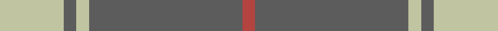

This page is one **sett** — a single exact thread-count. It belongs to the [tartan](/tartans/ly5n1ly1n12r1/)
(the same proportion at any scale), whose colour order is pattern [RBYBY](/stripes/rbyby/).

Sourced from register-of-tartans.  It is a [5 stripe tartan](/stripes/stripes5/).

Original link https://www.tartanregister.gov.uk/tartanDetails.aspx?ref=611

2 attestations — the source records this cloth was collapsed from (oldest owns this page)

<ul>
<li>01/01/1986 — Ceredigion (Personal) (register-of-tartans, <a href="https://www.tartanregister.gov.uk/tartanDetails.aspx?ref=611">record</a>)</li>
<li>1986-1993 — Ceredigion (Personal) (tartans-authority, <a href="http://www.tartansauthority.com/tartan-ferret/display/7078/">record</a>)</li>
</ul>

## Register references

External register numbers recorded for this tartan.

- Scottish Register of Tartans: [611](https://www.tartanregister.gov.uk/tartanDetails.aspx?ref=611)
- Scottish Tartans Authority (ITI): 7078

## Thread count
N/40 Na8 N8 Na96 R/8

## Palette

Palette: <strong>custom</strong>
<table><thead><tr><th>Colour</th><th>Threads</th><th>Shade</th><th>Base</th><th>OKLCh</th></tr></thead><tbody><tr><td>N/</td><td style="text-align:right;font-variant-numeric:tabular-nums">40</td><td><code style="background-color:#C0C4A0;">#C0C4A0</code> <small style="color:#888">#C0C4A0</small></td><td>Y <code style="background-color:#F2BF00;">#F2BF00</code></td><td><small style="color:#888">oklch(80.8% 0.049 112.6)</small></td></tr><tr><td>Na</td><td style="text-align:right;font-variant-numeric:tabular-nums">8</td><td><code style="background-color:#5C5C5C;">#5C5C5C</code> <small style="color:#888">#5C5C5C</small></td><td>B <code style="background-color:#2A418A;">#2A418A</code></td><td><small style="color:#888">oklch(47.5% 0.000 89.9)</small></td></tr><tr><td>N</td><td style="text-align:right;font-variant-numeric:tabular-nums">8</td><td><code style="background-color:#C0C4A0;">#C0C4A0</code> <small style="color:#888">#C0C4A0</small></td><td>Y <code style="background-color:#F2BF00;">#F2BF00</code></td><td><small style="color:#888">oklch(80.8% 0.049 112.6)</small></td></tr><tr><td>Na</td><td style="text-align:right;font-variant-numeric:tabular-nums">96</td><td><code style="background-color:#5C5C5C;">#5C5C5C</code> <small style="color:#888">#5C5C5C</small></td><td>B <code style="background-color:#2A418A;">#2A418A</code></td><td><small style="color:#888">oklch(47.5% 0.000 89.9)</small></td></tr><tr><td>R/</td><td style="text-align:right;font-variant-numeric:tabular-nums">8</td><td><code style="background-color:#B44440;">#B44440</code> <small style="color:#888">#B44440</small></td><td>R <code style="background-color:#CC0000;">#CC0000</code></td><td><small style="color:#888">oklch(53.9% 0.147 25.3)</small></td></tr></tbody></table>

# Sample pattern

## Nearest tartans

The nearest existing variants by ΔTartan distance, with this tartan at the top so the swatches line up against it.

ΔTartan

Tartan

Sett

—

<a href="/ttd/edit/#slug=ly5n1ly1n12r1~x8">Ceredigion (Personal)</a> <a class="nn-out" href="/setts/s5/ly5n1ly1n12r1~x8/" title="open its dictionary page">↗</a>

0.81

<a href="/ttd/edit/#slug=t11ly2r1ly2r1~x4">Carlisle, Ancient</a> <a class="nn-out" href="/setts/s5/t11ly2r1ly2r1~x4/" title="open its dictionary page">↗</a>

1.24

<a href="/ttd/edit/#slug=lo38w9lo3do9w3~x2">Loch Tummel Trade Tartan Tartan Number: 1751. Earliest known date: pre 2003 Nothing See products available Copyright © Blair Urquhart, Comrie, 2015</a> <a class="nn-out" href="/setts/s5/lo38w9lo3do9w3~x2/" title="open its dictionary page">↗</a>

1.34

<a href="/ttd/edit/#slug=lo72dt16w9dt4w5dt16~x2">Machair</a> <a class="nn-out" href="/setts/s6/lo72dt16w9dt4w5dt16~x2/" title="open its dictionary page">↗</a>

1.36

<a href="/ttd/edit/#slug=n62w11k4lg17~x2">Thunderlord (Corporate)</a> <a class="nn-out" href="/setts/s4/n62w11k4lg17~x2/" title="open its dictionary page">↗</a>

1.48

<a href="/ttd/edit/#slug=o57w5g20o5ly10">Jahore District Tartan Tartan Number: 1309. Earliest known date: c.1890 [50% actual count] Reputed to have been presented to the Sultan of Jahore by Queen Victoria during his visit to Balmoral around 1890. See products available Copyright © Blair Urquhart, Comrie, 2015</a> <a class="nn-out" href="/setts/s5/o57w5g20o5ly10/" title="open its dictionary page">↗</a>

1.55

<a href="/ttd/edit/#slug=o38w9o3dr9w3~x2">Loch Tummel</a> <a class="nn-out" href="/setts/s5/o38w9o3dr9w3~x2/" title="open its dictionary page">↗</a>

1.57

<a href="/ttd/edit/#slug=m2g1m1g10w1~x4">Welsh National District Tartan Tartan Number: 1523. Earliest known date: 1968 The Welsh Tartan owes its origin to a Society formed in Cardiff in 1967. Its aims were cultural and political - to strengthen Celtic ties and give visible signs of being an individual nation in culture, language and dress. The colours are those of the Welsh flag. It is said that the design was based on the Lord of the Isles tartan because the present Lord is also Prince of Wales. However comparison reveals similarity only to MacDonald, MacDonald of the Isles, or perhaps Applecross district. See products available Copyright © Blair Urquhart, Comrie, 2015</a> <a class="nn-out" href="/setts/s5/m2g1m1g10w1~x4/" title="open its dictionary page">↗</a>

1.57

<a href="/ttd/edit/#slug=t50dr4t12dr23ly4dr4~x2">Sligo</a> <a class="nn-out" href="/setts/s6/t50dr4t12dr23ly4dr4~x2/" title="open its dictionary page">↗</a>

1.63

<a href="/ttd/edit/#slug=db3lo30db40r3~x2">Sanix Large Muted</a> <a class="nn-out" href="/setts/s4/db3lo30db40r3~x2/" title="open its dictionary page">↗</a>

1.67

<a href="/ttd/edit/#slug=dy8o29dy8ly3dy8o8ly3~x2">Lister (Name)</a> <a class="nn-out" href="/setts/s7/dy8o29dy8ly3dy8o8ly3~x2/" title="open its dictionary page">↗</a>

## Neighbour map

Every grey dot is one of 14299 variants placed by the first two principal components of the ΔTartan feature space (44% of its variance). Red is this tartan; blue dots are its nearest — click one to open its page.

<svg viewBox="0 0 640 380" role="img" style="max-width:100%;height:auto;border:1px solid #e0e0e0;border-radius:4px;display:block" xmlns="http://www.w3.org/2000/svg"><image href="/nn/cloud.v1.png" width="640" height="380"/><a href="/setts/s5/t11ly2r1ly2r1~x4/"><circle cx="408.1" cy="208.3" r="4" fill="#3465a4"><title>Carlisle, Ancient</title></circle></a><a href="/setts/s5/lo38w9lo3do9w3~x2/"><circle cx="409.2" cy="200.0" r="4" fill="#3465a4"><title>Loch Tummel Trade Tartan Tartan Number: 1751. Earliest known date: pre 2003 Nothing See products available Copyright © Blair Urquhart, Comrie, 2015</title></circle></a><a href="/setts/s6/lo72dt16w9dt4w5dt16~x2/"><circle cx="382.0" cy="178.5" r="4" fill="#3465a4"><title>Machair</title></circle></a><a href="/setts/s4/n62w11k4lg17~x2/"><circle cx="403.9" cy="210.8" r="4" fill="#3465a4"><title>Thunderlord (Corporate)</title></circle></a><a href="/setts/s5/o57w5g20o5ly10/"><circle cx="402.8" cy="218.6" r="4" fill="#3465a4"><title>Jahore District Tartan Tartan Number: 1309. Earliest known date: c.1890 [50% actual count] Reputed to have been presented to the Sultan of Jahore by Queen Victoria during his visit to Balmoral around 1890. See products available Copyright © Blair Urquhart, Comrie, 2015</title></circle></a><a href="/setts/s5/o38w9o3dr9w3~x2/"><circle cx="408.1" cy="198.0" r="4" fill="#3465a4"><title>Loch Tummel</title></circle></a><a href="/setts/s5/m2g1m1g10w1~x4/"><circle cx="479.5" cy="228.3" r="4" fill="#3465a4"><title>Welsh National District Tartan Tartan Number: 1523. Earliest known date: 1968 The Welsh Tartan owes its origin to a Society formed in Cardiff in 1967. Its aims were cultural and political - to strengthen Celtic ties and give visible signs of being an individual nation in culture, language and dress. The colours are those of the Welsh flag. It is said that the design was based on the Lord of the Isles tartan because the present Lord is also Prince of Wales. However comparison reveals similarity only to MacDonald, MacDonald of the Isles, or perhaps Applecross district. See products available Copyright © Blair Urquhart, Comrie, 2015</title></circle></a><a href="/setts/s6/t50dr4t12dr23ly4dr4~x2/"><circle cx="400.5" cy="206.8" r="4" fill="#3465a4"><title>Sligo</title></circle></a><a href="/setts/s4/db3lo30db40r3~x2/"><circle cx="371.7" cy="229.7" r="4" fill="#3465a4"><title>Sanix Large Muted</title></circle></a><a href="/setts/s7/dy8o29dy8ly3dy8o8ly3~x2/"><circle cx="362.0" cy="233.6" r="4" fill="#3465a4"><title>Lister (Name)</title></circle></a><circle cx="433.6" cy="218.8" r="5" fill="#c00000"/></svg>

ID: /setts/s5/ly5n1ly1n12r1~x8/
