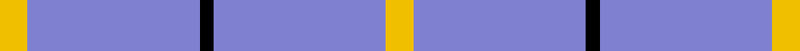

In pattern [YBKBY](/stripes/ybkby/).

This was sourced from weddslist.  It is a [5 stripe tartan](/stripes/stripes5/).

Original link http://www.weddslist.com/cgi-bin/tartans/pg.pl?source=sts

## Thread count
Y/12 B76 K6 B76 Y/12

## Palette
Each colour and the base-6 reference it is a variant of.

| Colour | Shade | Base |
|---|---|---|
| B | <code style="background-color:#8080D0;">#8080D0</code> `oklch(63.4% 0.119 282.5)` <small>#8080D0</small> | B <code style="background-color:#2A418A;">#2A418A</code> |
| K | <code style="background-color:#000000;">#000000</code> `oklch(0.0% 0.000 0.0)` <small>#000000</small> | K <code style="background-color:#000000;">#000000</code> |
| Y | <code style="background-color:#F0C000;">#F0C000</code> `oklch(82.7% 0.169 90.5)` <small>#F0C000</small> | Y <code style="background-color:#F2BF00;">#F2BF00</code> |

# Sample pattern

## Nearest tartans

The nearest existing variants by ΔTartan distance.

1. [Loevenstein Castle #2](/setts/s4/lr20db1lr4db3~x4/) — ΔT 1.83
1. [Poulain League (Corporate)](/setts/s3/ly6t38k3~x2/) — ΔT 1.97
1. [MacLaine of Lochbuie](/setts/s4/db32r3db4ly3~x2/) — ΔT 2.02
1. [Lochnagar](/setts/s6/w1y1y4y7p1w1~x4/) — ΔT 2.25
1. [Sephardim (Corporate)](/setts/s5/w50db7w7t7w18~x2/) — ΔT 2.29
1. [Dominion (Fashion)](/setts/s7/lg6r1lg17db3lg3db8lg1~x2/) — ΔT 2.32
1. [Westfield (Corporate?)](/setts/s4/dt102lr11dt14w11/) — ΔT 2.33
1. [Varrie](/setts/s4/t11db1w1ly1~x20/) — ΔT 2.34
1. [Varrie Commemorative Tartan Tartan Number: 9113. Earliest known date: 2009 November I have designed this tartan in remembrance of my mother Jean Alexander Varrie and for her Scottish Heritage, and all the Varrie Family's can used this design. See products available Copyright © Blair Urquhart, Comrie, 2015](/setts/s4/t9db1w1ly1~x20/) — ΔT 2.47
1. [GulfMark](/setts/s5/dt72b6dt12b17w6~x2/) — ΔT 2.47

## Neighbour map

Every grey dot is one of 14299 variants placed by the first two principal components of the ΔTartan feature space (44% of its variance). Red is this tartan; blue dots are its nearest — click one to open its page.

<svg viewBox="0 0 640 380" role="img" style="max-width:100%;height:auto;border:1px solid #e0e0e0;border-radius:4px;display:block" xmlns="http://www.w3.org/2000/svg"><image href="/nn/cloud.v1.png" width="640" height="380"/><a href="/setts/s4/lr20db1lr4db3~x4/"><circle cx="600.9" cy="214.9" r="4" fill="#3465a4"><title>Loevenstein Castle #2</title></circle></a><a href="/setts/s3/ly6t38k3~x2/"><circle cx="529.8" cy="248.3" r="4" fill="#3465a4"><title>Poulain League (Corporate)</title></circle></a><a href="/setts/s4/db32r3db4ly3~x2/"><circle cx="590.7" cy="239.4" r="4" fill="#3465a4"><title>MacLaine of Lochbuie</title></circle></a><a href="/setts/s6/w1y1y4y7p1w1~x4/"><circle cx="525.1" cy="253.5" r="4" fill="#3465a4"><title>Lochnagar</title></circle></a><a href="/setts/s5/w50db7w7t7w18~x2/"><circle cx="513.5" cy="228.3" r="4" fill="#3465a4"><title>Sephardim (Corporate)</title></circle></a><a href="/setts/s7/lg6r1lg17db3lg3db8lg1~x2/"><circle cx="453.7" cy="207.7" r="4" fill="#3465a4"><title>Dominion (Fashion)</title></circle></a><a href="/setts/s4/dt102lr11dt14w11/"><circle cx="540.7" cy="240.4" r="4" fill="#3465a4"><title>Westfield (Corporate?)</title></circle></a><a href="/setts/s4/t11db1w1ly1~x20/"><circle cx="512.0" cy="219.8" r="4" fill="#3465a4"><title>Varrie</title></circle></a><a href="/setts/s4/t9db1w1ly1~x20/"><circle cx="461.9" cy="225.5" r="4" fill="#3465a4"><title>Varrie Commemorative Tartan Tartan Number: 9113. Earliest known date: 2009 November I have designed this tartan in remembrance of my mother Jean Alexander Varrie and for her Scottish Heritage, and all the Varrie Family's can used this design. See products available Copyright © Blair Urquhart, Comrie, 2015</title></circle></a><a href="/setts/s5/dt72b6dt12b17w6~x2/"><circle cx="512.1" cy="236.8" r="4" fill="#3465a4"><title>GulfMark</title></circle></a><circle cx="540.9" cy="225.6" r="5" fill="#c00000"/></svg>

ID: /setts/s5/ly6b38k3b38ly6~x2/
