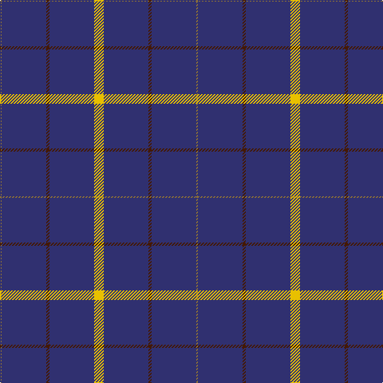

In pattern [GBBBY](/stripes/gbbby/).

This was sourced from register-of-tartans.  It is a [5 stripe tartan](/stripes/stripes5/).

Original link https://www.tartanregister.gov.uk/tartanDetails.aspx?ref=3310

## Attestations

This cloth appears in 2 source records; the oldest owns this page.

- 01/01/1951 — Pearson (register-of-tartans, [record](https://www.tartanregister.gov.uk/tartanDetails.aspx?ref=3310))
- 1951 — Pearson (Name) (tartans-authority, [record](http://www.tartansauthority.com/tartan-ferret/display/1734/))

## Register references

External register numbers recorded for this tartan.

- Scottish Register of Tartans: [3310](https://www.tartanregister.gov.uk/tartanDetails.aspx?ref=3310)
- Scottish Tartans Authority (ITI): 1734
- Scottish Tartans World Register: 1734

## Thread count
Y/12 DB56 DR4 DB56 LT/2

## Palette
Each colour and the base-6 reference it is a variant of.

| Colour | Shade | Base |
|---|---|---|
| DB | <code style="background-color:#303070;">#303070</code> `oklch(34.7% 0.108 279.2)` <small>#303070</small> | B <code style="background-color:#2A418A;">#2A418A</code> |
| DR | <code style="background-color:#441800;">#441800</code> `oklch(27.3% 0.076 46.3)` <small>#441800</small> | B <code style="background-color:#2A418A;">#2A418A</code> |
| LT | <code style="background-color:#8C7038;">#8C7038</code> `oklch(56.0% 0.082 83.0)` <small>#8C7038</small> | G <code style="background-color:#006100;">#006100</code> |
| Y | <code style="background-color:#E8C000;">#E8C000</code> `oklch(81.9% 0.168 93.7)` <small>#E8C000</small> | Y <code style="background-color:#F2BF00;">#F2BF00</code> |

# Sample pattern

## Nearest tartans

The nearest existing variants by ΔTartan distance.

1. [MacLaine of Lochbuie, hunting](/setts/s5/db32r3db4k1ly3~x2/) — ΔT 1.16
1. [Wylie](/setts/s6/db45ly3db10o4k1w2~x2/) — ΔT 1.74
1. [Gem](/setts/s4/db140r11db14ly11/) — ΔT 1.81
1. [East of Scotland Tartan Army](/setts/s6/dt40ly10dt8r20dt100w5/) — ΔT 1.87
1. [MacLaine of Lochbuie](/setts/s4/db32r3db4ly3~x2/) — ΔT 1.90
1. [RAAF #4](/setts/s9/db48w2db7w2db7w2db20t11r2~x2/) — ΔT 1.91
1. [MacLaine of Lochbuie Hunting](/setts/s5/db32r3db4k1ly3/) — ΔT 1.92
1. [Auchairne (Corporate)](/setts/s6/b11db7b3db70lb4db6~x2/) — ΔT 1.95
1. [Inverness, Duke of York](/setts/s8/db122r11w4r15ly4db6ly4db30/) — ΔT 1.97
1. [Volunteer Lifesaving Corps (Corp.)](/setts/s5/r5w4k4db80w4~x2/) — ΔT 1.99

## Neighbour map

Every grey dot is one of 14299 variants placed by the first two principal components of the ΔTartan feature space (44% of its variance). Red is this tartan; blue dots are its nearest — click one to open its page.

<svg viewBox="0 0 640 380" role="img" style="max-width:100%;height:auto;border:1px solid #e0e0e0;border-radius:4px;display:block" xmlns="http://www.w3.org/2000/svg"><image href="/nn/cloud.v1.png" width="640" height="380"/><a href="/setts/s5/db32r3db4k1ly3~x2/"><circle cx="597.3" cy="164.2" r="4" fill="#3465a4"><title>MacLaine of Lochbuie, hunting</title></circle></a><a href="/setts/s6/db45ly3db10o4k1w2~x2/"><circle cx="593.6" cy="123.9" r="4" fill="#3465a4"><title>Wylie</title></circle></a><a href="/setts/s4/db140r11db14ly11/"><circle cx="616.0" cy="230.9" r="4" fill="#3465a4"><title>Gem</title></circle></a><a href="/setts/s6/dt40ly10dt8r20dt100w5/"><circle cx="518.4" cy="180.8" r="4" fill="#3465a4"><title>East of Scotland Tartan Army</title></circle></a><a href="/setts/s4/db32r3db4ly3~x2/"><circle cx="590.7" cy="239.4" r="4" fill="#3465a4"><title>MacLaine of Lochbuie</title></circle></a><a href="/setts/s9/db48w2db7w2db7w2db20t11r2~x2/"><circle cx="549.6" cy="157.8" r="4" fill="#3465a4"><title>RAAF #4</title></circle></a><a href="/setts/s5/db32r3db4k1ly3/"><circle cx="575.7" cy="165.6" r="4" fill="#3465a4"><title>MacLaine of Lochbuie Hunting</title></circle></a><a href="/setts/s6/b11db7b3db70lb4db6~x2/"><circle cx="613.4" cy="198.4" r="4" fill="#3465a4"><title>Auchairne (Corporate)</title></circle></a><a href="/setts/s8/db122r11w4r15ly4db6ly4db30/"><circle cx="576.2" cy="137.7" r="4" fill="#3465a4"><title>Inverness, Duke of York</title></circle></a><a href="/setts/s5/r5w4k4db80w4~x2/"><circle cx="562.0" cy="162.9" r="4" fill="#3465a4"><title>Volunteer Lifesaving Corps (Corp.)</title></circle></a><circle cx="591.0" cy="196.5" r="5" fill="#c00000"/></svg>

ID: /setts/s5/ly6db28do2db28y1~x2/
