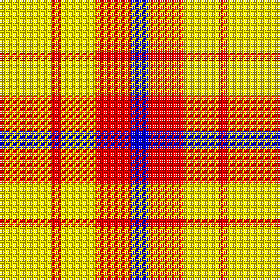

In pattern [BRYRY](/stripes/bryry/).

This was sourced from register-of-tartans.  It is a [5 stripe tartan](/stripes/stripes5/).

Original link https://www.tartanregister.gov.uk/tartanDetails.aspx?ref=10580

## Also known as

This cloth is also recorded under:

- Sands-Pingot Family, Alabama

## Attestations

This cloth appears in 2 source records; the oldest owns this page.

- 01/03/2012 — Sands-Pingot Family, Alabama (Personal) (register-of-tartans, [record](https://www.tartanregister.gov.uk/tartanDetails.aspx?ref=10580))
- 01/03/2012 — Sands-Pingot (Name?) (tartans-authority, [record](http://www.tartansauthority.com/tartan-ferret/display/10580/))

## Register references

External register numbers recorded for this tartan.

- Scottish Register of Tartans: [10580](https://www.tartanregister.gov.uk/tartanDetails.aspx?ref=10580)

## Thread count
Y/30 R5 Y20 R20 B/10

## Palette
Each colour and its ΔE from the base-6 reference it is a variant of.

| Colour | Shade | Base | ΔE (OKLab) |
|---|---|---|---|
| B | <code style="background-color:#0000CD;">#0000CD</code> `#0000CD` | B <code style="background-color:#2A418A;">#2A418A</code> | 0.14 |
| R | <code style="background-color:#FF0000;">#FF0000</code> `#FF0000` | R <code style="background-color:#CC0000;">#CC0000</code> | 0.11 |
| Y | <code style="background-color:#FFE600;">#FFE600</code> `#FFE600` | Y <code style="background-color:#F2BF00;">#F2BF00</code> | 0.10 |

# Sample pattern

## Nearest tartans

The nearest existing variants by ΔTartan distance.

1. [Quenouille (2011)](/setts/s3/ly49r16k11~x2/) — ΔT 1.57
1. [Shire of Hornwood (USA)](/setts/s5/r18ly3r18ly30k4~x2/) — ΔT 1.91
1. [Silvicola](/setts/s4/ly20k15ly20w3~x2/) — ΔT 1.95
1. [Burt's Highlanders (Fashion)](/setts/s5/lo40g13lo6db13lo22~x2/) — ΔT 1.99
1. [Lauder](/setts/s6/ly2k4ly2k2ly5r1~x2/) — ΔT 2.04
1. [Buchanan VS](/setts/s6/lb2r4lb2r4lb9k1~x2/) — ΔT 2.14
1. [Buchele Check (Fashion?)](/setts/s6/r4ly1r3ly1ly8ly2~x4/) — ΔT 2.22
1. [Al-Maktoum](/setts/s6/w11r32g12r5g12r5~x2/) — ΔT 2.24
1. [MacRae of Conchra #2](/setts/s4/k5w37r37w5~x2/) — ΔT 2.28
1. [Clayton Dress (Dance)](/setts/s6/w8r14w8r14w35k4~x2/) — ΔT 2.30

## Neighbour map

Every grey dot is one of 14299 variants placed by the first two principal components of the ΔTartan feature space (44% of its variance). Red is this tartan; blue dots are its nearest — click one to open its page.

<svg viewBox="0 0 640 380" role="img" style="max-width:100%;height:auto;border:1px solid #e0e0e0;border-radius:4px;display:block" xmlns="http://www.w3.org/2000/svg"><image href="/nn/cloud.v1.png" width="640" height="380"/><a href="/setts/s3/ly49r16k11~x2/"><circle cx="301.2" cy="261.2" r="4" fill="#3465a4"><title>Quenouille (2011)</title></circle></a><a href="/setts/s5/r18ly3r18ly30k4~x2/"><circle cx="284.4" cy="203.9" r="4" fill="#3465a4"><title>Shire of Hornwood (USA)</title></circle></a><a href="/setts/s4/ly20k15ly20w3~x2/"><circle cx="322.2" cy="265.6" r="4" fill="#3465a4"><title>Silvicola</title></circle></a><a href="/setts/s5/lo40g13lo6db13lo22~x2/"><circle cx="374.5" cy="244.7" r="4" fill="#3465a4"><title>Burt's Highlanders (Fashion)</title></circle></a><a href="/setts/s6/ly2k4ly2k2ly5r1~x2/"><circle cx="237.3" cy="254.4" r="4" fill="#3465a4"><title>Lauder</title></circle></a><a href="/setts/s6/lb2r4lb2r4lb9k1~x2/"><circle cx="321.8" cy="205.5" r="4" fill="#3465a4"><title>Buchanan VS</title></circle></a><a href="/setts/s6/r4ly1r3ly1ly8ly2~x4/"><circle cx="260.5" cy="216.1" r="4" fill="#3465a4"><title>Buchele Check (Fashion?)</title></circle></a><a href="/setts/s6/w11r32g12r5g12r5~x2/"><circle cx="275.9" cy="228.0" r="4" fill="#3465a4"><title>Al-Maktoum</title></circle></a><a href="/setts/s4/k5w37r37w5~x2/"><circle cx="281.3" cy="221.5" r="4" fill="#3465a4"><title>MacRae of Conchra #2</title></circle></a><a href="/setts/s6/w8r14w8r14w35k4~x2/"><circle cx="303.4" cy="198.2" r="4" fill="#3465a4"><title>Clayton Dress (Dance)</title></circle></a><circle cx="257.0" cy="242.3" r="5" fill="#c00000"/></svg>

ID: /setts/s5/ly6r1ly4r4db2~x5/
