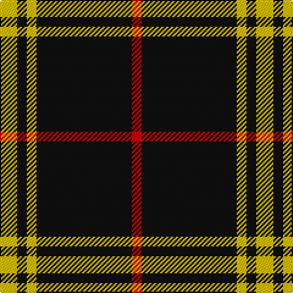

In pattern [RKYKY](/stripes/rkyky/).

This was sourced from register-of-tartans.  It is a [5 stripe tartan](/stripes/stripes5/).

Original link https://www.tartanregister.gov.uk/tartanDetails.aspx?ref=4599

## Register references

External register numbers recorded for this tartan.

- Scottish Register of Tartans: [4599](https://www.tartanregister.gov.uk/tartanDetails.aspx?ref=4599)
- Scottish Tartans World Register: 2756

## Thread count
Y/14 K8 Y8 K78 R/8

## Palette
Each colour and its ΔE from the base-6 reference it is a variant of.

| Colour | Shade | Base | ΔE (OKLab) |
|---|---|---|---|
| K | <code style="background-color:#101010;">#101010</code> `#101010` | K <code style="background-color:#000000;">#000000</code> | 0.17 |
| R | <code style="background-color:#DC0000;">#DC0000</code> `#DC0000` | R <code style="background-color:#CC0000;">#CC0000</code> | 0.03 |
| Y | <code style="background-color:#E8C000;">#E8C000</code> `#E8C000` | Y <code style="background-color:#F2BF00;">#F2BF00</code> | 0.02 |

# Sample pattern

## Nearest tartans

The nearest existing variants by ΔTartan distance.

1. [Gwynn (Name)](/setts/s5/ly9k4ly4k45r4~x2/) — ΔT 0.23
1. [White Stripes Hunting](/setts/s7/r2k1r2k14w1k1w1~x8/) — ΔT 1.22
1. [Dobelman (Personal)](/setts/s4/r1k20lb5r1~x4/) — ΔT 1.39
1. [Lundy Reform](/setts/s7/k2lb5k1lb1k10r1k1~x4/) — ΔT 1.40
1. [Northern Kentucky University](/setts/s7/w5k3ly6k5w3k30ly2~x2/) — ΔT 1.40
1. [Dhillon (Personal)](/setts/s4/k35lo3w3g3~x4/) — ΔT 1.43
1. [Believe - Colette](/setts/s7/n3k31w6k7n3k12w2~x2/) — ΔT 1.45
1. [Believe - Colette](/setts/s7/n3k31w6k8n3k12w2~x2/) — ΔT 1.49
1. [New Zealand District Tartan Tartan Number: 3250. Earliest known date: 2000 Designed as a District sett by Timely Marketing Promotions, Christchurch, New Zealand See products available Copyright © Blair Urquhart, Comrie, 2015](/setts/s6/k21w2k5w9k13g2~x4/) — ΔT 1.54
1. [Glen Coe Trade Tartan Tartan Number: 1243. Earliest known date: Modern Many new designs have been given district names to promote their Scottish connections. However, these names should not be confused with the District tartans which have earned their title through 'use and wont' and not a little history. See products available Copyright © Blair Urquhart, Comrie, 2015](/setts/s5/k37w9k3dg9w3~x2/) — ΔT 1.54

## Neighbour map

Every grey dot is one of 14299 variants placed by the first two principal components of the ΔTartan feature space (44% of its variance). Red is this tartan; blue dots are its nearest — click one to open its page.

<svg viewBox="0 0 640 380" role="img" style="max-width:100%;height:auto;border:1px solid #e0e0e0;border-radius:4px;display:block" xmlns="http://www.w3.org/2000/svg"><image href="/nn/cloud.v1.png" width="640" height="380"/><a href="/setts/s5/ly9k4ly4k45r4~x2/"><circle cx="453.3" cy="201.2" r="4" fill="#3465a4"><title>Gwynn (Name)</title></circle></a><a href="/setts/s7/r2k1r2k14w1k1w1~x8/"><circle cx="456.3" cy="167.2" r="4" fill="#3465a4"><title>White Stripes Hunting</title></circle></a><a href="/setts/s4/r1k20lb5r1~x4/"><circle cx="479.4" cy="198.4" r="4" fill="#3465a4"><title>Dobelman (Personal)</title></circle></a><a href="/setts/s7/k2lb5k1lb1k10r1k1~x4/"><circle cx="377.0" cy="195.3" r="4" fill="#3465a4"><title>Lundy Reform</title></circle></a><a href="/setts/s7/w5k3ly6k5w3k30ly2~x2/"><circle cx="405.4" cy="167.7" r="4" fill="#3465a4"><title>Northern Kentucky University</title></circle></a><a href="/setts/s4/k35lo3w3g3~x4/"><circle cx="490.0" cy="202.4" r="4" fill="#3465a4"><title>Dhillon (Personal)</title></circle></a><a href="/setts/s7/n3k31w6k7n3k12w2~x2/"><circle cx="472.3" cy="191.8" r="4" fill="#3465a4"><title>Believe - Colette</title></circle></a><a href="/setts/s7/n3k31w6k8n3k12w2~x2/"><circle cx="475.5" cy="194.2" r="4" fill="#3465a4"><title>Believe - Colette</title></circle></a><a href="/setts/s6/k21w2k5w9k13g2~x4/"><circle cx="415.8" cy="227.2" r="4" fill="#3465a4"><title>New Zealand District Tartan Tartan Number: 3250. Earliest known date: 2000 Designed as a District sett by Timely Marketing Promotions, Christchurch, New Zealand See products available Copyright © Blair Urquhart, Comrie, 2015</title></circle></a><a href="/setts/s5/k37w9k3dg9w3~x2/"><circle cx="373.3" cy="207.1" r="4" fill="#3465a4"><title>Glen Coe Trade Tartan Tartan Number: 1243. Earliest known date: Modern Many new designs have been given district names to promote their Scottish connections. However, these names should not be confused with the District tartans which have earned their title through 'use and wont' and not a little history. See products available Copyright © Blair Urquhart, Comrie, 2015</title></circle></a><circle cx="445.0" cy="207.2" r="5" fill="#c00000"/></svg>

ID: /setts/s5/ly7k4ly4k39r4~x2/
