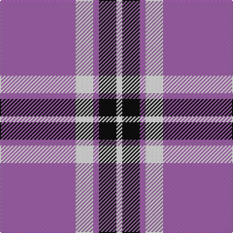

In pattern [RWRKW](/stripes/rwrkw/).

This was sourced from register-of-tartans.  It is a [5 stripe tartan](/stripes/stripes5/).

Original link https://www.tartanregister.gov.uk/tartanDetails.aspx?ref=1365

## Attestations

This cloth appears in 2 source records; the oldest owns this page.

- 01/01/2002 — Glen App (register-of-tartans, [record](https://www.tartanregister.gov.uk/tartanDetails.aspx?ref=1365))
- pre 2002 — Glen App (Fashion) (tartans-authority, [record](http://www.tartansauthority.com/tartan-ferret/display/636/))

## Register references

External register numbers recorded for this tartan.

- Scottish Register of Tartans: [1365](https://www.tartanregister.gov.uk/tartanDetails.aspx?ref=1365)
- Scottish Tartans Authority (ITI): 636
- Scottish Tartans World Register: 636

## Thread count
LP/78 W18 LP6 K18 W/6

## Palette
Each colour and the base-6 reference it is a variant of.

| Colour | Shade | Base |
|---|---|---|
| K | <code style="background-color:#101010;">#101010</code> `oklch(17.3% 0.000 89.9)` <small>#101010</small> | K <code style="background-color:#000000;">#000000</code> |
| LP | <code style="background-color:#9C68A4;">#9C68A4</code> `oklch(59.4% 0.107 322.0)` <small>#9C68A4</small> | R <code style="background-color:#CC0000;">#CC0000</code> |
| W | <code style="background-color:#FCFCFC;">#FCFCFC</code> `oklch(99.1% 0.000 89.9)` <small>#FCFCFC</small> | W <code style="background-color:#F7F7F7;">#F7F7F7</code> |

# Sample pattern

## Nearest tartans

The nearest existing variants by ΔTartan distance.

1. [UEFA (Glasgow)](/setts/s6/b30ly5b4r12~x4/) — ΔT 1.43
1. [MacQueen variant](/setts/s6/db2r7db2r7db22ly2~x2/) — ΔT 1.63
1. [Glen App](/setts/s5/p37w9p3o9w3~x2/) — ΔT 1.64
1. [Auchmaliddie Samkoma](/setts/s4/dp23w4r4~x4/) — ΔT 1.67
1. [Glen App Trade Tartan Tartan Number: 636. Earliest known date: pre 2003 A fashion check See products available Copyright © Blair Urquhart, Comrie, 2015](/setts/s5/dp37w9dp3dr9w3~x2/) — ΔT 1.71
1. [South Australian Pipes & Drums (Corp](/setts/s6/db60ly6db11r25~x2/) — ΔT 1.74
1. [Carlisle Ancient](/setts/s5/b11lo2r1lo2r1~x4/) — ΔT 1.76
1. [Erskine Purple (Dance) Fashion Tartan Tartan Number: 6534. Earliest known date: 01/01/1980 A dancers' tartan now woven by D C Dalgliesh of Selkirk. See products available Copyright © Blair Urquhart, Comrie, 2015](/setts/s6/dp6w2dp29w29dp2w6~x2/) — ΔT 1.77
1. [Western Illinois University](/setts/s8/k2w3dp5lo4w3lo4dp25lo2~x2/) — ΔT 1.78
1. [UEFA (Corporate)](/setts/s4/b30ly5b4r12~x4/) — ΔT 1.80

## Neighbour map

Every grey dot is one of 14299 variants placed by the first two principal components of the ΔTartan feature space (44% of its variance). Red is this tartan; blue dots are its nearest — click one to open its page.

<svg viewBox="0 0 640 380" role="img" style="max-width:100%;height:auto;border:1px solid #e0e0e0;border-radius:4px;display:block" xmlns="http://www.w3.org/2000/svg"><image href="/nn/cloud.v1.png" width="640" height="380"/><a href="/setts/s6/b30ly5b4r12~x4/"><circle cx="346.9" cy="217.8" r="4" fill="#3465a4"><title>UEFA (Glasgow)</title></circle></a><a href="/setts/s6/db2r7db2r7db22ly2~x2/"><circle cx="394.4" cy="206.7" r="4" fill="#3465a4"><title>MacQueen variant</title></circle></a><a href="/setts/s5/p37w9p3o9w3~x2/"><circle cx="402.7" cy="192.3" r="4" fill="#3465a4"><title>Glen App</title></circle></a><a href="/setts/s4/dp23w4r4~x4/"><circle cx="350.3" cy="236.7" r="4" fill="#3465a4"><title>Auchmaliddie Samkoma</title></circle></a><a href="/setts/s5/dp37w9dp3dr9w3~x2/"><circle cx="397.2" cy="191.6" r="4" fill="#3465a4"><title>Glen App Trade Tartan Tartan Number: 636. Earliest known date: pre 2003 A fashion check See products available Copyright © Blair Urquhart, Comrie, 2015</title></circle></a><a href="/setts/s6/db60ly6db11r25~x2/"><circle cx="410.4" cy="214.8" r="4" fill="#3465a4"><title>South Australian Pipes &amp; Drums (Corp</title></circle></a><a href="/setts/s5/b11lo2r1lo2r1~x4/"><circle cx="396.5" cy="209.3" r="4" fill="#3465a4"><title>Carlisle Ancient</title></circle></a><a href="/setts/s6/dp6w2dp29w29dp2w6~x2/"><circle cx="341.5" cy="186.5" r="4" fill="#3465a4"><title>Erskine Purple (Dance) Fashion Tartan Tartan Number: 6534. Earliest known date: 01/01/1980 A dancers' tartan now woven by D C Dalgliesh of Selkirk. See products available Copyright © Blair Urquhart, Comrie, 2015</title></circle></a><a href="/setts/s8/k2w3dp5lo4w3lo4dp25lo2~x2/"><circle cx="336.8" cy="140.7" r="4" fill="#3465a4"><title>Western Illinois University</title></circle></a><a href="/setts/s4/b30ly5b4r12~x4/"><circle cx="381.9" cy="250.7" r="4" fill="#3465a4"><title>UEFA (Corporate)</title></circle></a><circle cx="392.1" cy="184.9" r="5" fill="#c00000"/></svg>

ID: /setts/s5/m13w3m1k3w1~x6/
