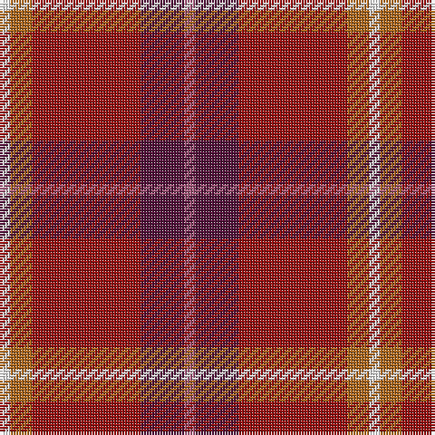

In pattern [RBRRW](/stripes/rbrrw/).

This was sourced from register-of-tartans.  It is a [5 stripe tartan](/stripes/stripes5/).

Original link https://www.tartanregister.gov.uk/tartanDetails.aspx?ref=10521

## Register references

External register numbers recorded for this tartan.

- Scottish Register of Tartans: [10521](https://www.tartanregister.gov.uk/tartanDetails.aspx?ref=10521)

## Thread count
W/4 LT8 DR40 DP16 LP/4

## Palette
Each colour and its ΔE from the base-6 reference it is a variant of.

| Colour | Shade | Base | ΔE (OKLab) |
|---|---|---|---|
| DP | <code style="background-color:#531039;">#531039</code> `#531039` | B <code style="background-color:#2A418A;">#2A418A</code> | 0.18 |
| DR | <code style="background-color:#970F0F;">#970F0F</code> `#970F0F` | R <code style="background-color:#CC0000;">#CC0000</code> | 0.11 |
| LP | <code style="background-color:#A35879;">#A35879</code> `#A35879` | R <code style="background-color:#CC0000;">#CC0000</code> | 0.15 |
| LT | <code style="background-color:#AD681D;">#AD681D</code> `#AD681D` | R <code style="background-color:#CC0000;">#CC0000</code> | 0.14 |
| W | <code style="background-color:#FFFFFF;">#FFFFFF</code> `#FFFFFF` | W <code style="background-color:#F7F7F7;">#F7F7F7</code> | 0.02 |

# Sample pattern

## Nearest tartans

The nearest existing variants by ΔTartan distance.

1. [Stevens #3](/setts/s6/dp2t9dp3r7r19ly2~x2/) — ΔT 1.41
1. [Staves (Personal)](/setts/s5/r10dg4r1w1t1~x6/) — ΔT 1.46
1. [Staves (Personal)](/setts/s5/r10dg4r1w1t1~x2/) — ΔT 1.48
1. [Love (Fashion)](/setts/s5/r1r4r10lo2w1~x4/) — ΔT 1.49
1. [Moray of Abercairney](/setts/s6/r8r1dg4r1dg1t2~x2/) — ΔT 1.61
1. [Wasko (Personal)](/setts/s7/r8w2m30g12m3g12m3~x2/) — ΔT 1.67
1. [MacNab #3](/setts/s7/dg6r2r2dg4r2r12k1~x2/) — ΔT 1.67
1. [Flowers of the Forest, The](/setts/s9/r2do2r20y13lg3db5r2r4o2~x2/) — ΔT 1.70
1. [Chisholm](/setts/s8/r12dp2lb1dp2r3dg8r3dp1/) — ΔT 1.71
1. [Finnigan (Estimated threadcount)](/setts/s6/r3db15r3g8r20k2~x2/) — ΔT 1.73

## Neighbour map

Every grey dot is one of 14299 variants placed by the first two principal components of the ΔTartan feature space (44% of its variance). Red is this tartan; blue dots are its nearest — click one to open its page.

<svg viewBox="0 0 640 380" role="img" style="max-width:100%;height:auto;border:1px solid #e0e0e0;border-radius:4px;display:block" xmlns="http://www.w3.org/2000/svg"><image href="/nn/cloud.v1.png" width="640" height="380"/><a href="/setts/s6/dp2t9dp3r7r19ly2~x2/"><circle cx="245.6" cy="194.2" r="4" fill="#3465a4"><title>Stevens #3</title></circle></a><a href="/setts/s5/r10dg4r1w1t1~x6/"><circle cx="328.3" cy="174.6" r="4" fill="#3465a4"><title>Staves (Personal)</title></circle></a><a href="/setts/s5/r10dg4r1w1t1~x2/"><circle cx="327.5" cy="174.2" r="4" fill="#3465a4"><title>Staves (Personal)</title></circle></a><a href="/setts/s5/r1r4r10lo2w1~x4/"><circle cx="348.8" cy="196.6" r="4" fill="#3465a4"><title>Love (Fashion)</title></circle></a><a href="/setts/s6/r8r1dg4r1dg1t2~x2/"><circle cx="271.5" cy="208.2" r="4" fill="#3465a4"><title>Moray of Abercairney</title></circle></a><a href="/setts/s7/r8w2m30g12m3g12m3~x2/"><circle cx="331.5" cy="186.3" r="4" fill="#3465a4"><title>Wasko (Personal)</title></circle></a><a href="/setts/s7/dg6r2r2dg4r2r12k1~x2/"><circle cx="297.8" cy="191.4" r="4" fill="#3465a4"><title>MacNab #3</title></circle></a><a href="/setts/s9/r2do2r20y13lg3db5r2r4o2~x2/"><circle cx="291.1" cy="153.8" r="4" fill="#3465a4"><title>Flowers of the Forest, The</title></circle></a><a href="/setts/s8/r12dp2lb1dp2r3dg8r3dp1/"><circle cx="330.1" cy="178.1" r="4" fill="#3465a4"><title>Chisholm</title></circle></a><a href="/setts/s6/r3db15r3g8r20k2~x2/"><circle cx="286.5" cy="207.5" r="4" fill="#3465a4"><title>Finnigan (Estimated threadcount)</title></circle></a><circle cx="325.7" cy="195.5" r="5" fill="#c00000"/></svg>

ID: /setts/s5/m1dp4r10o2w1~x4/
