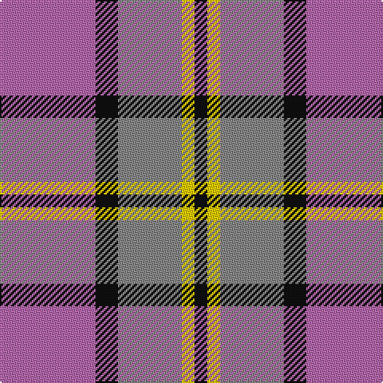

**Bands:** [KYRKR](/stripes/kyrkr/) · **Stripes:** [K LY O K M](/stripes/stripes5/) K LY O K M

This was sourced from tartans-authority.  It is a [5 band tartan](/bands/bands5/).

Original link http://www.tartansauthority.com/tartan-ferret/display/8691/

## Thread count
P/60 K14 N40 Y8 K/8

## Palette
Each colour and its ΔE from the base-6 reference it is a variant of.

| Colour | Shade | Base | ΔE (OKLab) |
|---|---|---|---|
| K | <code style="background-color:#101010;">#101010</code> `#101010` | K <code style="background-color:#000000;">#000000</code> | 0.17 |
| N | <code style="background-color:#888888;">#888888</code> `#888888` | R <code style="background-color:#CC0000;">#CC0000</code> | 0.24 |
| P | <code style="background-color:#B468AC;">#B468AC</code> `#B468AC` | R <code style="background-color:#CC0000;">#CC0000</code> | 0.21 |
| Y | <code style="background-color:#FCCC00;">#FCCC00</code> `#FCCC00` | Y <code style="background-color:#F2BF00;">#F2BF00</code> | 0.04 |

# Sample pattern

## Nearest tartans

The nearest existing variants by ΔTartan distance.

1. [Thompson, D.C. (Personal)](/setts/s6/k4t28r6w12r12w3~x2/) — ΔT 1.12
1. [Little's (Corporate)](/setts/s6/db1o8w1db4r8w1~x6/) — ΔT 1.19
1. [Nebar (Corporate)](/setts/s4/o24r11k6db4~x4/) — ΔT 1.27
1. [Wicks (Personal)](/setts/s5/ly3dg8o20dp30ly2~x2/) — ΔT 1.30
1. [Think Pink (ICF)](/setts/s5/k4db2lr13m13lb2~x4/) — ΔT 1.35
1. [Winnipeg Embroiders' Guild (Corp.)](/setts/s6/r12dt2ly2lb2dt4lb3~x2/) — ΔT 1.36
1. [Bronte House Check](/setts/s6/m10dy60dt13lo24dt24dy8/) — ΔT 1.37
1. [Oban Grey (Fashion)](/setts/s5/k4lb4k4o15r2~x4/) — ΔT 1.42
1. [Common Ground Dress (Fashion)](/setts/s5/w3r27w16db27lo3~x2/) — ΔT 1.43
1. [Snowbird (Corporate)](/setts/s5/r8lg15b12r29w4~x2/) — ΔT 1.45

## Neighbour map

Every grey dot is one of 14299 variants placed by the first two principal components of the ΔTartan feature space (44% of its variance). Red is this tartan; blue dots are its nearest — click one to open its page.

<svg viewBox="0 0 640 380" role="img" style="max-width:100%;height:auto;border:1px solid #e0e0e0;border-radius:4px;display:block" xmlns="http://www.w3.org/2000/svg"><image href="/nn/cloud.v1.png" width="640" height="380"/><a href="/setts/s6/k4t28r6w12r12w3~x2/"><circle cx="203.8" cy="195.3" r="4" fill="#3465a4"><title>Thompson, D.C. (Personal)</title></circle></a><a href="/setts/s6/db1o8w1db4r8w1~x6/"><circle cx="183.9" cy="208.6" r="4" fill="#3465a4"><title>Little's (Corporate)</title></circle></a><a href="/setts/s4/o24r11k6db4~x4/"><circle cx="268.6" cy="258.4" r="4" fill="#3465a4"><title>Nebar (Corporate)</title></circle></a><a href="/setts/s5/ly3dg8o20dp30ly2~x2/"><circle cx="280.6" cy="194.5" r="4" fill="#3465a4"><title>Wicks (Personal)</title></circle></a><a href="/setts/s5/k4db2lr13m13lb2~x4/"><circle cx="167.3" cy="202.0" r="4" fill="#3465a4"><title>Think Pink (ICF)</title></circle></a><a href="/setts/s6/r12dt2ly2lb2dt4lb3~x2/"><circle cx="221.6" cy="201.7" r="4" fill="#3465a4"><title>Winnipeg Embroiders' Guild (Corp.)</title></circle></a><a href="/setts/s6/m10dy60dt13lo24dt24dy8/"><circle cx="248.8" cy="222.4" r="4" fill="#3465a4"><title>Bronte House Check</title></circle></a><a href="/setts/s5/k4lb4k4o15r2~x4/"><circle cx="242.6" cy="217.8" r="4" fill="#3465a4"><title>Oban Grey (Fashion)</title></circle></a><a href="/setts/s5/w3r27w16db27lo3~x2/"><circle cx="165.3" cy="208.2" r="4" fill="#3465a4"><title>Common Ground Dress (Fashion)</title></circle></a><a href="/setts/s5/r8lg15b12r29w4~x2/"><circle cx="268.6" cy="235.0" r="4" fill="#3465a4"><title>Snowbird (Corporate)</title></circle></a><circle cx="234.1" cy="219.4" r="5" fill="#c00000"/></svg>

ID: /setts/s5/m30k7o20ly4k4~x2/
