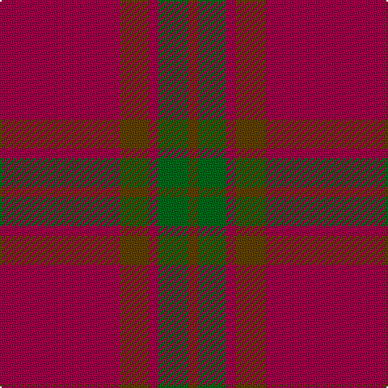

In pattern [GGRGR](/stripes/ggrgr/).

This was sourced from house-of-tartan.  It is a [5 stripe tartan](/stripes/stripes5/).

Original link http://www.house-of-tartan.scotland.net/house/TartanViewjs.asp?colr=Def&tnam=1662

## Thread count
R/74 T18 R6 G18 T/6

## Palette
Each colour and the base-6 reference it is a variant of.

| Colour | Shade | Base |
|---|---|---|
| G | <code style="background-color:#006818;">#006818</code> `oklch(45.0% 0.142 145.0)` <small>#006818</small> | G <code style="background-color:#006100;">#006100</code> |
| R | <code style="background-color:#A00048;">#A00048</code> `oklch(45.4% 0.182 5.3)` <small>#A00048</small> | R <code style="background-color:#CC0000;">#CC0000</code> |
| T | <code style="background-color:#604000;">#604000</code> `oklch(39.8% 0.083 76.8)` <small>#604000</small> | G <code style="background-color:#006100;">#006100</code> |

# Sample pattern

## Nearest tartans

The nearest existing variants by ΔTartan distance.

1. [Glen Shee](/setts/s5/r37o9r3g9o3~x2/) — ΔT 0.40
1. [Glen Shee #1 (Fashion)](/setts/s5/r37do9r3g9do3~x2/) — ΔT 1.24
1. [Glenshee #2](/setts/s5/r37dy9r3dg9dy3~x2/) — ΔT 1.27
1. [Cairn O'Mount (Personal)](/setts/s6/r58n12r5y28r7lo5~x2/) — ΔT 1.47
1. [Hunt (Personal)](/setts/s5/r9y2r45y20lo3~x2/) — ΔT 1.60
1. [Waverley Care Aids Trust (Corporate)](/setts/s6/r8g2r2k1r1g2~x10/) — ΔT 1.79
1. [Monica](/setts/s6/r3o10r3o4r20lb1~x4/) — ΔT 1.91
1. [Inverness Augustus](/setts/s7/m18dg1k5dg1k1dg1m9~x2/) — ΔT 1.91
1. [Hunt (Personal)](/setts/s8/r9y2r45y20lo3~x2/) — ΔT 1.93
1. [Maguire, Black (Name)](/setts/s6/r29g2r2g2r6lo21~x4/) — ΔT 1.93

## Neighbour map

Every grey dot is one of 14299 variants placed by the first two principal components of the ΔTartan feature space (44% of its variance). Red is this tartan; blue dots are its nearest — click one to open its page.

<svg viewBox="0 0 640 380" role="img" style="max-width:100%;height:auto;border:1px solid #e0e0e0;border-radius:4px;display:block" xmlns="http://www.w3.org/2000/svg"><image href="/nn/cloud.v1.png" width="640" height="380"/><a href="/setts/s5/r37o9r3g9o3~x2/"><circle cx="488.1" cy="239.7" r="4" fill="#3465a4"><title>Glen Shee</title></circle></a><a href="/setts/s5/r37do9r3g9do3~x2/"><circle cx="514.9" cy="257.2" r="4" fill="#3465a4"><title>Glen Shee #1 (Fashion)</title></circle></a><a href="/setts/s5/r37dy9r3dg9dy3~x2/"><circle cx="525.9" cy="261.5" r="4" fill="#3465a4"><title>Glenshee #2</title></circle></a><a href="/setts/s6/r58n12r5y28r7lo5~x2/"><circle cx="427.7" cy="215.5" r="4" fill="#3465a4"><title>Cairn O'Mount (Personal)</title></circle></a><a href="/setts/s5/r9y2r45y20lo3~x2/"><circle cx="516.5" cy="209.0" r="4" fill="#3465a4"><title>Hunt (Personal)</title></circle></a><a href="/setts/s6/r8g2r2k1r1g2~x10/"><circle cx="471.5" cy="253.9" r="4" fill="#3465a4"><title>Waverley Care Aids Trust (Corporate)</title></circle></a><a href="/setts/s6/r3o10r3o4r20lb1~x4/"><circle cx="462.0" cy="199.1" r="4" fill="#3465a4"><title>Monica</title></circle></a><a href="/setts/s7/m18dg1k5dg1k1dg1m9~x2/"><circle cx="588.1" cy="221.5" r="4" fill="#3465a4"><title>Inverness Augustus</title></circle></a><a href="/setts/s8/r9y2r45y20lo3~x2/"><circle cx="500.4" cy="195.7" r="4" fill="#3465a4"><title>Hunt (Personal)</title></circle></a><a href="/setts/s6/r29g2r2g2r6lo21~x4/"><circle cx="454.0" cy="206.2" r="4" fill="#3465a4"><title>Maguire, Black (Name)</title></circle></a><circle cx="494.9" cy="241.4" r="5" fill="#c00000"/></svg>

ID: /setts/s5/m37dy9m3g9dy3~x2/
