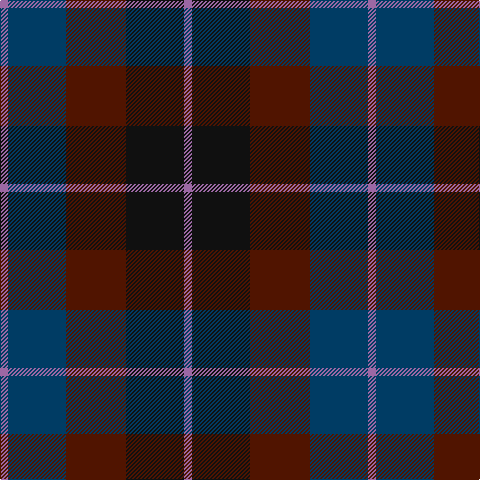

**Bands:** [RBBKR](/stripes/rbbkr/) · **Stripes:** [M DT DR K M](/stripes/stripes5/) M DT DR K M

This was sourced from tartans-authority.  It is a [5 band tartan](/bands/bands5/).

Original link http://www.tartansauthority.com/tartan-ferret/display/5046/

## Thread count
LP/8 DB58 DR60 K58 LP/8

## Palette
Each colour and its ΔE from the base-6 reference it is a variant of.

| Colour | Shade | Base | ΔE (OKLab) |
|---|---|---|---|
| DB | <code style="background-color:#003C64;">#003C64</code> `#003C64` | B <code style="background-color:#2A418A;">#2A418A</code> | 0.08 |
| DR | <code style="background-color:#501400;">#501400</code> `#501400` | B <code style="background-color:#2A418A;">#2A418A</code> | 0.23 |
| K | <code style="background-color:#101010;">#101010</code> `#101010` | K <code style="background-color:#000000;">#000000</code> | 0.17 |
| LP | <code style="background-color:#9C68A4;">#9C68A4</code> `#9C68A4` | R <code style="background-color:#CC0000;">#CC0000</code> | 0.21 |

# Sample pattern

## Nearest tartans

The nearest existing variants by ΔTartan distance.

1. [Edinburgh International Conference Centre, The](/setts/s6/dy4dt20dy3k20o24dt3~x2/) — ΔT 1.08
1. [MacCaughan or MacEachain (Personal)](/setts/s6/dp2dg6k2db6k1r2~x4/) — ΔT 1.18
1. [Ferguson Britt (Corporate)](/setts/s6/do2dy12do12r1k12dy2~x6/) — ΔT 1.21
1. [Lennie](/setts/s6/dg2dp8k9y2dg10k2~x2/) — ΔT 1.29
1. [I Y](/setts/s6/k4dg16k13db16t3db3~x2/) — ΔT 1.45
1. [Murray #3](/setts/s6/db2k2db12k8dg11r2~x2/) — ΔT 1.46
1. [Swankie](/setts/s7/dg3dt22dr10o5dg21r6dt3~x2/) — ΔT 1.47
1. [Ferguson of Balquhidder](/setts/s6/dg2db12r1k12dg12k2~x2/) — ΔT 1.52
1. [Ferguson of Balquhidder #3](/setts/s6/k3db12r2k12dg12k3~x2/) — ΔT 1.53
1. [Clark Clerk(e)](/setts/s5/db3k1dg1k1m3~x16/) — ΔT 1.57

## Neighbour map

Every grey dot is one of 14313 variants placed by the first two principal components of the ΔTartan feature space (44% of its variance). Red is this tartan; blue dots are its nearest — click one to open its page.

<svg viewBox="0 0 640 380" role="img" style="max-width:100%;height:auto;border:1px solid #e0e0e0;border-radius:4px;display:block" xmlns="http://www.w3.org/2000/svg"><image href="/nn/cloud.v1.png" width="640" height="380"/><a href="/setts/s6/dy4dt20dy3k20o24dt3~x2/"><circle cx="217.6" cy="255.6" r="4" fill="#3465a4"><title>Edinburgh International Conference Centre, The</title></circle></a><a href="/setts/s6/dp2dg6k2db6k1r2~x4/"><circle cx="165.1" cy="263.6" r="4" fill="#3465a4"><title>MacCaughan or MacEachain (Personal)</title></circle></a><a href="/setts/s6/do2dy12do12r1k12dy2~x6/"><circle cx="260.6" cy="246.5" r="4" fill="#3465a4"><title>Ferguson Britt (Corporate)</title></circle></a><a href="/setts/s6/dg2dp8k9y2dg10k2~x2/"><circle cx="200.6" cy="280.9" r="4" fill="#3465a4"><title>Lennie</title></circle></a><a href="/setts/s6/k4dg16k13db16t3db3~x2/"><circle cx="238.4" cy="310.2" r="4" fill="#3465a4"><title>I Y</title></circle></a><a href="/setts/s6/db2k2db12k8dg11r2~x2/"><circle cx="217.2" cy="272.3" r="4" fill="#3465a4"><title>Murray #3</title></circle></a><a href="/setts/s7/dg3dt22dr10o5dg21r6dt3~x2/"><circle cx="217.1" cy="248.2" r="4" fill="#3465a4"><title>Swankie</title></circle></a><a href="/setts/s6/dg2db12r1k12dg12k2~x2/"><circle cx="249.9" cy="250.8" r="4" fill="#3465a4"><title>Ferguson of Balquhidder</title></circle></a><a href="/setts/s6/k3db12r2k12dg12k3~x2/"><circle cx="224.9" cy="280.0" r="4" fill="#3465a4"><title>Ferguson of Balquhidder #3</title></circle></a><a href="/setts/s5/db3k1dg1k1m3~x16/"><circle cx="182.3" cy="325.6" r="4" fill="#3465a4"><title>Clark Clerk(e)</title></circle></a><circle cx="222.2" cy="286.8" r="5" fill="#c00000"/></svg>

ID: /setts/s5/m4dt29dr30k29m4~x2/
