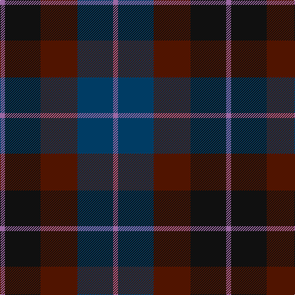

This page is one **sett** — a single exact thread-count. It belongs to the [tartan](/tartans/m4k29dr30dt29m4/)
(the same proportion at any scale), whose colour order is pattern [RBBKR](/stripes/rbbkr/).

Sourced from tartans-authority.  It is a [5 stripe tartan](/stripes/stripes5/).

Original link http://www.tartansauthority.com/tartan-ferret/display/5046/

## Thread count
LP/8 K58 DR60 DB58 LP/8

## Palette

Palette: <strong>Tartan Register</strong> <small style="color:#888">(3 of 4 colours)</small>
<table><thead><tr><th>Colour</th><th>Threads</th><th>Shade</th><th>Base</th><th>OKLCh</th></tr></thead><tbody><tr><td>LP/</td><td style="text-align:right;font-variant-numeric:tabular-nums">8</td><td><code style="background-color:#9C68A4;">#9C68A4</code> <small style="color:#888">#9C68A4</small></td><td>R <code style="background-color:#CC0000;">#CC0000</code></td><td><small style="color:#888">oklch(59.4% 0.107 322.0)</small></td></tr><tr><td>K</td><td style="text-align:right;font-variant-numeric:tabular-nums">58</td><td><code style="background-color:#101010;">#101010</code> <small style="color:#888">#101010</small></td><td>K <code style="background-color:#000000;">#000000</code></td><td><small style="color:#888">oklch(17.3% 0.000 89.9)</small></td></tr><tr><td>DR</td><td style="text-align:right;font-variant-numeric:tabular-nums">60</td><td><code style="background-color:#501400;">#501400</code> <small style="color:#888">#501400</small></td><td>B <code style="background-color:#2A418A;">#2A418A</code></td><td><small style="color:#888">oklch(29.1% 0.094 38.4)</small></td></tr><tr><td>DB</td><td style="text-align:right;font-variant-numeric:tabular-nums">58</td><td><code style="background-color:#003C64;">#003C64</code> <small style="color:#888">#003C64</small></td><td>B <code style="background-color:#2A418A;">#2A418A</code></td><td><small style="color:#888">oklch(34.5% 0.089 246.0)</small></td></tr><tr><td>LP/</td><td style="text-align:right;font-variant-numeric:tabular-nums">8</td><td><code style="background-color:#9C68A4;">#9C68A4</code> <small style="color:#888">#9C68A4</small></td><td>R <code style="background-color:#CC0000;">#CC0000</code></td><td><small style="color:#888">oklch(59.4% 0.107 322.0)</small></td></tr></tbody></table>

# Sample pattern

## Nearest tartans

The nearest existing variants by ΔTartan distance, with this tartan at the top so the swatches line up against it.

ΔTartan

Tartan

Sett

—

<a href="/ttd/edit/#slug=m4k29dr30dt29m4~x2">Glen Shee #3 (Fashion)</a> <a class="nn-out" href="/setts/s5/m4k29dr30dt29m4~x2/" title="open its dictionary page">↗</a>

1.08

<a href="/ttd/edit/#slug=dy4dt20dy3k20o24dt3~x2">Edinburgh International Conference Centre, The</a> <a class="nn-out" href="/setts/s6/dy4dt20dy3k20o24dt3~x2/" title="open its dictionary page">↗</a>

1.18

<a href="/ttd/edit/#slug=dp2dg6k2db6k1r2~x4">MacCaughan or MacEachain (Personal)</a> <a class="nn-out" href="/setts/s6/dp2dg6k2db6k1r2~x4/" title="open its dictionary page">↗</a>

1.21

<a href="/ttd/edit/#slug=do2dy12do12r1k12dy2~x6">Ferguson Britt (Corporate)</a> <a class="nn-out" href="/setts/s6/do2dy12do12r1k12dy2~x6/" title="open its dictionary page">↗</a>

1.29

<a href="/ttd/edit/#slug=k2dg10y2k9dp8dg2~x2">Lennie</a> <a class="nn-out" href="/setts/s6/k2dg10y2k9dp8dg2~x2/" title="open its dictionary page">↗</a>

1.45

<a href="/ttd/edit/#slug=k4dg16k13db16t3db3~x2">I Y</a> <a class="nn-out" href="/setts/s6/k4dg16k13db16t3db3~x2/" title="open its dictionary page">↗</a>

1.46

<a href="/ttd/edit/#slug=db2k2db12k8dg11r2~x2">Murray #3</a> <a class="nn-out" href="/setts/s6/db2k2db12k8dg11r2~x2/" title="open its dictionary page">↗</a>

1.47

<a href="/ttd/edit/#slug=dg3dt22dr10o5dg21r6dt3~x2">Swankie</a> <a class="nn-out" href="/setts/s7/dg3dt22dr10o5dg21r6dt3~x2/" title="open its dictionary page">↗</a>

1.52

<a href="/ttd/edit/#slug=k2dg12k12r1db12dg2~x2">Ferguson of Balquhidder</a> <a class="nn-out" href="/setts/s6/k2dg12k12r1db12dg2~x2/" title="open its dictionary page">↗</a>

1.53

<a href="/ttd/edit/#slug=k3dg12k12r2db12k3~x2">Ferguson of Balquhidder #3</a> <a class="nn-out" href="/setts/s6/k3dg12k12r2db12k3~x2/" title="open its dictionary page">↗</a>

1.57

<a href="/ttd/edit/#slug=db3k1dg1k1m3~x16">Clark Clerk(e)</a> <a class="nn-out" href="/setts/s5/db3k1dg1k1m3~x16/" title="open its dictionary page">↗</a>

## Neighbour map

Every grey dot is one of 14299 variants placed by the first two principal components of the ΔTartan feature space (44% of its variance). Red is this tartan; blue dots are its nearest — click one to open its page.

<svg viewBox="0 0 640 380" role="img" style="max-width:100%;height:auto;border:1px solid #e0e0e0;border-radius:4px;display:block" xmlns="http://www.w3.org/2000/svg"><image href="/nn/cloud.v1.png" width="640" height="380"/><a href="/setts/s6/dy4dt20dy3k20o24dt3~x2/"><circle cx="217.7" cy="255.7" r="4" fill="#3465a4"><title>Edinburgh International Conference Centre, The</title></circle></a><a href="/setts/s6/dp2dg6k2db6k1r2~x4/"><circle cx="165.4" cy="263.8" r="4" fill="#3465a4"><title>MacCaughan or MacEachain (Personal)</title></circle></a><a href="/setts/s6/do2dy12do12r1k12dy2~x6/"><circle cx="260.7" cy="246.6" r="4" fill="#3465a4"><title>Ferguson Britt (Corporate)</title></circle></a><a href="/setts/s6/k2dg10y2k9dp8dg2~x2/"><circle cx="200.9" cy="281.0" r="4" fill="#3465a4"><title>Lennie</title></circle></a><a href="/setts/s6/k4dg16k13db16t3db3~x2/"><circle cx="238.7" cy="310.4" r="4" fill="#3465a4"><title>I Y</title></circle></a><a href="/setts/s6/db2k2db12k8dg11r2~x2/"><circle cx="217.4" cy="272.4" r="4" fill="#3465a4"><title>Murray #3</title></circle></a><a href="/setts/s7/dg3dt22dr10o5dg21r6dt3~x2/"><circle cx="217.3" cy="248.4" r="4" fill="#3465a4"><title>Swankie</title></circle></a><a href="/setts/s6/k2dg12k12r1db12dg2~x2/"><circle cx="250.1" cy="250.9" r="4" fill="#3465a4"><title>Ferguson of Balquhidder</title></circle></a><a href="/setts/s6/k3dg12k12r2db12k3~x2/"><circle cx="225.1" cy="280.0" r="4" fill="#3465a4"><title>Ferguson of Balquhidder #3</title></circle></a><a href="/setts/s5/db3k1dg1k1m3~x16/"><circle cx="182.6" cy="325.7" r="4" fill="#3465a4"><title>Clark Clerk(e)</title></circle></a><circle cx="222.5" cy="287.0" r="5" fill="#c00000"/></svg>

ID: /setts/s5/m4k29dr30dt29m4~x2/
