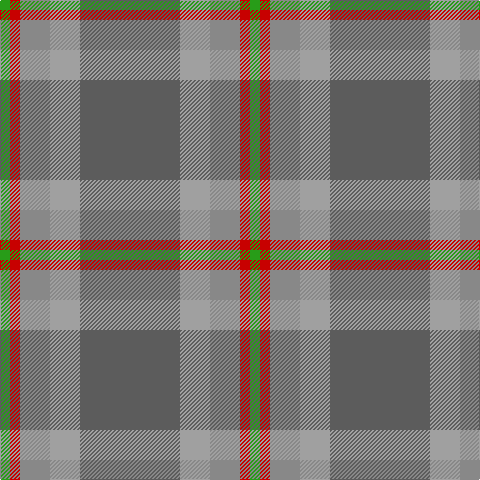

This page is one **sett** — a single exact thread-count. It belongs to the [tartan](/tartans/n10lr3o3r1g1/)
(the same proportion at any scale), whose colour order is pattern [BYRRG](/stripes/byrrg/).

Sourced from tartans-authority.  It is a [5 stripe tartan](/stripes/stripes5/).

Original link http://www.tartansauthority.com/tartan-ferret/display/10193/

2 attestations — the source records this cloth was collapsed from (oldest owns this page)

<ul>
<li>21st March 2010 — Bagpipe Shop, The (Corporate) (tartans-authority, <a href="http://www.tartansauthority.com/tartan-ferret/display/10193/">record</a>)</li>
<li>undated — Bagpipe Shop, The Corporate Tartan Tartan Number: 10193. Earliest known date: 21st March 2010 Designed to brand the website and other corporate publications of the Bagpipe Shop ('Das Fachgeschaft fur Dudelsacke') in Riehen, Germany. For the corporate use of the Bagpipe Shop, Riehen, and Nicole M Irman. (House of Tartan, Scotland) See products available Copyright © Blair Urquhart, Comrie, 2015 (house-of-tartan, <a href="http://www.house-of-tartan.scotland.net/house/TartanViewjs.asp?colr=Def&tnam=10193">record</a>)</li>
</ul>

## Register references

External register numbers recorded for this tartan.

- Scottish Register of Tartans: [10193](https://www.tartanregister.gov.uk/tartanDetails?ref=10193)
- Scottish Tartans Authority (ITI): 10193

## Thread count
N/100 Na30 Nb30 R10 G/10

## Palette

Palette: <strong>Tartan Register</strong> <small style="color:#888">(4 of 5 colours)</small>
<table><thead><tr><th>Colour</th><th>Threads</th><th>Shade</th><th>Base</th><th>OKLCh</th></tr></thead><tbody><tr><td>N/</td><td style="text-align:right;font-variant-numeric:tabular-nums">100</td><td><code style="background-color:#5C5C5C;">#5C5C5C</code> <small style="color:#888">#5C5C5C</small></td><td>B <code style="background-color:#2A418A;">#2A418A</code></td><td><small style="color:#888">oklch(47.5% 0.000 89.9)</small></td></tr><tr><td>Na</td><td style="text-align:right;font-variant-numeric:tabular-nums">30</td><td><code style="background-color:#A0A0A0;">#A0A0A0</code> <small style="color:#888">#A0A0A0</small></td><td>Y <code style="background-color:#F2BF00;">#F2BF00</code></td><td><small style="color:#888">oklch(70.6% 0.000 89.9)</small></td></tr><tr><td>Nb</td><td style="text-align:right;font-variant-numeric:tabular-nums">30</td><td><code style="background-color:#888888;">#888888</code> <small style="color:#888">#888888</small></td><td>R <code style="background-color:#CC0000;">#CC0000</code></td><td><small style="color:#888">oklch(62.7% 0.000 89.9)</small></td></tr><tr><td>R</td><td style="text-align:right;font-variant-numeric:tabular-nums">10</td><td><code style="background-color:#C80000;">#C80000</code> <small style="color:#888">#C80000</small></td><td>R <code style="background-color:#CC0000;">#CC0000</code></td><td><small style="color:#888">oklch(52.3% 0.215 29.2)</small></td></tr><tr><td>G/</td><td style="text-align:right;font-variant-numeric:tabular-nums">10</td><td><code style="background-color:#289C18;">#289C18</code> <small style="color:#888">#289C18</small></td><td>G <code style="background-color:#006100;">#006100</code></td><td><small style="color:#888">oklch(60.6% 0.191 141.6)</small></td></tr></tbody></table>

# Sample pattern

## Nearest tartans

The nearest existing variants by ΔTartan distance, with this tartan at the top so the swatches line up against it.

ΔTartan

Tartan

Sett

—

<a href="/ttd/edit/#slug=n10lr3o3r1g1~x10">Bagpipe Shop, The (Corporate)</a> <a class="nn-out" href="/setts/s5/n10lr3o3r1g1~x10/" title="open its dictionary page">↗</a>

1.47

<a href="/ttd/edit/#slug=dy4lg11dy14o30r4~x2">Trinity Bicycles</a> <a class="nn-out" href="/setts/s5/dy4lg11dy14o30r4~x2/" title="open its dictionary page">↗</a>

1.50

<a href="/setts/s7/dp3n24ni10n2g11n8w3~x2/">Hesco</a>

1.53

<a href="/ttd/edit/#slug=g8dr2g13r4g12t22g5y3~x2">Kildare</a> <a class="nn-out" href="/setts/s8/g8dr2g13r4g12t22g5y3~x2/" title="open its dictionary page">↗</a>

1.68

<a href="/ttd/edit/#slug=dy46g23b23r4ly4~x2">McMoosie Htg (Fashion)</a> <a class="nn-out" href="/setts/s5/dy46g23b23r4ly4~x2/" title="open its dictionary page">↗</a>

1.73

<a href="/ttd/edit/#slug=o15r5o30db32o4ly3~x2">Cameron, hunting</a> <a class="nn-out" href="/setts/s6/o15r5o30db32o4ly3~x2/" title="open its dictionary page">↗</a>

1.74

<a href="/ttd/edit/#slug=ri4y2db4y35t27r3~x2">Royal Deeside (District)</a> <a class="nn-out" href="/setts/s6/ri4y2db4y35t27r3~x2/" title="open its dictionary page">↗</a>

1.78

<a href="/ttd/edit/#slug=r3n34db4g47lb3~x2">Exabyte</a> <a class="nn-out" href="/setts/s5/r3n34db4g47lb3~x2/" title="open its dictionary page">↗</a>

1.79

<a href="/ttd/edit/#slug=n29y4db4y4do4y4r4~x4">Marino</a> <a class="nn-out" href="/setts/s7/n29y4db4y4do4y4r4~x4/" title="open its dictionary page">↗</a>

1.80

<a href="/ttd/edit/#slug=t20dt4y5n14ly1t2~x2">Riley's Theme</a> <a class="nn-out" href="/setts/s6/t20dt4y5n14ly1t2~x2/" title="open its dictionary page">↗</a>

1.82

<a href="/ttd/edit/#slug=r1g4lo1g3r4n15w1~x4">Bressuire (District)</a> <a class="nn-out" href="/setts/s7/r1g4lo1g3r4n15w1~x4/" title="open its dictionary page">↗</a>

## Neighbour map

Every grey dot is one of 14359 variants placed by the first two principal components of the ΔTartan feature space (44% of its variance). Red is this tartan; blue dots are its nearest — click one to open its page.

<svg viewBox="0 0 640 380" role="img" style="max-width:100%;height:auto;border:1px solid #e0e0e0;border-radius:4px;display:block" xmlns="http://www.w3.org/2000/svg"><image href="/nn/cloud.v1.png" width="640" height="380"/><a href="/setts/s5/dy4lg11dy14o30r4~x2/"><circle cx="317.1" cy="270.9" r="4" fill="#3465a4"><title>Trinity Bicycles</title></circle></a><a href="/setts/s7/dp3n24ni10n2g11n8w3~x2/"><circle cx="323.9" cy="218.0" r="4" fill="#3465a4"><title>Hesco</title></circle></a><a href="/setts/s8/g8dr2g13r4g12t22g5y3~x2/"><circle cx="349.4" cy="239.1" r="4" fill="#3465a4"><title>Kildare</title></circle></a><a href="/setts/s5/dy46g23b23r4ly4~x2/"><circle cx="283.4" cy="239.6" r="4" fill="#3465a4"><title>McMoosie Htg (Fashion)</title></circle></a><a href="/setts/s6/o15r5o30db32o4ly3~x2/"><circle cx="378.5" cy="245.6" r="4" fill="#3465a4"><title>Cameron, hunting</title></circle></a><a href="/setts/s6/ri4y2db4y35t27r3~x2/"><circle cx="341.4" cy="187.2" r="4" fill="#3465a4"><title>Royal Deeside (District)</title></circle></a><a href="/setts/s5/r3n34db4g47lb3~x2/"><circle cx="380.5" cy="226.2" r="4" fill="#3465a4"><title>Exabyte</title></circle></a><a href="/setts/s7/n29y4db4y4do4y4r4~x4/"><circle cx="338.8" cy="207.9" r="4" fill="#3465a4"><title>Marino</title></circle></a><a href="/setts/s6/t20dt4y5n14ly1t2~x2/"><circle cx="345.0" cy="208.6" r="4" fill="#3465a4"><title>Riley's Theme</title></circle></a><a href="/setts/s7/r1g4lo1g3r4n15w1~x4/"><circle cx="332.3" cy="183.6" r="4" fill="#3465a4"><title>Bressuire (District)</title></circle></a><circle cx="363.7" cy="239.7" r="5" fill="#c00000"/></svg>

ID: /setts/s5/n10lr3o3r1g1~x10/
