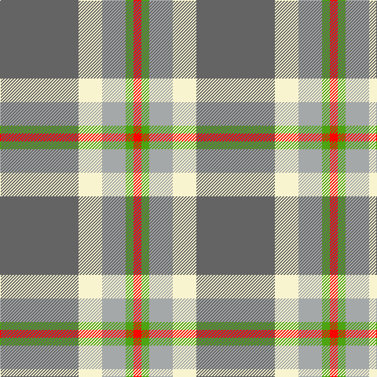

In pattern [BWYGR](/stripes/bwygr/).

This was sourced from register-of-tartans.  It is a [5 stripe tartan](/stripes/stripes5/).

Original link https://www.tartanregister.gov.uk/tartanDetails.aspx?ref=10773

## Register references

External register numbers recorded for this tartan.

- Scottish Register of Tartans: [10773](https://www.tartanregister.gov.uk/tartanDetails.aspx?ref=10773)

## Thread count
N/100 LY30 Na30 G10 R/10

## Palette
Each colour and the base-6 reference it is a variant of.

| Colour | Shade | Base |
|---|---|---|
| G | <code style="background-color:#4CA412;">#4CA412</code> `oklch(63.9% 0.188 137.1)` <small>#4CA412</small> | G <code style="background-color:#006100;">#006100</code> |
| LY | <code style="background-color:#F8F4D0;">#F8F4D0</code> `oklch(96.1% 0.047 102.0)` <small>#F8F4D0</small> | W <code style="background-color:#F7F7F7;">#F7F7F7</code> |
| N | <code style="background-color:#646464;">#646464</code> `oklch(50.3% 0.000 89.9)` <small>#646464</small> | B <code style="background-color:#2A418A;">#2A418A</code> |
| Na | <code style="background-color:#A4A8A8;">#A4A8A8</code> `oklch(72.8% 0.005 197.1)` <small>#A4A8A8</small> | Y <code style="background-color:#F2BF00;">#F2BF00</code> |
| R | <code style="background-color:#FF0000;">#FF0000</code> `oklch(62.8% 0.258 29.2)` <small>#FF0000</small> | R <code style="background-color:#CC0000;">#CC0000</code> |

# Sample pattern

## Nearest tartans

The nearest existing variants by ΔTartan distance, with this tartan at the top so the swatches line up against it.

ΔTartan

Tartan

Sett

—

<a href="/ttd/edit/#slug=n10w3lr3g1r1~x10">Bagpipe Shop (Switzerland)</a> <a class="nn-out" href="/setts/s5/n10w3lr3g1r1~x10/" title="open its dictionary page">↗</a>

0.28

<a href="/ttd/edit/#slug=n10w3lb3g1r1~x10">Bagpipe Shop (Corporate)</a> <a class="nn-out" href="/setts/s5/n10w3lb3g1r1~x10/" title="open its dictionary page">↗</a>

0.75

<a href="/ttd/edit/#slug=ly15r9t30w3db4~x2">S.I.D.E. (Corporate)</a> <a class="nn-out" href="/setts/s5/ly15r9t30w3db4~x2/" title="open its dictionary page">↗</a>

1.20

<a href="/ttd/edit/#slug=o10k1db3g3ly1~x6">Celtic Norse Heritage Society</a> <a class="nn-out" href="/setts/s5/o10k1db3g3ly1~x6/" title="open its dictionary page">↗</a>

1.34

<a href="/ttd/edit/#slug=o62t17ly12g8dg8~x2">Dundhuin Dress (Personal)</a> <a class="nn-out" href="/setts/s5/o62t17ly12g8dg8~x2/" title="open its dictionary page">↗</a>

1.44

<a href="/ttd/edit/#slug=b4g16ly2p7b28w4~x2">Manx Laxey</a> <a class="nn-out" href="/setts/s6/b4g16ly2p7b28w4~x2/" title="open its dictionary page">↗</a>

1.45

<a href="/ttd/edit/#slug=t4dg16ly2dp7t28w4~x2">Manx Laxey (Blue)</a> <a class="nn-out" href="/setts/s6/t4dg16ly2dp7t28w4~x2/" title="open its dictionary page">↗</a>

1.47

<a href="/ttd/edit/#slug=r4lb30y14lb11y4~x2">Trinity Bicycles (Corporate)</a> <a class="nn-out" href="/setts/s5/r4lb30y14lb11y4~x2/" title="open its dictionary page">↗</a>

1.48

<a href="/ttd/edit/#slug=g11lo10dp11t33w3~x2">Sterling, Rob (Florida) (Persona Name Tartan Tartan Number: 10653. Earliest known date: 10/07/2012 Designed by Rob Sterling, St. Petersburg, Florida, for use by his family and associates. See products available Copyright © Blair Urquhart, Comrie, 2015</a> <a class="nn-out" href="/setts/s5/g11lo10dp11t33w3~x2/" title="open its dictionary page">↗</a>

1.49

<a href="/ttd/edit/#slug=o3w3k3lo10r1~x6">Burberry Counterfeit</a> <a class="nn-out" href="/setts/s5/o3w3k3lo10r1~x6/" title="open its dictionary page">↗</a>

1.53

<a href="/ttd/edit/#slug=lb3k3lb3k3o15r1~x4">Tiree Grey</a> <a class="nn-out" href="/setts/s6/lb3k3lb3k3o15r1~x4/" title="open its dictionary page">↗</a>

## Neighbour map

Every grey dot is one of 14299 variants placed by the first two principal components of the ΔTartan feature space (44% of its variance). Red is this tartan; blue dots are its nearest — click one to open its page.

<svg viewBox="0 0 640 380" role="img" style="max-width:100%;height:auto;border:1px solid #e0e0e0;border-radius:4px;display:block" xmlns="http://www.w3.org/2000/svg"><image href="/nn/cloud.v1.png" width="640" height="380"/><a href="/setts/s5/n10w3lb3g1r1~x10/"><circle cx="274.9" cy="187.9" r="4" fill="#3465a4"><title>Bagpipe Shop (Corporate)</title></circle></a><a href="/setts/s5/ly15r9t30w3db4~x2/"><circle cx="230.9" cy="192.9" r="4" fill="#3465a4"><title>S.I.D.E. (Corporate)</title></circle></a><a href="/setts/s5/o10k1db3g3ly1~x6/"><circle cx="260.8" cy="190.1" r="4" fill="#3465a4"><title>Celtic Norse Heritage Society</title></circle></a><a href="/setts/s5/o62t17ly12g8dg8~x2/"><circle cx="315.4" cy="209.5" r="4" fill="#3465a4"><title>Dundhuin Dress (Personal)</title></circle></a><a href="/setts/s6/b4g16ly2p7b28w4~x2/"><circle cx="272.2" cy="175.5" r="4" fill="#3465a4"><title>Manx Laxey</title></circle></a><a href="/setts/s6/t4dg16ly2dp7t28w4~x2/"><circle cx="273.9" cy="181.6" r="4" fill="#3465a4"><title>Manx Laxey (Blue)</title></circle></a><a href="/setts/s5/r4lb30y14lb11y4~x2/"><circle cx="234.6" cy="220.7" r="4" fill="#3465a4"><title>Trinity Bicycles (Corporate)</title></circle></a><a href="/setts/s5/g11lo10dp11t33w3~x2/"><circle cx="242.7" cy="214.8" r="4" fill="#3465a4"><title>Sterling, Rob (Florida) (Persona Name Tartan Tartan Number: 10653. Earliest known date: 10/07/2012 Designed by Rob Sterling, St. Petersburg, Florida, for use by his family and associates. See products available Copyright © Blair Urquhart, Comrie, 2015</title></circle></a><a href="/setts/s5/o3w3k3lo10r1~x6/"><circle cx="212.7" cy="186.2" r="4" fill="#3465a4"><title>Burberry Counterfeit</title></circle></a><a href="/setts/s6/lb3k3lb3k3o15r1~x4/"><circle cx="291.5" cy="170.8" r="4" fill="#3465a4"><title>Tiree Grey</title></circle></a><circle cx="277.9" cy="188.2" r="5" fill="#c00000"/></svg>

ID: /setts/s5/n10w3lr3g1r1~x10/
