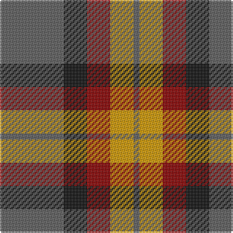

In pattern [BKRYB](/stripes/bkryb/).

This was sourced from register-of-tartans.  It is a [5 stripe tartan](/stripes/stripes5/).

Original link https://www.tartanregister.gov.uk/tartanDetails.aspx?ref=1812

## Attestations

This cloth appears in 2 source records; the oldest owns this page.

- 01/01/1993 — Ikelman #2 (Personal) (register-of-tartans, [record](https://www.tartanregister.gov.uk/tartanDetails.aspx?ref=1812))
- 1993 January — Ikelman #2 (Personal) (tartans-authority, [record](http://www.tartansauthority.com/tartan-ferret/display/2211/))

## Register references

External register numbers recorded for this tartan.

- Scottish Register of Tartans: [1812](https://www.tartanregister.gov.uk/tartanDetails.aspx?ref=1812)
- Scottish Tartans Authority (ITI): 2211
- Scottish Tartans World Register: 2211

## Thread count
N/44 K16 DR16 DY16 N/4

## Palette
Each colour and the base-6 reference it is a variant of.

| Colour | Shade | Base |
|---|---|---|
| DR | <code style="background-color:#880000;">#880000</code> `oklch(39.4% 0.162 29.2)` <small>#880000</small> | R <code style="background-color:#CC0000;">#CC0000</code> |
| DY | <code style="background-color:#D09800;">#D09800</code> `oklch(71.4% 0.147 82.1)` <small>#D09800</small> | Y <code style="background-color:#F2BF00;">#F2BF00</code> |
| K | <code style="background-color:#101010;">#101010</code> `oklch(17.3% 0.000 89.9)` <small>#101010</small> | K <code style="background-color:#000000;">#000000</code> |
| N | <code style="background-color:#5C5C5C;">#5C5C5C</code> `oklch(47.5% 0.000 89.9)` <small>#5C5C5C</small> | B <code style="background-color:#2A418A;">#2A418A</code> |

# Sample pattern

## Nearest tartans

The nearest existing variants by ΔTartan distance.

1. [Fraser Green](/setts/s6/lb2dr12g6dr1n6dr1~x4/) — ΔT 0.82
1. [Dohmen (Personal)](/setts/s4/g30ly3db8r25~x2/) — ΔT 0.94
1. [Bronte House Check](/setts/s6/m10dy60dt13lo24dt24dy8/) — ΔT 1.05
1. [Eyre (Personal)](/setts/s6/r3db12r4g18r6k2~x2/) — ΔT 1.11
1. [Strathspey (Fashion)](/setts/s6/g3r22t5g10k10g2~x2/) — ΔT 1.13
1. [Balfour #2](/setts/s6/db18ly2dy6ly2dy19r3~x2/) — ΔT 1.13
1. [Balfour (Clan)](/setts/s6/db18ly2dy6ly2dy19r3~x4/) — ΔT 1.13
1. [Bronte House Check (Fashion)](/setts/s6/r10dy60dt13lb24dt24dy8/) — ΔT 1.14
1. [Canadian Autumn](/setts/s6/g4r28db6g10k10g3~x2/) — ΔT 1.14
1. [MacNab 7](/setts/s4/g15r3p11t2~x2/) — ΔT 1.16

## Neighbour map

Every grey dot is one of 14299 variants placed by the first two principal components of the ΔTartan feature space (44% of its variance). Red is this tartan; blue dots are its nearest — click one to open its page.

<svg viewBox="0 0 640 380" role="img" style="max-width:100%;height:auto;border:1px solid #e0e0e0;border-radius:4px;display:block" xmlns="http://www.w3.org/2000/svg"><image href="/nn/cloud.v1.png" width="640" height="380"/><a href="/setts/s6/lb2dr12g6dr1n6dr1~x4/"><circle cx="288.5" cy="212.1" r="4" fill="#3465a4"><title>Fraser Green</title></circle></a><a href="/setts/s4/g30ly3db8r25~x2/"><circle cx="262.9" cy="246.5" r="4" fill="#3465a4"><title>Dohmen (Personal)</title></circle></a><a href="/setts/s6/m10dy60dt13lo24dt24dy8/"><circle cx="248.8" cy="222.4" r="4" fill="#3465a4"><title>Bronte House Check</title></circle></a><a href="/setts/s6/r3db12r4g18r6k2~x2/"><circle cx="215.7" cy="223.8" r="4" fill="#3465a4"><title>Eyre (Personal)</title></circle></a><a href="/setts/s6/g3r22t5g10k10g2~x2/"><circle cx="251.9" cy="225.9" r="4" fill="#3465a4"><title>Strathspey (Fashion)</title></circle></a><a href="/setts/s6/db18ly2dy6ly2dy19r3~x2/"><circle cx="297.5" cy="218.4" r="4" fill="#3465a4"><title>Balfour #2</title></circle></a><a href="/setts/s6/db18ly2dy6ly2dy19r3~x4/"><circle cx="297.5" cy="218.4" r="4" fill="#3465a4"><title>Balfour (Clan)</title></circle></a><a href="/setts/s6/r10dy60dt13lb24dt24dy8/"><circle cx="232.2" cy="220.2" r="4" fill="#3465a4"><title>Bronte House Check (Fashion)</title></circle></a><a href="/setts/s6/g4r28db6g10k10g3~x2/"><circle cx="267.8" cy="226.5" r="4" fill="#3465a4"><title>Canadian Autumn</title></circle></a><a href="/setts/s4/g15r3p11t2~x2/"><circle cx="252.2" cy="248.6" r="4" fill="#3465a4"><title>MacNab 7</title></circle></a><circle cx="266.5" cy="231.7" r="5" fill="#c00000"/></svg>

ID: /setts/s5/n11k4r4lo4n1~x4/
