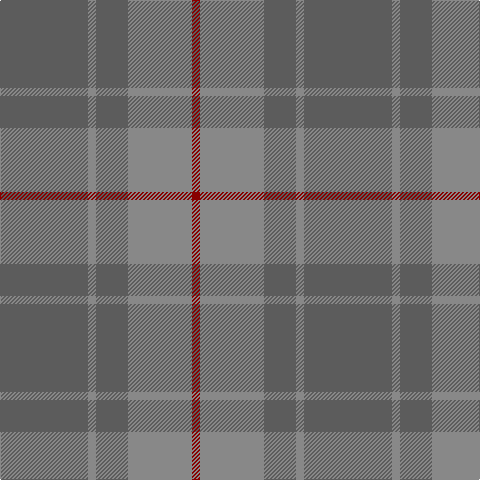

This page is one **sett** — a single exact thread-count. It belongs to the [tartan](/tartans/n11o1n4o8r1/)
(the same proportion at any scale), whose colour order is pattern [BRBRR](/stripes/brbrr/).

Sourced from tartans-authority.  It is a [5 stripe tartan](/stripes/stripes5/).

Original link http://www.tartansauthority.com/tartan-ferret/display/10143/

## Thread count
N/88 Na8 N32 Na64 DR/8

## Palette

Palette: <strong>Tartan Register</strong> <small style="color:#888">(2 of 3 colours)</small>
<table><thead><tr><th>Colour</th><th>Threads</th><th>Shade</th><th>Base</th><th>OKLCh</th></tr></thead><tbody><tr><td>N/</td><td style="text-align:right;font-variant-numeric:tabular-nums">88</td><td><code style="background-color:#5C5C5C;">#5C5C5C</code> <small style="color:#888">#5C5C5C</small></td><td>B <code style="background-color:#2A418A;">#2A418A</code></td><td><small style="color:#888">oklch(47.5% 0.000 89.9)</small></td></tr><tr><td>Na</td><td style="text-align:right;font-variant-numeric:tabular-nums">8</td><td><code style="background-color:#888888;">#888888</code> <small style="color:#888">#888888</small></td><td>R <code style="background-color:#CC0000;">#CC0000</code></td><td><small style="color:#888">oklch(62.7% 0.000 89.9)</small></td></tr><tr><td>N</td><td style="text-align:right;font-variant-numeric:tabular-nums">32</td><td><code style="background-color:#5C5C5C;">#5C5C5C</code> <small style="color:#888">#5C5C5C</small></td><td>B <code style="background-color:#2A418A;">#2A418A</code></td><td><small style="color:#888">oklch(47.5% 0.000 89.9)</small></td></tr><tr><td>Na</td><td style="text-align:right;font-variant-numeric:tabular-nums">64</td><td><code style="background-color:#888888;">#888888</code> <small style="color:#888">#888888</small></td><td>R <code style="background-color:#CC0000;">#CC0000</code></td><td><small style="color:#888">oklch(62.7% 0.000 89.9)</small></td></tr><tr><td>DR/</td><td style="text-align:right;font-variant-numeric:tabular-nums">8</td><td><code style="background-color:#880000;">#880000</code> <small style="color:#888">#880000</small></td><td>R <code style="background-color:#CC0000;">#CC0000</code></td><td><small style="color:#888">oklch(39.4% 0.162 29.2)</small></td></tr></tbody></table>

# Sample pattern

## Nearest tartans

The nearest existing variants by ΔTartan distance, with this tartan at the top so the swatches line up against it.

ΔTartan

Tartan

Sett

—

<a href="/ttd/edit/#slug=n11o1n4o8r1~x8">Cairns, David (Personal)</a> <a class="nn-out" href="/setts/s5/n11o1n4o8r1~x8/" title="open its dictionary page">↗</a>

1.60

<a href="/ttd/edit/#slug=t4lo15t4lo15t4w2~x2">Takla Makan #2</a> <a class="nn-out" href="/setts/s6/t4lo15t4lo15t4w2~x2/" title="open its dictionary page">↗</a>

1.81

<a href="/ttd/edit/#slug=do11n1do4n8r1~x8">Cairns, David (Personal)</a> <a class="nn-out" href="/setts/s5/do11n1do4n8r1~x8/" title="open its dictionary page">↗</a>

1.90

<a href="/ttd/edit/#slug=t48g25t13ly5~x2">Laurel Park</a> <a class="nn-out" href="/setts/s4/t48g25t13ly5~x2/" title="open its dictionary page">↗</a>

1.97

<a href="/ttd/edit/#slug=y37dy9y3do9dy3~x2">Glen Boig Trade Tartan Tartan Number: 915. Earliest known date: Modern Many new designs have been given district names to promote their Scottish connections. However, these names should not be confused with the District tartans which have earned their title through 'use and wont' and not a little history. See products available Copyright © Blair Urquhart, Comrie, 2015</a> <a class="nn-out" href="/setts/s5/y37dy9y3do9dy3~x2/" title="open its dictionary page">↗</a>

2.04

<a href="/ttd/edit/#slug=db5y15o4y4o24y4o4db5">Daks, (Muted Skye)</a> <a class="nn-out" href="/setts/s8/db5y15o4y4o24y4o4db5/" title="open its dictionary page">↗</a>

2.28

<a href="/ttd/edit/#slug=dg3dy30dg40r3~x2">Sanix Muted</a> <a class="nn-out" href="/setts/s4/dg3dy30dg40r3~x2/" title="open its dictionary page">↗</a>

2.29

<a href="/ttd/edit/#slug=n16r2n10r14t5~x2">Mowbray (Personal)</a> <a class="nn-out" href="/setts/s5/n16r2n10r14t5~x2/" title="open its dictionary page">↗</a>

2.34

<a href="/ttd/edit/#slug=y50dy25ly2dp6~x2">Highland Greenford (Personal)</a> <a class="nn-out" href="/setts/s4/y50dy25ly2dp6~x2/" title="open its dictionary page">↗</a>

2.36

<a href="/ttd/edit/#slug=y9y52dy15ly4~x2">McGuigan, Julia (St Monans, Fife) (Personal)</a> <a class="nn-out" href="/setts/s4/y9y52dy15ly4~x2/" title="open its dictionary page">↗</a>

2.36

<a href="/ttd/edit/#slug=dg4t10y10t1~x4">Baker City (District)</a> <a class="nn-out" href="/setts/s4/dg4t10y10t1~x4/" title="open its dictionary page">↗</a>

## Neighbour map

Every grey dot is one of 14299 variants placed by the first two principal components of the ΔTartan feature space (44% of its variance). Red is this tartan; blue dots are its nearest — click one to open its page.

<svg viewBox="0 0 640 380" role="img" style="max-width:100%;height:auto;border:1px solid #e0e0e0;border-radius:4px;display:block" xmlns="http://www.w3.org/2000/svg"><image href="/nn/cloud.v1.png" width="640" height="380"/><a href="/setts/s6/t4lo15t4lo15t4w2~x2/"><circle cx="521.4" cy="315.0" r="4" fill="#3465a4"><title>Takla Makan #2</title></circle></a><a href="/setts/s5/do11n1do4n8r1~x8/"><circle cx="545.1" cy="340.1" r="4" fill="#3465a4"><title>Cairns, David (Personal)</title></circle></a><a href="/setts/s4/t48g25t13ly5~x2/"><circle cx="514.9" cy="334.1" r="4" fill="#3465a4"><title>Laurel Park</title></circle></a><a href="/setts/s5/y37dy9y3do9dy3~x2/"><circle cx="554.6" cy="298.1" r="4" fill="#3465a4"><title>Glen Boig Trade Tartan Tartan Number: 915. Earliest known date: Modern Many new designs have been given district names to promote their Scottish connections. However, these names should not be confused with the District tartans which have earned their title through 'use and wont' and not a little history. See products available Copyright © Blair Urquhart, Comrie, 2015</title></circle></a><a href="/setts/s8/db5y15o4y4o24y4o4db5/"><circle cx="414.8" cy="309.3" r="4" fill="#3465a4"><title>Daks, (Muted Skye)</title></circle></a><a href="/setts/s4/dg3dy30dg40r3~x2/"><circle cx="536.7" cy="335.3" r="4" fill="#3465a4"><title>Sanix Muted</title></circle></a><a href="/setts/s5/n16r2n10r14t5~x2/"><circle cx="397.8" cy="317.9" r="4" fill="#3465a4"><title>Mowbray (Personal)</title></circle></a><a href="/setts/s4/y50dy25ly2dp6~x2/"><circle cx="505.7" cy="261.9" r="4" fill="#3465a4"><title>Highland Greenford (Personal)</title></circle></a><a href="/setts/s4/y9y52dy15ly4~x2/"><circle cx="537.8" cy="304.1" r="4" fill="#3465a4"><title>McGuigan, Julia (St Monans, Fife) (Personal)</title></circle></a><a href="/setts/s4/dg4t10y10t1~x4/"><circle cx="375.0" cy="339.1" r="4" fill="#3465a4"><title>Baker City (District)</title></circle></a><circle cx="504.7" cy="311.4" r="5" fill="#c00000"/></svg>

ID: /setts/s5/n11o1n4o8r1~x8/
