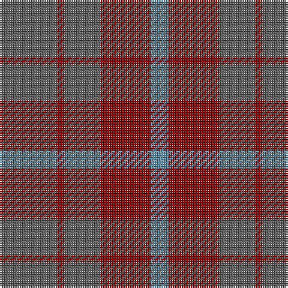

In pattern [BRBRB](/stripes/brbrb/).

This was sourced from register-of-tartans.  It is a [5 stripe tartan](/stripes/stripes5/).

Original link https://www.tartanregister.gov.uk/tartanDetails.aspx?ref=3037

## Attestations

This cloth appears in 2 source records; the oldest owns this page.

- 01/01/1984 — Mowbray (Personal) (register-of-tartans, [record](https://www.tartanregister.gov.uk/tartanDetails.aspx?ref=3037))
- 1984 — Mowbray (USA) (Personal) (tartans-authority, [record](http://www.tartansauthority.com/tartan-ferret/display/565/))

## Register references

External register numbers recorded for this tartan.

- Scottish Register of Tartans: [3037](https://www.tartanregister.gov.uk/tartanDetails.aspx?ref=3037)
- Scottish Tartans Authority (ITI): 565
- Scottish Tartans World Register: 565

## Thread count
N/32 DR4 N20 DR28 B/10

## Palette
Each colour and its ΔE from the base-6 reference it is a variant of.

| Colour | Shade | Base | ΔE (OKLab) |
|---|---|---|---|
| B | <code style="background-color:#5C8CA8;">#5C8CA8</code> `#5C8CA8` | B <code style="background-color:#2A418A;">#2A418A</code> | 0.23 |
| DR | <code style="background-color:#880000;">#880000</code> `#880000` | R <code style="background-color:#CC0000;">#CC0000</code> | 0.15 |
| N | <code style="background-color:#5C5C5C;">#5C5C5C</code> `#5C5C5C` | B <code style="background-color:#2A418A;">#2A418A</code> | 0.15 |

# Sample pattern

## Nearest tartans

The nearest existing variants by ΔTartan distance.

1. [Mowbray, (Moubray)](/setts/s5/y16r2y10r15t5~x2/) — ΔT 1.16
1. [Mowbray (Moubray) Family Tartan Tartan Number: 565. Earliest known date: 1983 Designed C.1984 by Peter MacDonald for a Mr Mowbray in the USA. Sometimes woven with green in place of gray, and blue in place of azure. See products available Copyright © Blair Urquhart, Comrie, 2015](/setts/s5/o16r2o10r15t5~x2/) — ΔT 1.40
1. [Unidentified 17](/setts/s5/db16o2db16o19r4~x3/) — ΔT 1.47
1. [Unidentified #24](/setts/s5/db16dy2db16dy19r4~x3/) — ΔT 1.66
1. [Harmony 6](/setts/s5/dg2dp10dy15dg10dp2~x4/) — ΔT 1.86
1. [Trinity Bicycles](/setts/s5/dy4lg11dy14o30r4~x2/) — ΔT 1.88
1. [MacNab WI 2](/setts/s4/dg15r3n11b2~x2/) — ΔT 1.91
1. [MacNab WI2](/setts/s4/dg15r3n11b2/) — ΔT 1.91
1. [Cameron, hunting](/setts/s6/o15r5o30db32o4ly3~x2/) — ΔT 1.96
1. [MacKinnon Hunting](/setts/s7/dg1dr8dg8r1dg8dr8lr1~x4/) — ΔT 2.06

## Neighbour map

Every grey dot is one of 14299 variants placed by the first two principal components of the ΔTartan feature space (44% of its variance). Red is this tartan; blue dots are its nearest — click one to open its page.

<svg viewBox="0 0 640 380" role="img" style="max-width:100%;height:auto;border:1px solid #e0e0e0;border-radius:4px;display:block" xmlns="http://www.w3.org/2000/svg"><image href="/nn/cloud.v1.png" width="640" height="380"/><a href="/setts/s5/y16r2y10r15t5~x2/"><circle cx="374.4" cy="298.3" r="4" fill="#3465a4"><title>Mowbray, (Moubray)</title></circle></a><a href="/setts/s5/o16r2o10r15t5~x2/"><circle cx="369.5" cy="294.4" r="4" fill="#3465a4"><title>Mowbray (Moubray) Family Tartan Tartan Number: 565. Earliest known date: 1983 Designed C.1984 by Peter MacDonald for a Mr Mowbray in the USA. Sometimes woven with green in place of gray, and blue in place of azure. See products available Copyright © Blair Urquhart, Comrie, 2015</title></circle></a><a href="/setts/s5/db16o2db16o19r4~x3/"><circle cx="408.2" cy="307.1" r="4" fill="#3465a4"><title>Unidentified 17</title></circle></a><a href="/setts/s5/db16dy2db16dy19r4~x3/"><circle cx="399.4" cy="306.1" r="4" fill="#3465a4"><title>Unidentified #24</title></circle></a><a href="/setts/s5/dg2dp10dy15dg10dp2~x4/"><circle cx="304.7" cy="309.3" r="4" fill="#3465a4"><title>Harmony 6</title></circle></a><a href="/setts/s5/dy4lg11dy14o30r4~x2/"><circle cx="317.4" cy="270.2" r="4" fill="#3465a4"><title>Trinity Bicycles</title></circle></a><a href="/setts/s4/dg15r3n11b2~x2/"><circle cx="335.6" cy="299.8" r="4" fill="#3465a4"><title>MacNab WI 2</title></circle></a><a href="/setts/s4/dg15r3n11b2/"><circle cx="335.6" cy="299.8" r="4" fill="#3465a4"><title>MacNab WI2</title></circle></a><a href="/setts/s6/o15r5o30db32o4ly3~x2/"><circle cx="378.9" cy="245.0" r="4" fill="#3465a4"><title>Cameron, hunting</title></circle></a><a href="/setts/s7/dg1dr8dg8r1dg8dr8lr1~x4/"><circle cx="361.8" cy="281.9" r="4" fill="#3465a4"><title>MacKinnon Hunting</title></circle></a><circle cx="397.8" cy="317.9" r="5" fill="#c00000"/></svg>

ID: /setts/s5/n16r2n10r14t5~x2/
