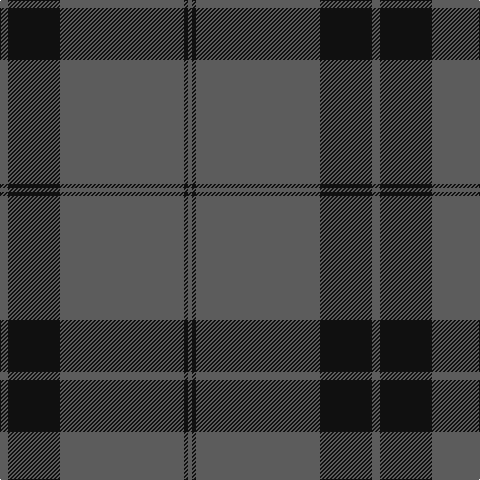

In pattern [BKBKB](/stripes/bkbkb/).

This was sourced from register-of-tartans.  It is a [5 stripe tartan](/stripes/stripes5/).

Original link https://www.tartanregister.gov.uk/tartanDetails.aspx?ref=3788

## Register references

External register numbers recorded for this tartan.

- Scottish Register of Tartans: [3788](https://www.tartanregister.gov.uk/tartanDetails.aspx?ref=3788)
- Scottish Tartans Authority (ITI): 6927

## Thread count
N/8 K52 N124 K4 N/4

## Palette
Each colour and its ΔE from the base-6 reference it is a variant of.

| Colour | Shade | Base | ΔE (OKLab) |
|---|---|---|---|
| K | <code style="background-color:#101010;">#101010</code> `#101010` | K <code style="background-color:#000000;">#000000</code> | 0.17 |
| N | <code style="background-color:#5C5C5C;">#5C5C5C</code> `#5C5C5C` | B <code style="background-color:#2A418A;">#2A418A</code> | 0.15 |

# Sample pattern

## Nearest tartans

The nearest existing variants by ΔTartan distance.

1. [Pride of New Zealand](/setts/s4/n62k30w1k1~x2/) — ΔT 1.46
1. [Silver Mist (Corporate)](/setts/s6/k13n2k13n31k1n1~x4/) — ΔT 1.59
1. [Wilson](/setts/s6/db48g14r3g2r3g2~x2/) — ΔT 1.65
1. [Wilson](/setts/s6/db64g20r4g3r4g3/) — ΔT 1.75
1. [Tyrconnell (Personal)](/setts/s5/g44db9r2db9g2~x2/) — ΔT 1.97
1. [Highland Autumn (Fashion)](/setts/s8/r2n2k2n28k8n9k1lo2~x2/) — ΔT 2.00
1. [Wilson #2](/setts/s6/db48dg14r3dg2r3dg2~x2/) — ΔT 2.02
1. [Norsemen, The](/setts/s6/n65k2n4k2n10r24~x2/) — ΔT 2.04
1. [Freedom of Scotland](/setts/s6/k15n7k6n11k50n4~x2/) — ΔT 2.05
1. [Grey Spirit Fashion Tartan Tartan Number: 6594. Earliest known date: 01/03/2005 A fashion tartan from ACS Clothing of Glasgow for use in their kilt hire business. Woven by Lochcarron. The grey is actually a grey/black marl (mixture) which can't be shown graphically. See products available Copyright © Blair Urquhart, Comrie, 2015](/setts/s6/n6k16n6k16n45k4~x2/) — ΔT 2.08

## Neighbour map

Every grey dot is one of 14299 variants placed by the first two principal components of the ΔTartan feature space (44% of its variance). Red is this tartan; blue dots are its nearest — click one to open its page.

<svg viewBox="0 0 640 380" role="img" style="max-width:100%;height:auto;border:1px solid #e0e0e0;border-radius:4px;display:block" xmlns="http://www.w3.org/2000/svg"><image href="/nn/cloud.v1.png" width="640" height="380"/><a href="/setts/s4/n62k30w1k1~x2/"><circle cx="512.8" cy="193.0" r="4" fill="#3465a4"><title>Pride of New Zealand</title></circle></a><a href="/setts/s6/k13n2k13n31k1n1~x4/"><circle cx="463.1" cy="213.5" r="4" fill="#3465a4"><title>Silver Mist (Corporate)</title></circle></a><a href="/setts/s6/db48g14r3g2r3g2~x2/"><circle cx="490.3" cy="188.3" r="4" fill="#3465a4"><title>Wilson</title></circle></a><a href="/setts/s6/db64g20r4g3r4g3/"><circle cx="474.8" cy="193.1" r="4" fill="#3465a4"><title>Wilson</title></circle></a><a href="/setts/s5/g44db9r2db9g2~x2/"><circle cx="512.9" cy="221.1" r="4" fill="#3465a4"><title>Tyrconnell (Personal)</title></circle></a><a href="/setts/s8/r2n2k2n28k8n9k1lo2~x2/"><circle cx="518.2" cy="164.7" r="4" fill="#3465a4"><title>Highland Autumn (Fashion)</title></circle></a><a href="/setts/s6/db48dg14r3dg2r3dg2~x2/"><circle cx="520.7" cy="205.2" r="4" fill="#3465a4"><title>Wilson #2</title></circle></a><a href="/setts/s6/n65k2n4k2n10r24~x2/"><circle cx="552.5" cy="177.1" r="4" fill="#3465a4"><title>Norsemen, The</title></circle></a><a href="/setts/s6/k15n7k6n11k50n4~x2/"><circle cx="565.0" cy="265.8" r="4" fill="#3465a4"><title>Freedom of Scotland</title></circle></a><a href="/setts/s6/n6k16n6k16n45k4~x2/"><circle cx="460.5" cy="268.2" r="4" fill="#3465a4"><title>Grey Spirit Fashion Tartan Tartan Number: 6594. Earliest known date: 01/03/2005 A fashion tartan from ACS Clothing of Glasgow for use in their kilt hire business. Woven by Lochcarron. The grey is actually a grey/black marl (mixture) which can't be shown graphically. See products available Copyright © Blair Urquhart, Comrie, 2015</title></circle></a><circle cx="562.7" cy="215.4" r="5" fill="#c00000"/></svg>

ID: /setts/s5/n2k13n31k1n1~x4/
