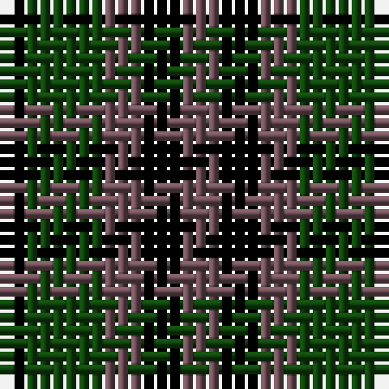

**Bands:** [BKBGK](/stripes/bkbgk/) · **Stripes:** [N K N DG K](/stripes/stripes5/) N K N DG K

This was sourced from weddslist.  It is a [5 band tartan](/bands/bands5/).

Original link http://www.weddslist.com/cgi-bin/tartans/pg.pl?source=x

## Register references

External register numbers recorded for this tartan.

- Scottish Register of Tartans: [2540](https://www.tartanregister.gov.uk/tartanDetails.aspx?ref=2540)
- Scottish Register of Tartans: [2625](https://www.tartanregister.gov.uk/tartanDetails.aspx?ref=2625)
- Scottish Register of Tartans: [3555](https://www.tartanregister.gov.uk/tartanDetails.aspx?ref=3555)
- Scottish Tartans Authority (ITI): 1429
- Scottish Tartans Authority (ITI): 218
- Scottish Tartans World Register: 1429
- Scottish Tartans World Register: 218
- Scottish Tartans World Register: 864

## Variants

Other setts woven to the same stripe pattern.

- [Austin WI](/setts/s5/n3k3n3dg6k2~x2/)

## Thread count
K/2 DG6 N3 K3 N/3

## Palette
Each colour and its ΔE from the base-6 reference it is a variant of.

| Colour | Shade | Base | ΔE (OKLab) |
|---|---|---|---|
| DG | <code style="background-color:#11450D;">#11450D</code> `#11450D` | G <code style="background-color:#006100;">#006100</code> | 0.09 |
| K | <code style="background-color:#000000;">#000000</code> `#000000` | K <code style="background-color:#000000;">#000000</code> | 0.00 |
| N | <code style="background-color:#6E5058;">#6E5058</code> `#6E5058` | B <code style="background-color:#2A418A;">#2A418A</code> | 0.15 |

# Sample pattern

## Nearest tartans

The nearest existing variants by ΔTartan distance.

1. [Austin WI](/setts/s5/n3k3n3dg6k2~x2/) — ΔT 0.00
1. [Durham District Tartan Tartan Number: 1089. Earliest known date: 1819 It was Wilson's practice to give the names of towns to many of his new designs. Maybe because the order came from there or because it was the name of the purchaser. There was a family of Durhams associated with the Royal Court in Edinburgh prior to the Union of the Crowns. Wilson was also a collector of tartans, receiving samples from his agents in the Highlands and from purchase orders from around the world. See 'Denholme' and 'Urquhart'. See products available Copyright © Blair Urquhart, Comrie, 2015](/setts/s5/k1g3k3db3r1~x4/) — ΔT 1.34
1. [Sutherland, 42nd](/setts/s6/db1k1db3k3g3k1~x4/) — ΔT 1.44
1. [Norwich No.064](/setts/s8/db12k16g14k5g14k16db12g4~x2/) — ΔT 1.51
1. [Denholm (Fashion)](/setts/s5/k5g20k18db20r5~x2/) — ΔT 1.51
1. [Unnamed 1](/setts/s5/k5g14k16db12g4~x2/) — ΔT 1.55
1. [Graham of Montrose - 1850 (Clan)](/setts/s7/k9g9w2g9k9db9k3~x2/) — ΔT 1.57
1. [Denholme](/setts/s5/k2g8k7db8r2~x2/) — ΔT 1.58
1. [Campbell, the 42nd](/setts/s6/db6k6db18k18g22k5/) — ΔT 1.61
1. [Austin (Wilson's No 173)](/setts/s5/dp3k3dp3dg6ly2~x2/) — ΔT 1.61

## Neighbour map

Every grey dot is one of 14313 variants placed by the first two principal components of the ΔTartan feature space (44% of its variance). Red is this tartan; blue dots are its nearest — click one to open its page.

<svg viewBox="0 0 640 380" role="img" style="max-width:100%;height:auto;border:1px solid #e0e0e0;border-radius:4px;display:block" xmlns="http://www.w3.org/2000/svg"><image href="/nn/cloud.v1.png" width="640" height="380"/><a href="/setts/s5/n3k3n3dg6k2~x2/"><circle cx="140.3" cy="334.5" r="4" fill="#3465a4"><title>Austin WI</title></circle></a><a href="/setts/s5/k1g3k3db3r1~x4/"><circle cx="129.9" cy="317.5" r="4" fill="#3465a4"><title>Durham District Tartan Tartan Number: 1089. Earliest known date: 1819 It was Wilson's practice to give the names of towns to many of his new designs. Maybe because the order came from there or because it was the name of the purchaser. There was a family of Durhams associated with the Royal Court in Edinburgh prior to the Union of the Crowns. Wilson was also a collector of tartans, receiving samples from his agents in the Highlands and from purchase orders from around the world. See 'Denholme' and 'Urquhart'. See products available Copyright © Blair Urquhart, Comrie, 2015</title></circle></a><a href="/setts/s6/db1k1db3k3g3k1~x4/"><circle cx="148.3" cy="306.9" r="4" fill="#3465a4"><title>Sutherland, 42nd</title></circle></a><a href="/setts/s8/db12k16g14k5g14k16db12g4~x2/"><circle cx="137.5" cy="306.9" r="4" fill="#3465a4"><title>Norwich No.064</title></circle></a><a href="/setts/s5/k5g20k18db20r5~x2/"><circle cx="110.1" cy="284.5" r="4" fill="#3465a4"><title>Denholm (Fashion)</title></circle></a><a href="/setts/s5/k5g14k16db12g4~x2/"><circle cx="156.6" cy="310.9" r="4" fill="#3465a4"><title>Unnamed 1</title></circle></a><a href="/setts/s7/k9g9w2g9k9db9k3~x2/"><circle cx="148.1" cy="288.8" r="4" fill="#3465a4"><title>Graham of Montrose - 1850 (Clan)</title></circle></a><a href="/setts/s5/k2g8k7db8r2~x2/"><circle cx="98.3" cy="279.7" r="4" fill="#3465a4"><title>Denholme</title></circle></a><a href="/setts/s6/db6k6db18k18g22k5/"><circle cx="154.3" cy="285.4" r="4" fill="#3465a4"><title>Campbell, the 42nd</title></circle></a><a href="/setts/s5/dp3k3dp3dg6ly2~x2/"><circle cx="93.3" cy="304.1" r="4" fill="#3465a4"><title>Austin (Wilson's No 173)</title></circle></a><circle cx="140.3" cy="334.5" r="5" fill="#c00000"/></svg>

ID: /setts/s5/n3k3n3dg6k2/
