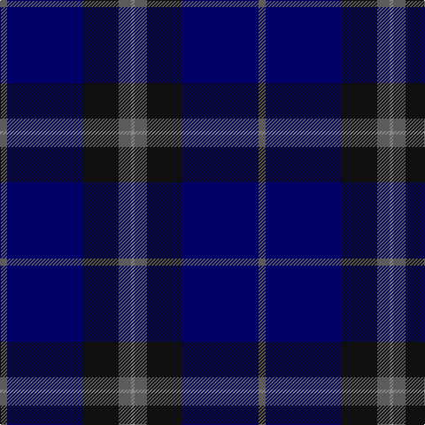

This page is one **sett** — a single exact thread-count. It belongs to the [tartan](/tartans/n4db43k20n7na2/)
(the same proportion at any scale), whose colour order is pattern [BBKBR](/stripes/bbkbr/).

Sourced from tartans-authority.  It is a [5 stripe tartan](/stripes/stripes5/).

Original link http://www.tartansauthority.com/tartan-ferret/display/10287/

## Thread count
N/8 DB86 K40 N14 Na/4

## Palette
Each colour and the base-6 reference it is a variant of.

| Colour | Shade | Base |
|---|---|---|
| DB | <code style="background-color:#000068;">#000068</code> `oklch(23.4% 0.162 264.1)` <small>#000068</small> | B <code style="background-color:#2A418A;">#2A418A</code> |
| K | <code style="background-color:#101010;">#101010</code> `oklch(17.3% 0.000 89.9)` <small>#101010</small> | K <code style="background-color:#000000;">#000000</code> |
| N | <code style="background-color:#5C5C5C;">#5C5C5C</code> `oklch(47.5% 0.000 89.9)` <small>#5C5C5C</small> | B <code style="background-color:#2A418A;">#2A418A</code> |
| Na | <code style="background-color:#888888;">#888888</code> `oklch(62.7% 0.000 89.9)` <small>#888888</small> | R <code style="background-color:#CC0000;">#CC0000</code> |

# Sample pattern

## Nearest tartans

The nearest existing variants by ΔTartan distance, with this tartan at the top so the swatches line up against it.

ΔTartan

Tartan

Sett

—

<a href="/ttd/edit/#slug=n4db43k20n7o2~x2">Deighan (Burham Kent) (Name)</a> <a class="nn-out" href="/setts/s5/n4db43k20n7o2~x2/" title="open its dictionary page">↗</a>

1.18

<a href="/ttd/edit/#slug=k30db6k6db41lt2~x2">Williams (New York) (Personal)</a> <a class="nn-out" href="/setts/s5/k30db6k6db41lt2~x2/" title="open its dictionary page">↗</a>

1.19

<a href="/ttd/edit/#slug=db80k28dp9k3m5k12~x2">Earl Blue Marl</a> <a class="nn-out" href="/setts/s6/db80k28dp9k3m5k12~x2/" title="open its dictionary page">↗</a>

1.22

<a href="/ttd/edit/#slug=k4ly1k18db18lb1db4~x4">Lyndon Prep (School)</a> <a class="nn-out" href="/setts/s6/k4ly1k18db18lb1db4~x4/" title="open its dictionary page">↗</a>

1.32

<a href="/ttd/edit/#slug=k2dg7db2dg7db16r1~x6">Hutton</a> <a class="nn-out" href="/setts/s6/k2dg7db2dg7db16r1~x6/" title="open its dictionary page">↗</a>

1.38

<a href="/ttd/edit/#slug=t5db30k25t5db30dp2t5~x2">Van Loo (Personal)</a> <a class="nn-out" href="/setts/s7/t5db30k25t5db30dp2t5~x2/" title="open its dictionary page">↗</a>

1.42

<a href="/ttd/edit/#slug=db26dg6db2dg17dy4w1dy4~x4">Doral</a> <a class="nn-out" href="/setts/s7/db26dg6db2dg17dy4w1dy4~x4/" title="open its dictionary page">↗</a>

1.47

<a href="/ttd/edit/#slug=db104db16w8db66r3db16">Edzell, U.S. Navy</a> <a class="nn-out" href="/setts/s6/db104db16w8db66r3db16/" title="open its dictionary page">↗</a>

1.51

<a href="/ttd/edit/#slug=db8k39db8k39db87r6">Largan (?)</a> <a class="nn-out" href="/setts/s6/db8k39db8k39db87r6/" title="open its dictionary page">↗</a>

1.54

<a href="/ttd/edit/#slug=db4r1db18n18lr1~x4">Ardee (Corporate)</a> <a class="nn-out" href="/setts/s5/db4r1db18n18lr1~x4/" title="open its dictionary page">↗</a>

1.56

<a href="/ttd/edit/#slug=db19k4dr1k4dg9k1~x4">Monarchs Corporate Sport Tartan Tartan Number: 2222. Earliest known date: 2002 Designed by Enid Brown of Lyle &amp; Scott Ltd for Gleneagles Golf Developments. To be used for golf clothing and accessories. The Monarch's Course, created in the early 1990's by Jack Nicklaus, was renamed The PGA Centenary Course in February 2001 to celebrate the centenary year of The Professional Golfer's Association and is the selected venue for the 2014 Ryder Cup. See products available Copyright © Blair Urquhart, Comrie, 2015</a> <a class="nn-out" href="/setts/s6/db19k4dr1k4dg9k1~x4/" title="open its dictionary page">↗</a>

## Neighbour map

Every grey dot is one of 14299 variants placed by the first two principal components of the ΔTartan feature space (44% of its variance). Red is this tartan; blue dots are its nearest — click one to open its page.

<svg viewBox="0 0 640 380" role="img" style="max-width:100%;height:auto;border:1px solid #e0e0e0;border-radius:4px;display:block" xmlns="http://www.w3.org/2000/svg"><image href="/nn/cloud.v1.png" width="640" height="380"/><a href="/setts/s5/k30db6k6db41lt2~x2/"><circle cx="436.3" cy="253.4" r="4" fill="#3465a4"><title>Williams (New York) (Personal)</title></circle></a><a href="/setts/s6/db80k28dp9k3m5k12~x2/"><circle cx="453.2" cy="200.6" r="4" fill="#3465a4"><title>Earl Blue Marl</title></circle></a><a href="/setts/s6/k4ly1k18db18lb1db4~x4/"><circle cx="368.2" cy="219.3" r="4" fill="#3465a4"><title>Lyndon Prep (School)</title></circle></a><a href="/setts/s6/k2dg7db2dg7db16r1~x6/"><circle cx="360.6" cy="234.7" r="4" fill="#3465a4"><title>Hutton</title></circle></a><a href="/setts/s7/t5db30k25t5db30dp2t5~x2/"><circle cx="370.0" cy="224.9" r="4" fill="#3465a4"><title>Van Loo (Personal)</title></circle></a><a href="/setts/s7/db26dg6db2dg17dy4w1dy4~x4/"><circle cx="348.8" cy="199.2" r="4" fill="#3465a4"><title>Doral</title></circle></a><a href="/setts/s6/db104db16w8db66r3db16/"><circle cx="387.3" cy="186.3" r="4" fill="#3465a4"><title>Edzell, U.S. Navy</title></circle></a><a href="/setts/s6/db8k39db8k39db87r6/"><circle cx="429.9" cy="254.8" r="4" fill="#3465a4"><title>Largan (?)</title></circle></a><a href="/setts/s5/db4r1db18n18lr1~x4/"><circle cx="400.1" cy="227.8" r="4" fill="#3465a4"><title>Ardee (Corporate)</title></circle></a><a href="/setts/s6/db19k4dr1k4dg9k1~x4/"><circle cx="351.1" cy="211.8" r="4" fill="#3465a4"><title>Monarchs Corporate Sport Tartan Tartan Number: 2222. Earliest known date: 2002 Designed by Enid Brown of Lyle &amp; Scott Ltd for Gleneagles Golf Developments. To be used for golf clothing and accessories. The Monarch's Course, created in the early 1990's by Jack Nicklaus, was renamed The PGA Centenary Course in February 2001 to celebrate the centenary year of The Professional Golfer's Association and is the selected venue for the 2014 Ryder Cup. See products available Copyright © Blair Urquhart, Comrie, 2015</title></circle></a><circle cx="403.1" cy="225.5" r="5" fill="#c00000"/></svg>

ID: /setts/s5/n4db43k20n7o2~x2/
