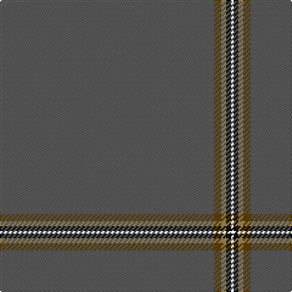

In pattern [BGYKK](/stripes/bgykk/).

This was sourced from house-of-tartan.  It is a [5 stripe tartan](/stripes/stripes5/).

Original link http://www.house-of-tartan.scotland.net/house/TartanViewjs.asp?colr=Def&tnam=10214

## Thread count
N/176 T6 LT4 K4 LN/2

## Palette
Each colour and the base-6 reference it is a variant of.

| Colour | Shade | Base |
|---|---|---|
| K | <code style="background-color:#101010;">#101010</code> `oklch(17.3% 0.000 89.9)` <small>#101010</small> | K <code style="background-color:#000000;">#000000</code> |
| LT | <code style="background-color:#A08858;">#A08858</code> `oklch(63.7% 0.071 84.0)` <small>#A08858</small> | Y <code style="background-color:#F2BF00;">#F2BF00</code> |
| N | <code style="background-color:#5C5C5C;">#5C5C5C</code> `oklch(47.5% 0.000 89.9)` <small>#5C5C5C</small> | B <code style="background-color:#2A418A;">#2A418A</code> |
| Na | <code style="background-color:#888888;">#888888</code> `oklch(62.7% 0.000 89.9)` <small>#888888</small> | R <code style="background-color:#CC0000;">#CC0000</code> |
| T | <code style="background-color:#604000;">#604000</code> `oklch(39.8% 0.083 76.8)` <small>#604000</small> | G <code style="background-color:#006100;">#006100</code> |

# Sample pattern

## Nearest tartans

The nearest existing variants by ΔTartan distance.

1. [Eternity (Fashion)](/setts/s5/n88dy3lo2k2lr1~x2/) — ΔT 1.19
1. [Burnett, of Leys hunting](/setts/s8/o96db8o8w3o8g3o8r3~x2/) — ΔT 1.78
1. [Eternity, Dedicated 2 Weddings](/setts/s5/do88o3ly2k2lr1~x2/) — ΔT 1.84
1. [Burnett of Leys Hunting Family Tartan Tartan Number: 1657. Earliest known date: 1988 Nothing See products available Copyright © Blair Urquhart, Comrie, 2015](/setts/s8/dy96db8dy8w3dy8g3dy8r3~x2/) — ΔT 2.57
1. [Alich (Personal)](/setts/s4/k50r1dt3dp1~x4/) — ΔT 2.65
1. [Torridon Tweed](/setts/s6/n4db1n6m1n14lr1~x8/) — ΔT 2.73
1. [Connacht](/setts/s10/o64g6o2g3o2g6o64dr2o2dr6~x2/) — ΔT 2.79
1. [Alich (Personal)](/setts/s4/k50r1db3dp1~x4/) — ΔT 2.79
1. [MacFie](/setts/s7/lr1r12dg2r1dg162r12ly1~x2/) — ΔT 2.99
1. [St. David's (District)](/setts/s6/dg60r2dg8r1dg5k2/) — ΔT 3.11

## Neighbour map

Every grey dot is one of 14299 variants placed by the first two principal components of the ΔTartan feature space (44% of its variance). Red is this tartan; blue dots are its nearest — click one to open its page.

<svg viewBox="0 0 640 380" role="img" style="max-width:100%;height:auto;border:1px solid #e0e0e0;border-radius:4px;display:block" xmlns="http://www.w3.org/2000/svg"><image href="/nn/cloud.v1.png" width="640" height="380"/><a href="/setts/s5/n88dy3lo2k2lr1~x2/"><circle cx="626.0" cy="193.5" r="4" fill="#3465a4"><title>Eternity (Fashion)</title></circle></a><a href="/setts/s8/o96db8o8w3o8g3o8r3~x2/"><circle cx="626.0" cy="155.4" r="4" fill="#3465a4"><title>Burnett, of Leys hunting</title></circle></a><a href="/setts/s5/do88o3ly2k2lr1~x2/"><circle cx="626.0" cy="155.4" r="4" fill="#3465a4"><title>Eternity, Dedicated 2 Weddings</title></circle></a><a href="/setts/s8/dy96db8dy8w3dy8g3dy8r3~x2/"><circle cx="626.0" cy="146.4" r="4" fill="#3465a4"><title>Burnett of Leys Hunting Family Tartan Tartan Number: 1657. Earliest known date: 1988 Nothing See products available Copyright © Blair Urquhart, Comrie, 2015</title></circle></a><a href="/setts/s4/k50r1dt3dp1~x4/"><circle cx="626.0" cy="217.2" r="4" fill="#3465a4"><title>Alich (Personal)</title></circle></a><a href="/setts/s6/n4db1n6m1n14lr1~x8/"><circle cx="626.0" cy="270.0" r="4" fill="#3465a4"><title>Torridon Tweed</title></circle></a><a href="/setts/s10/o64g6o2g3o2g6o64dr2o2dr6~x2/"><circle cx="626.0" cy="189.0" r="4" fill="#3465a4"><title>Connacht</title></circle></a><a href="/setts/s4/k50r1db3dp1~x4/"><circle cx="626.0" cy="213.5" r="4" fill="#3465a4"><title>Alich (Personal)</title></circle></a><a href="/setts/s7/lr1r12dg2r1dg162r12ly1~x2/"><circle cx="626.0" cy="149.2" r="4" fill="#3465a4"><title>MacFie</title></circle></a><a href="/setts/s6/dg60r2dg8r1dg5k2/"><circle cx="626.0" cy="200.1" r="4" fill="#3465a4"><title>St. David's (District)</title></circle></a><circle cx="626.0" cy="176.3" r="5" fill="#c00000"/></svg>

ID: /setts/s5/n88dy3lo2k2k1~x2/
