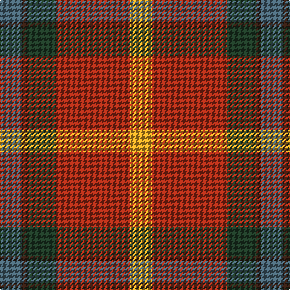

**Bands:** [YRGBB](/stripes/yrgbb/) · **Stripes:** [LO O DG DO N](/stripes/stripes5/) LO O DG DO N

This was sourced from register-of-tartans.  It is a [5 band tartan](/bands/bands5/).

Original link https://www.tartanregister.gov.uk/tartanDetails.aspx?ref=10300

## Register references

External register numbers recorded for this tartan.

- Scottish Register of Tartans: [10300](https://www.tartanregister.gov.uk/tartanDetails.aspx?ref=10300)

## Thread count
N/18 K4 DN24 R62 Y/18

## Palette
Each colour and its ΔE from the base-6 reference it is a variant of.

| Colour | Shade | Base | ΔE (OKLab) |
|---|---|---|---|
| DN | <code style="background-color:#203B27;">#203B27</code> `#203B27` | G <code style="background-color:#006100;">#006100</code> | 0.14 |
| K | <code style="background-color:#351E14;">#351E14</code> `#351E14` | B <code style="background-color:#2A418A;">#2A418A</code> | 0.21 |
| N | <code style="background-color:#486373;">#486373</code> `#486373` | B <code style="background-color:#2A418A;">#2A418A</code> | 0.13 |
| R | <code style="background-color:#A32D18;">#A32D18</code> `#A32D18` | R <code style="background-color:#CC0000;">#CC0000</code> | 0.08 |
| Y | <code style="background-color:#E0A126;">#E0A126</code> `#E0A126` | Y <code style="background-color:#F2BF00;">#F2BF00</code> | 0.08 |

# Sample pattern

## Nearest tartans

The nearest existing variants by ΔTartan distance.

1. [Buncle (Name)](/setts/s5/t9dy2g12r31lo9~x2/) — ΔT 0.32
1. [Jardine](/setts/s5/dr18o9y9r1t1~x4/) — ΔT 0.89
1. [Douglas Ancient Red](/setts/s5/k8lo2n30r30lb3~x2/) — ΔT 1.07
1. [Bronte](/setts/s5/g24b2r25ly2k3~x2/) — ΔT 1.27
1. [Dundhuin](/setts/s6/lr6o5k2y18r28w2~x2/) — ΔT 1.31
1. [MacQuarrie 2](/setts/s7/r6g16r4db12r16t1r2~x2/) — ΔT 1.38
1. [Caithness (1848) (District?)](/setts/s6/r40t11w2k12g36r32~x2/) — ΔT 1.39
1. [Leckie (Personal)](/setts/s7/r3db1r12o3dg12lb1dg2~x4/) — ΔT 1.40
1. [Duminiak (Trevose, Pennsylvania)](/setts/s6/y47w6r24w3dp5lo3~x2/) — ΔT 1.40
1. [Plaid Wine](/setts/s6/r24n5o9n2o9lb9~x4/) — ΔT 1.43

## Neighbour map

Every grey dot is one of 14299 variants placed by the first two principal components of the ΔTartan feature space (44% of its variance). Red is this tartan; blue dots are its nearest — click one to open its page.

<svg viewBox="0 0 640 380" role="img" style="max-width:100%;height:auto;border:1px solid #e0e0e0;border-radius:4px;display:block" xmlns="http://www.w3.org/2000/svg"><image href="/nn/cloud.v1.png" width="640" height="380"/><a href="/setts/s5/t9dy2g12r31lo9~x2/"><circle cx="283.8" cy="198.0" r="4" fill="#3465a4"><title>Buncle (Name)</title></circle></a><a href="/setts/s5/dr18o9y9r1t1~x4/"><circle cx="287.2" cy="192.1" r="4" fill="#3465a4"><title>Jardine</title></circle></a><a href="/setts/s5/k8lo2n30r30lb3~x2/"><circle cx="283.9" cy="200.2" r="4" fill="#3465a4"><title>Douglas Ancient Red</title></circle></a><a href="/setts/s5/g24b2r25ly2k3~x2/"><circle cx="284.0" cy="182.7" r="4" fill="#3465a4"><title>Bronte</title></circle></a><a href="/setts/s6/lr6o5k2y18r28w2~x2/"><circle cx="258.0" cy="163.0" r="4" fill="#3465a4"><title>Dundhuin</title></circle></a><a href="/setts/s7/r6g16r4db12r16t1r2~x2/"><circle cx="288.7" cy="195.2" r="4" fill="#3465a4"><title>MacQuarrie 2</title></circle></a><a href="/setts/s6/r40t11w2k12g36r32~x2/"><circle cx="294.5" cy="179.7" r="4" fill="#3465a4"><title>Caithness (1848) (District?)</title></circle></a><a href="/setts/s7/r3db1r12o3dg12lb1dg2~x4/"><circle cx="275.0" cy="180.8" r="4" fill="#3465a4"><title>Leckie (Personal)</title></circle></a><a href="/setts/s6/y47w6r24w3dp5lo3~x2/"><circle cx="335.4" cy="166.8" r="4" fill="#3465a4"><title>Duminiak (Trevose, Pennsylvania)</title></circle></a><a href="/setts/s6/r24n5o9n2o9lb9~x4/"><circle cx="234.3" cy="206.4" r="4" fill="#3465a4"><title>Plaid Wine</title></circle></a><circle cx="282.4" cy="197.8" r="5" fill="#c00000"/></svg>

ID: /setts/s5/n9do2dg12o31lo9~x2/
