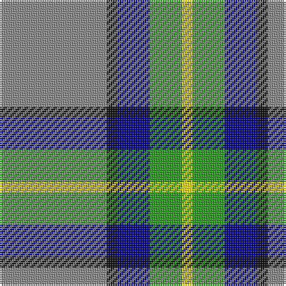

In pattern [RKBGY](/stripes/rkbgy/).

This was sourced from register-of-tartans.  It is a [5 stripe tartan](/stripes/stripes5/).

Original link https://www.tartanregister.gov.uk/tartanDetails.aspx?ref=11093

## Attestations

This cloth appears in 2 source records; the oldest owns this page.

- 17/03/2014 — Celtic Norse Heritage Society (register-of-tartans, [record](https://www.tartanregister.gov.uk/tartanDetails.aspx?ref=11093))
- 2014 — Celtic Norse Heritage Society (tartans-authority, [record](http://www.tartansauthority.com/tartan-ferret/display/11093/))

## Register references

External register numbers recorded for this tartan.

- Scottish Register of Tartans: [11093](https://www.tartanregister.gov.uk/tartanDetails.aspx?ref=11093)

## Thread count
N/60 K6 DB18 G18 Y/6

## Palette
Each colour and the base-6 reference it is a variant of.

| Colour | Shade | Base |
|---|---|---|
| DB | <code style="background-color:#00008C;">#00008C</code> `oklch(28.9% 0.200 264.1)` <small>#00008C</small> | B <code style="background-color:#2A418A;">#2A418A</code> |
| G | <code style="background-color:#289C18;">#289C18</code> `oklch(60.6% 0.191 141.6)` <small>#289C18</small> | G <code style="background-color:#006100;">#006100</code> |
| K | <code style="background-color:#101010;">#101010</code> `oklch(17.3% 0.000 89.9)` <small>#101010</small> | K <code style="background-color:#000000;">#000000</code> |
| N | <code style="background-color:#888888;">#888888</code> `oklch(62.7% 0.000 89.9)` <small>#888888</small> | R <code style="background-color:#CC0000;">#CC0000</code> |
| Y | <code style="background-color:#FFE600;">#FFE600</code> `oklch(91.7% 0.192 101.4)` <small>#FFE600</small> | Y <code style="background-color:#F2BF00;">#F2BF00</code> |

# Sample pattern

## Nearest tartans

The nearest existing variants by ΔTartan distance, with this tartan at the top so the swatches line up against it.

ΔTartan

Tartan

Sett

—

<a href="/ttd/edit/#slug=o10k1db3g3ly1~x6">Celtic Norse Heritage Society</a> <a class="nn-out" href="/setts/s5/o10k1db3g3ly1~x6/" title="open its dictionary page">↗</a>

0.99

<a href="/ttd/edit/#slug=n10w3lb3g1r1~x10">Bagpipe Shop (Corporate)</a> <a class="nn-out" href="/setts/s5/n10w3lb3g1r1~x10/" title="open its dictionary page">↗</a>

1.09

<a href="/ttd/edit/#slug=t4dg16ly2dp7t28w4~x2">Manx Laxey (Blue)</a> <a class="nn-out" href="/setts/s6/t4dg16ly2dp7t28w4~x2/" title="open its dictionary page">↗</a>

1.18

<a href="/ttd/edit/#slug=lr2dg17w6b5r1~x4">Scotstown</a> <a class="nn-out" href="/setts/s5/lr2dg17w6b5r1~x4/" title="open its dictionary page">↗</a>

1.20

<a href="/ttd/edit/#slug=n10w3lr3g1r1~x10">Bagpipe Shop (Switzerland)</a> <a class="nn-out" href="/setts/s5/n10w3lr3g1r1~x10/" title="open its dictionary page">↗</a>

1.20

<a href="/ttd/edit/#slug=k3t2g13w2t24r3~x4">Vance</a> <a class="nn-out" href="/setts/s6/k3t2g13w2t24r3~x4/" title="open its dictionary page">↗</a>

1.26

<a href="/ttd/edit/#slug=r4db24w2g13db2k3~x4">Vance (Family Association)</a> <a class="nn-out" href="/setts/s6/r4db24w2g13db2k3~x4/" title="open its dictionary page">↗</a>

1.31

<a href="/ttd/edit/#slug=k8ly2b21w3r2~x4">Oklahoma</a> <a class="nn-out" href="/setts/s5/k8ly2b21w3r2~x4/" title="open its dictionary page">↗</a>

1.33

<a href="/ttd/edit/#slug=dg62g17ly12t8o8~x2">Dundhuin Hunting (Personal)</a> <a class="nn-out" href="/setts/s5/dg62g17ly12t8o8~x2/" title="open its dictionary page">↗</a>

1.34

<a href="/ttd/edit/#slug=b4g16ly2p7b28w4~x2">Manx Laxey</a> <a class="nn-out" href="/setts/s6/b4g16ly2p7b28w4~x2/" title="open its dictionary page">↗</a>

1.34

<a href="/ttd/edit/#slug=t4g16ly2db7t28w4~x2">Allanton (Fashion)</a> <a class="nn-out" href="/setts/s6/t4g16ly2db7t28w4~x2/" title="open its dictionary page">↗</a>

## Neighbour map

Every grey dot is one of 14299 variants placed by the first two principal components of the ΔTartan feature space (44% of its variance). Red is this tartan; blue dots are its nearest — click one to open its page.

<svg viewBox="0 0 640 380" role="img" style="max-width:100%;height:auto;border:1px solid #e0e0e0;border-radius:4px;display:block" xmlns="http://www.w3.org/2000/svg"><image href="/nn/cloud.v1.png" width="640" height="380"/><a href="/setts/s5/n10w3lb3g1r1~x10/"><circle cx="274.9" cy="187.9" r="4" fill="#3465a4"><title>Bagpipe Shop (Corporate)</title></circle></a><a href="/setts/s6/t4dg16ly2dp7t28w4~x2/"><circle cx="273.9" cy="181.6" r="4" fill="#3465a4"><title>Manx Laxey (Blue)</title></circle></a><a href="/setts/s5/lr2dg17w6b5r1~x4/"><circle cx="256.8" cy="164.8" r="4" fill="#3465a4"><title>Scotstown</title></circle></a><a href="/setts/s5/n10w3lr3g1r1~x10/"><circle cx="277.9" cy="188.2" r="4" fill="#3465a4"><title>Bagpipe Shop (Switzerland)</title></circle></a><a href="/setts/s6/k3t2g13w2t24r3~x4/"><circle cx="290.2" cy="180.2" r="4" fill="#3465a4"><title>Vance</title></circle></a><a href="/setts/s6/r4db24w2g13db2k3~x4/"><circle cx="277.3" cy="178.6" r="4" fill="#3465a4"><title>Vance (Family Association)</title></circle></a><a href="/setts/s5/k8ly2b21w3r2~x4/"><circle cx="279.7" cy="181.2" r="4" fill="#3465a4"><title>Oklahoma</title></circle></a><a href="/setts/s5/dg62g17ly12t8o8~x2/"><circle cx="269.4" cy="199.6" r="4" fill="#3465a4"><title>Dundhuin Hunting (Personal)</title></circle></a><a href="/setts/s6/b4g16ly2p7b28w4~x2/"><circle cx="272.2" cy="175.5" r="4" fill="#3465a4"><title>Manx Laxey</title></circle></a><a href="/setts/s6/t4g16ly2db7t28w4~x2/"><circle cx="281.5" cy="189.8" r="4" fill="#3465a4"><title>Allanton (Fashion)</title></circle></a><circle cx="260.8" cy="190.1" r="5" fill="#c00000"/></svg>

ID: /setts/s5/o10k1db3g3ly1~x6/
