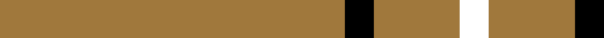

**Bands:** [KRRKR](/stripes/krrkr/) · **Stripes:** [K O O K O](/stripes/stripes5/) K O O K O

This was sourced from tartans-authority.  It is a [5 band tartan](/bands/bands5/).

Original link http://www.tartansauthority.com/tartan-ferret/display/5461/

## Thread count
LT/96 K8 LTa16 LT8 R/8

## Palette
Each colour and its ΔE from the base-6 reference it is a variant of.

| Colour | Shade | Base | ΔE (OKLab) |
|---|---|---|---|
| K | <code style="background-color:#000000;">#000000</code> `#000000` | K <code style="background-color:#000000;">#000000</code> | 0.00 |
| LT | <code style="background-color:#A0783C;">#A0783C</code> `#A0783C` | R <code style="background-color:#CC0000;">#CC0000</code> | 0.18 |
| LTa | <code style="background-color:#A0783C;">#A0783C</code> `#A0783C` | R <code style="background-color:#CC0000;">#CC0000</code> | 0.18 |

# Sample pattern

## Nearest tartans

The nearest existing variants by ΔTartan distance.

1. [Lochcarron Camel](/setts/s5/o12lb1k2o1r1~x8/) — ΔT 0.73
1. [Bro-Dreger](/setts/s7/lo3k2lo32r3lo3k5w3~x2/) — ΔT 1.20
1. [Coca Cola](/setts/s5/w7dy7w7dy40r3~x2/) — ΔT 1.39
1. [Coca Cola (Corporate)](/setts/s5/w15dy15w15dy80r6/) — ΔT 1.47
1. [Glenlivet Dress Reproduction (Corp)](/setts/s8/dy6r2dy42db2dy5w16dy5db2~x2/) — ΔT 1.62
1. [Loch Tummel](/setts/s5/o38w9o3dr9w3~x2/) — ΔT 1.78
1. [Wilbers](/setts/s8/ly5k9ly2k7lo35r4lo35k4~x2/) — ΔT 1.79
1. [Highlands at Wyomissing, The](/setts/s5/r35w3r8ly2g11~x2/) — ΔT 1.82
1. [Welsh National (District)](/setts/s5/r8g3r4g44w4~x2/) — ΔT 1.84
1. [Volkswagen Orange Trim](/setts/s6/g3lo3k10lo26k3lo3~x2/) — ΔT 1.94

## Neighbour map

Every grey dot is one of 14313 variants placed by the first two principal components of the ΔTartan feature space (44% of its variance). Red is this tartan; blue dots are its nearest — click one to open its page.

<svg viewBox="0 0 640 380" role="img" style="max-width:100%;height:auto;border:1px solid #e0e0e0;border-radius:4px;display:block" xmlns="http://www.w3.org/2000/svg"><image href="/nn/cloud.v1.png" width="640" height="380"/><a href="/setts/s5/o12lb1k2o1r1~x8/"><circle cx="468.1" cy="174.0" r="4" fill="#3465a4"><title>Lochcarron Camel</title></circle></a><a href="/setts/s7/lo3k2lo32r3lo3k5w3~x2/"><circle cx="469.9" cy="144.6" r="4" fill="#3465a4"><title>Bro-Dreger</title></circle></a><a href="/setts/s5/w7dy7w7dy40r3~x2/"><circle cx="455.9" cy="196.8" r="4" fill="#3465a4"><title>Coca Cola</title></circle></a><a href="/setts/s5/w15dy15w15dy80r6/"><circle cx="445.8" cy="198.0" r="4" fill="#3465a4"><title>Coca Cola (Corporate)</title></circle></a><a href="/setts/s8/dy6r2dy42db2dy5w16dy5db2~x2/"><circle cx="453.1" cy="136.6" r="4" fill="#3465a4"><title>Glenlivet Dress Reproduction (Corp)</title></circle></a><a href="/setts/s5/o38w9o3dr9w3~x2/"><circle cx="408.5" cy="198.3" r="4" fill="#3465a4"><title>Loch Tummel</title></circle></a><a href="/setts/s8/ly5k9ly2k7lo35r4lo35k4~x2/"><circle cx="400.4" cy="150.5" r="4" fill="#3465a4"><title>Wilbers</title></circle></a><a href="/setts/s5/r35w3r8ly2g11~x2/"><circle cx="469.1" cy="180.9" r="4" fill="#3465a4"><title>Highlands at Wyomissing, The</title></circle></a><a href="/setts/s5/r8g3r4g44w4~x2/"><circle cx="504.9" cy="208.4" r="4" fill="#3465a4"><title>Welsh National (District)</title></circle></a><a href="/setts/s6/g3lo3k10lo26k3lo3~x2/"><circle cx="387.0" cy="195.8" r="4" fill="#3465a4"><title>Volkswagen Orange Trim</title></circle></a><circle cx="483.3" cy="184.3" r="5" fill="#c00000"/></svg>

ID: /setts/s5/o12k1o2o1k1~x8/
